# Enhanced SQL Generation Workflow Documentation

## Overview
This document describes the enhanced SQL generation and evaluation workflow implemented in ThothAI, featuring multi-agent orchestration with semantic test deduplication and intelligent SQL selection.

## Source Files Involved

### Main Orchestration
- **`frontend/sql_generator/main.py`**
  - Entry point for FastAPI application
  - Coordinates the entire SQL generation pipeline
  - Handles streaming responses to client

### Workflow Phases
- **`frontend/sql_generator/helpers/main_helpers/main_request_initialization.py`**
  - Initializes request state and validation
  
- **`frontend/sql_generator/helpers/main_helpers/main_preprocessing_phases.py`**
  - Phase 1: Question validation
  - Phase 2: Keyword extraction  
  - Phase 3: Context retrieval

- **`frontend/sql_generator/helpers/main_helpers/main_generation_phases.py`**
  - Phase 4: SQL generation orchestration
  - Phase 5: Evaluation and selection coordination
  - Integrates enhanced evaluation flow

- **`frontend/sql_generator/helpers/main_helpers/main_response_preparation.py`**
  - Phase 6: Final response preparation
  - Workspace state management

### Enhanced Evaluation System
- **`frontend/sql_generator/helpers/main_helpers/enhanced_evaluation_flow.py`**
  - Core enhanced evaluation logic
  - 4-case decision system (A, B, C, D)
  - Auxiliary agent coordination

- **`frontend/sql_generator/helpers/main_helpers/main_evaluation.py`**
  - Test deduplication (exact matching)
  - Test semantic filtering integration
  - Standard evaluation execution

### Agent Components
- **`frontend/sql_generator/agents/test_reducer_agent.py`**
  - Semantic test deduplication
  - Similarity analysis and filtering

- **`frontend/sql_generator/agents/sql_selector_agent.py`**
  - Selects best SQL from multiple 100% candidates
  - Quality and efficiency analysis

- **`frontend/sql_generator/agents/evaluator_supervisor_agent.py`**
  - Reviews borderline SQL evaluations
  - Deep analysis for threshold cases

- **`frontend/sql_generator/agents/core/agent_manager.py`**
  - Agent pool management
  - Model configuration and initialization

### Supporting Components
- **`frontend/sql_generator/model/system_state.py`**
  - System state management
  - Workflow data persistence

- **`frontend/sql_generator/agents/core/agent_result_models.py`**
  - Enhanced evaluation result models
  - Status enumerations

- **`frontend/sql_generator/helpers/main_helpers/evaluation_logger.py`**
  - Detailed evaluation logging
  - Performance metrics tracking

## Workflow Diagram


## Agent Collaboration Diagram


## Activity Diagram

```mermaid
stateDiagram-v2
    [*] --> RequestReceived
    
    RequestReceived --> Validation: Initialize State
    
    state Validation {
        [*] --> ValidateQuestion
        ValidateQuestion --> ExtractKeywords
        ExtractKeywords --> RetrieveContext
        RetrieveContext --> [*]
    }
    
    Validation --> SQLGeneration: Context Ready
    
    state SQLGeneration {
        [*] --> GenerateParallel
        GenerateParallel --> CollectSQLs
        CollectSQLs --> GenerateTests
        GenerateTests --> [*]
    }
    
    SQLGeneration --> TestProcessing: SQLs & Tests Ready
    
    state TestProcessing {
        [*] --> DeduplicateExact
        DeduplicateExact --> CheckTestCount
        CheckTestCount --> SemanticFilter: >5 tests
        CheckTestCount --> RunEvaluation: ≤5 tests
        SemanticFilter --> RunEvaluation
        RunEvaluation --> CalculateRates
        CalculateRates --> [*]
    }
    
    TestProcessing --> CaseClassification: Pass Rates Calculated
    
    state CaseClassification {
        [*] --> AnalyzeRates
        AnalyzeRates --> CaseA: Single 100%
        AnalyzeRates --> CaseB: Multiple 100%
        AnalyzeRates --> CaseC: Borderline (threshold%-99%)
        AnalyzeRates --> CaseD: All < threshold%
        
        CaseA --> SelectDirect: GOLD
        CaseB --> RunSelector
        CaseC --> RunSupervisor
        CaseD --> PrepareEscalation
        
        RunSelector --> SelectBest: GOLD
        RunSupervisor --> ReviewDecision
        ReviewDecision --> ApproveSQL: Approved
        ReviewDecision --> RejectSQL: Rejected
        
        SelectDirect --> [*]
        SelectBest --> [*]
        ApproveSQL --> [*]
        RejectSQL --> [*]
        PrepareEscalation --> [*]
    }
    
    CaseClassification --> ResponsePrep: Decision Made
    
    state ResponsePrep {
        [*] --> FormatResponse
        FormatResponse --> SaveState
        SaveState --> StreamToClient
        StreamToClient --> [*]
    }
    
    ResponsePrep --> [*]: Complete
```



## Key Features

### 1. Intelligent Test Management
- **Exact Deduplication**: Removes identical test cases
- **Semantic Filtering**: TestReducer eliminates similar tests while maintaining coverage
- **Dynamic Threshold**: Only applies semantic filtering when >5 tests

### 2. Multi-Case Evaluation System
- **Case A**: Direct selection for single perfect SQL
- **Case B**: SqlSelector for choosing among multiple perfect SQLs
- **Case C**: EvaluatorSupervisor for borderline cases
- **Case D**: Escalation mechanism for all failures

### 3. Threshold-Based Decision Making
- Configurable evaluation threshold (default 90%)
- Borderline zone between threshold and 99%
- Automatic escalation below threshold

### 4. Agent Orchestration
- Core agents handle primary workflow
- Auxiliary agents created on-demand
- Shared model configuration across agents
- Comprehensive logging and metrics

## Configuration

### Evaluation Threshold
Set in workspace configuration:
```python
workspace['evaluation_threshold'] = 90  # 90% minimum pass rate
```

### Agent Model Configuration
Auxiliary agents inherit configuration from the evaluator agent to ensure consistency.

## Performance Considerations

1. **Parallel SQL Generation**: Multiple SQLs generated concurrently
2. **Lazy Agent Creation**: Auxiliary agents created only when needed
3. **Smart Test Filtering**: Reduces evaluation overhead
4. **Streaming Response**: Results streamed to client as available

## Error Handling

- Graceful degradation if auxiliary agents fail
- Fallback to simpler cases when advanced features unavailable
- Comprehensive error logging and context preservation
- Escalation path for systematic failures