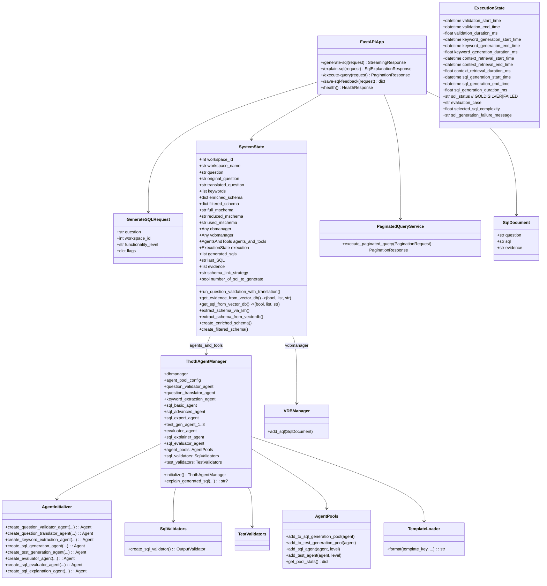
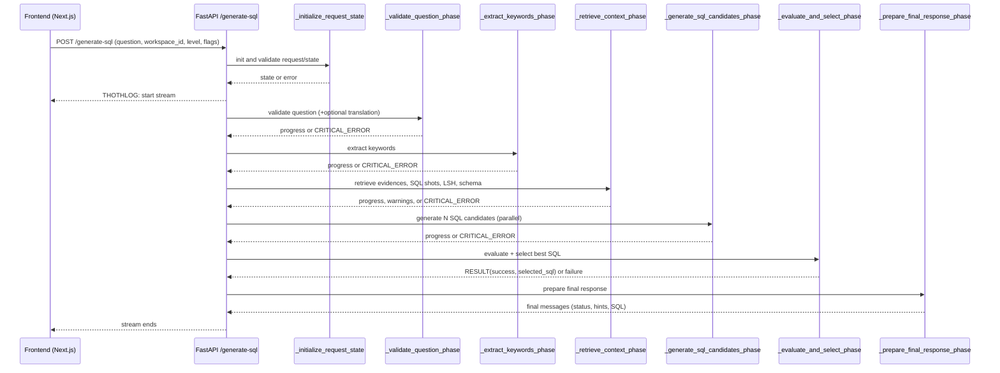
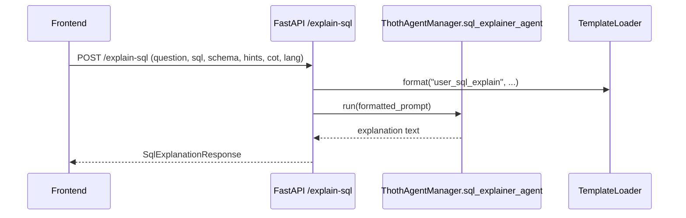
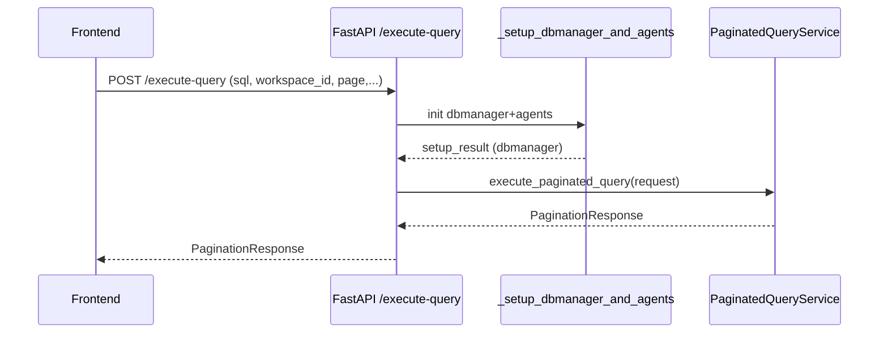
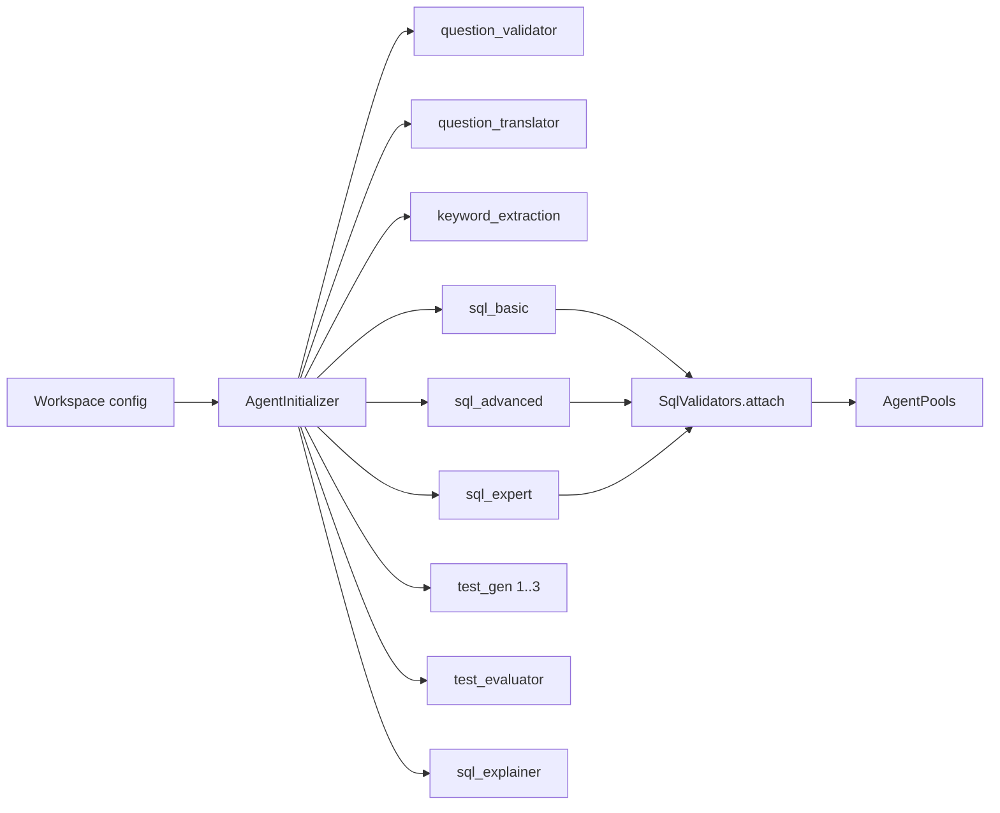
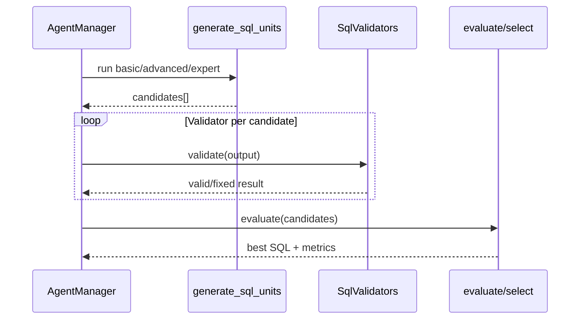

ThothAI SQL Generator – UML Documentation

Overview
- Purpose: FastAPI service that turns natural language questions into validated SQL, executes queries with pagination, and can explain SQL. It coordinates PydanticAI agents, vector DB context retrieval, schema preparation, SQL generation/evaluation, and response formatting.
- Entrypoint: `frontend/sql_generator/main.py:1`
- Core orchestrators: `helpers/main_helpers/*`
- Agents: `agents/core/*`, validators in `agents/validators/*`
- Models/state: `model/*`

Mermaid Class Diagram


Mermaid Collaboration (Sequence) Diagrams

1) Generate SQL end-to-end


2) Explain SQL


3) Execute query with pagination


Mermaid Activity (Workflow) Diagram
```mermaid
flowchart TD
    A[Request /generate-sql] --> B[Initialize request/state]
    B -->|ok| C[Validate question (+translate)]
    B -->|error| Z1[Return error]
    C -->|invalid| Z2[CRITICAL_ERROR + stop]
    C -->|valid| D[Extract keywords]
    D -->|error| Z3[CRITICAL_ERROR + stop]
    D --> E[Retrieve context: evidences, sql shots, LSH, schema]
    E -->|vdb missing| Z4[CRITICAL_ERROR + stop]
    E -->|warnings| E2[Log warnings, continue]
    E2 --> F[Decide schema strategy]
    E --> F
    F -->|WITH_SCHEMA_LINK| G[Build reduced schema -> mschema]
    F -->|WITHOUT_SCHEMA_LINK| H[Build full schema -> mschema]
    G --> I[Generate SQL candidates]
    H --> I
    I -->|error| Z5[CRITICAL_ERROR + stop]
    I --> J[Evaluate + select best SQL]
    J -->|cancelled| Z6[Stop]
    J --> K[Prepare final response]
    K --> L[Stream to client]
```

Key Modules and Functions (by responsibility)

- API Orchestration: `frontend/sql_generator/main.py:1`
  - `generate_sql`: streams the full pipeline; phases: `_validate_question_phase`, `_extract_keywords_phase`, `_retrieve_context_phase`, `_generate_sql_candidates_phase`, `_evaluate_and_select_phase`, `_prepare_final_response_phase`.
  - `explain_sql`: builds explainer prompt and calls `ThothAgentManager.explain_generated_sql`.
  - `execute_query`: initializes dbmanager and runs `PaginatedQueryService.execute_paginated_query`.
  - `save_sql_feedback`: persists last SQL into vector DB via `thoth_qdrant.SqlDocument` and `vdbmanager.add_sql`.

- Initialization and Setup:
  - `helpers/main_helpers/main_request_initialization.py:_initialize_request_state`: creates `SystemState`, loads workspace, resolves env, attaches managers, session cache.
  - `helpers/main_helpers/main_methods.py:_setup_dbmanager_and_agents`: returns `dbmanager` and `ThothAgentManager` per workspace; `initialize_database_plugins` registers DB drivers.
  - `helpers/session_cache.py:ensure_cached_setup`: caches heavy setup per session/workspace.

- Preprocessing Phases: `helpers/main_helpers/main_preprocessing_phases.py:1`
  - `_validate_question_phase`: optional question validation and translation via agents; timestamps + streaming errors.
  - `_extract_keywords_phase`: runs keyword extraction agent, stores `state.keywords`.
  - `_retrieve_context_phase`: gets evidences/SQL shots, extracts schema via LSH and vector DB, decides schema strategy, builds mschema.

- Generation and Selection: `helpers/main_helpers/main_generation_phases.py:1`
  - `_generate_sql_candidates_phase`: runs parallel SQL generation via configured agents; sets timings and handles critical errors; uses `generate_sql_units` and `clean_sql_results`.
  - `_evaluate_and_select_phase`: evaluates candidates with tests/scores and emits a `RESULT(success, selected_sql)` tuple plus logs.
  - `_finalize_execution_state_status`: consolidates GOLD/SILVER/FAILED and evaluation cases.

- Agents and Validators:
  - `agents/core/agent_manager.py: ThothAgentManager.initialize`: builds agents via `AgentInitializer`, attaches `SqlValidators` to SQL agents, configures pools.
  - `agents/core/agent_initializer.py`: factory for all agent types; applies model providers via `agent_ai_model_factory` and prompt templates.
  - `agents/core/agent_ai_model_factory.py`: resolves AI providers/keys, fallback chaining.
  - `agents/validators/sql_validators.py: SqlValidators.create_sql_validator`: output validator executing SQL safely against `dbmanager` and applying delimiter/compatibility fixes.

- Context and Templates:
  - `helpers/template_preparation.py: TemplateLoader`: loads and formats system/user templates for agents (unified system template for SQL generation; specific user prompts by level).
  - `helpers/vectordb_context_retrieval.py`, `helpers/vectordb_utils.py`: vector DB access (Qdrant), evidence retrieval, schema enrichment.
  - `helpers/sql_delimiter_corrector.py`, `helpers/sql_compatibility.py`: adjust SQL for engine differences.

- Execution and Pagination:
  - `services/paginated_query_service.py: PaginatedQueryService.execute_paginated_query`: executes SQL with sorting/filtering/pagination and returns `PaginationResponse` for AG Grid.

- Logging and Errors:
  - `helpers/logging_config.py: configure_root_logger, get_logging_level` and `helpers/dual_logger.py: log_debug, log_error` unify logging.
  - `helpers/error_response.py: handle_exception` standardizes error payloads for API exceptions.

General Workflow
- Input: question, workspace_id, functionality_level, flags.
- Validate/translate question; extract keywords.
- Retrieve context: evidences, similar SQL, LSH examples, schema with descriptions.
- Decide schema link strategy; construct mschema (reduced or full) per query.
- Generate SQL candidates using Basic/Advanced/Expert agents, attach SQL validator (executes against dbmanager).
- Evaluate and select best SQL (test generation and evaluator agents in pipeline).
- Stream status and results to client; allow pagination of execution and explanation on demand.
- Optional: save user feedback (Like) back into vector DB as `SqlDocument`.

Meaningful Functions and Notes
- `main.generate_sql`: top-level orchestrator, streams THOTHLOG/system warnings/errors; checks for client disconnects between phases.
- `_initialize_request_state`: validates env, loads workspace configuration, injects db and vector managers, wires agent manager.
- `_validate_question_phase`: timestamps, translation, and validation errors as CRITICAL_ERROR to the stream.
- `_extract_keywords_phase`: requires keyword agent; missing agent is a CRITICAL_ERROR.
- `_retrieve_context_phase`: handles vdb absence as CRITICAL_ERROR; emits warnings for partial failures; runs LSH and schema extraction; chooses schema link strategy.
- `_generate_sql_candidates_phase`: measures gen time; calls `generate_sql_units` with functionality level and agent pools; cleans results.
- `_evaluate_and_select_phase`: aggregates tests/scores, returns tuple `("RESULT", success, selected_sql)`; pipeline uses it to branch.
- `_prepare_final_response_phase`: always runs; finalizes state, formats output rows/columns, emits CSV, agent metadata, timings.
- `ThothAgentManager.initialize`: creates question validator/translator, keyword extractor, SQL basic/advanced/expert, test generators, evaluator, SQL explainer; attaches SQL validators with `dbmanager` context.
- `ThothAgentManager.explain_generated_sql`: formats template and runs `sql_explainer_agent` to produce explanation string.
- `SqlValidators.create_sql_validator`: ensures generated SQL is syntactically/semantically sound, optionally executes test queries safely.
- `PaginatedQueryService.execute_paginated_query`: centralizes result paging for UI tables.
- `save_sql_feedback`: converts last state to `SqlDocument` and stores via `vdbmanager.add_sql`.

Operational Considerations
- Env selection: if `DOCKER_CONTAINER=true`, Docker env is used; else `.env.local` at repo root is loaded.
- Logging/telemetry: `logfire.instrument_pydantic_ai()` active if token present; centralized logger configured early.
- CORS: allows localhost ports used by Next.js; streaming responses are plain text with markers (THOTHLOG, SYSTEM_WARNING, CRITICAL_ERROR, CANCELLED, RESULT).
- Disconnection handling: each long phase checks `http_request.is_disconnected()` to stop work early.

Appendix: Additional Mermaid Snippets

Agent Construction Flow


SQL Generation/Evaluation High-Level


