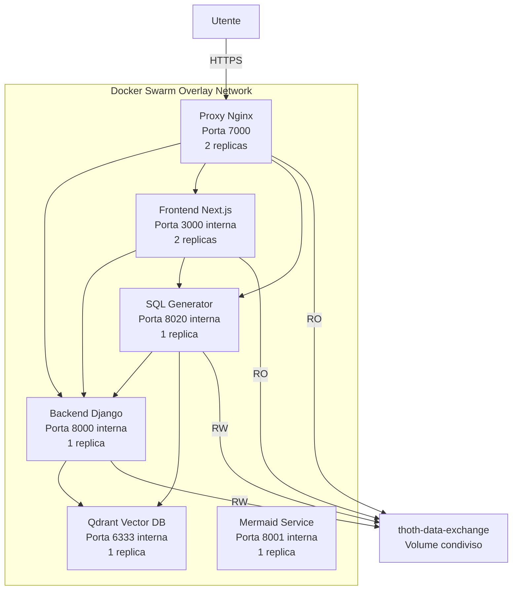

# Docker Swarm CI/CD Deployment Guide

Guida completa per l'automazione del deploy di ThothAI su Docker Swarm con pipeline CI/CD.

---

## 📋 Indice

1. [Panoramica](#panoramica)
2. [Architettura](#architettura)
3. [Pipeline GitHub Actions](#pipeline-github-actions)
4. [Pipeline GitLab CI](#pipeline-gitlab-ci)
5. [Script di Deploy](#script-di-deploy)
6. [Gestione Secrets](#gestione-secrets)
7. [Monitoraggio e Logging](#monitoraggio-e-logging)
8. [Troubleshooting](#troubleshooting)

---

## Panoramica

ThothAI su Docker Swarm utilizza una configurazione standardizzata con:

- **Porte**: 7000-7050 (range dedicato per Swarm)
- **Volume condiviso**: `thoth-data-exchange` per lo scambio dati tra servizi
- **6 servizi**: proxy, frontend, backend, sql-generator, mermaid-service, thoth-qdrant
- **Rolling updates**: Supporto nativo di Docker Swarm

### Porte Default Swarm

| Porta | Servizio | Descrizione | Accesso |
|-------|----------|-------------|---------|
| 7000 | proxy | Nginx reverse proxy (routing per path) | Tutti i servizi (vedi tabella sotto) |
| 7001 | frontend | Next.js Web App | Diretto |
| 7002 | backend | Django REST API + Home page | ⚠️ DA CONFIGURARE (vedi nota) |
| 7003 | sql-generator | FastAPI + PydanticAI agents | Diretto |
| 7004 | mermaid-service | Generazione diagrammi | Diretto |
| 7005 | thoth-qdrant | Vector database (Qdrant) | Diretto |

### Routing Proxy (Porta 7000)

Il proxy Nginx sulla porta **7000** implementa il routing basato sui path:

| Path Proxy | Servizio | Descrizione |
|-----------|----------|-------------|
| `/` | Backend (Django) | Home page Django |
| `/admin` | Backend (Django) | Admin panel Django |
| `/api` | Backend (Django) | REST API |
| `/static` | Backend (Django) | File statici |
| `/media` | Backend (Django) | File media |
| `/exports` | Volume data-exchange | File condivisi |
| `/frontend/` | Frontend (Next.js) | Web UI |
| `/sql-generator/` | SQL Generator | API SQL generation |

### Accesso Diretto al Backend

⚠️ **IMPORTANTE**: Per abilitare l'accesso diretto al backend (porta 7002), modificare [`docker-stack.yml`](docker-stack.yml:12):

```yaml
backend:
  image: ${REGISTRY_URL}/thoth-backend:${VERSION:-latest}
  networks:
    - thoth-network
  ports:
    - target: 8000
      published: ${BACKEND_PORT:-7002}
      protocol: tcp
      mode: ingress
  # ... resto della configurazione
```

Dopo la modifica, redeployare lo stack:

```bash
export BACKEND_PORT=7002
docker stack deploy -c docker-stack.yml thoth
```

### Volume thoth-data-exchange

Il volume `thoth-data-exchange` è un volume condiviso Docker Swarm che permette lo scambio di file tra i servizi:

**Permessi:**
- **backend**: Read/Write - può creare e modificare file
- **sql-generator**: Read/Write - può leggere e generare file
- **frontend**: Read-Only - può solo leggere file (es. per download)
- **proxy**: Read-Only - serve file statici e media

**Uso tipico:**
- Import/export CSV
- Documenti condivisi
- Backup temporanei
- File generati da SQL Generator

---

## Architettura



---

## Pipeline GitHub Actions

### Configurazione

Crea il file `.github/workflows/deploy-swarm.yml`:

```yaml
name: Deploy to Docker Swarm

on:
  push:
    branches:
      - main
    tags:
      - 'v*'
  workflow_dispatch:

env:
  REGISTRY_URL: registry.uni.com/tylconsulting/ThothAI

jobs:
  build-and-deploy:
    runs-on: ubuntu-latest
    
    steps:
      - name: Checkout code
        uses: actions/checkout@v4
      
      - name: Set up Docker Buildx
        uses: docker/setup-buildx-action@v3
      
      - name: Login to Docker Registry
        uses: docker/login-action@v3
        with:
          registry: ${{ secrets.REGISTRY_URL }}
          username: ${{ secrets.REGISTRY_USERNAME }}
          password: ${{ secrets.REGISTRY_PASSWORD }}
      
      - name: Get version
        id: version
        run: |
          if [[ "${{ github.ref }}" == refs/tags/* ]]; then
            VERSION=${GITHUB_REF#refs/tags/v}
          else
            VERSION="latest"
          fi
          echo "version=$VERSION" >> $GITHUB_OUTPUT
          echo "version=$VERSION"
      
      - name: Generate .env.docker
        env:
          OPENAI_API_KEY: ${{ secrets.OPENAI_API_KEY }}
          ANTHROPIC_API_KEY: ${{ secrets.ANTHROPIC_API_KEY }}
          GEMINI_API_KEY: ${{ secrets.GEMINI_API_KEY }}
          EMBEDDING_API_KEY: ${{ secrets.EMBEDDING_API_KEY }}
        run: |
          pip install pyyaml requests toml
          python scripts/validate_config.py config.yml.local
          python scripts/configure_embedding.py config.yml.local
          python scripts/installer.py --generate-env-only
      
      - name: Build and push images
        run: |
          chmod +x build-and-push-images.sh
          ./build-and-push-images.sh ${{ env.REGISTRY_URL }} ${{ steps.version.outputs.version }}
      
      - name: Deploy to Swarm
        uses: appleboy/ssh-action@v1.0.0
        with:
          host: ${{ secrets.SWARM_MANAGER_HOST }}
          username: ${{ secrets.SWARM_USER }}
          key: ${{ secrets.SSH_PRIVATE_KEY }}
          script: |
            cd /opt/ThothAI
            export REGISTRY_URL=${{ env.REGISTRY_URL }}
            export VERSION=${{ steps.version.outputs.version }}
            chmod +x deploy-swarm.sh
            ./deploy-swarm.sh
            docker service ls
```

### Secrets Richiesti

Configura i seguenti secrets nel repository GitHub:

| Secret | Descrizione |
|--------|-------------|
| `REGISTRY_URL` | URL del Docker registry |
| `REGISTRY_USERNAME` | Username del registry |
| `REGISTRY_PASSWORD` | Password del registry |
| `OPENAI_API_KEY` | Chiave API OpenAI (opzionale) |
| `ANTHROPIC_API_KEY` | Chiave API Anthropic (opzionale) |
| `GEMINI_API_KEY` | Chiave API Gemini (opzionale) |
| `EMBEDDING_API_KEY` | Chiave API per embeddings |
| `SWARM_MANAGER_HOST` | IP/hostname del manager Swarm |
| `SWARM_USER` | Utente SSH per accesso al manager |
| `SSH_PRIVATE_KEY` | Chiave privata SSH |

---

## Pipeline GitLab CI

### Configurazione

Crea il file `.gitlab-ci.yml`:

```yaml
stages:
  - build
  - deploy

variables:
  REGISTRY_URL: registry.uni.com/tylconsulting/ThothAI
  DOCKER_TLS_CERTDIR: ""

build-images:
  stage: build
  image: docker:24
  services:
    - docker:24-dind
  before_script:
    - echo "$REGISTRY_PASSWORD" | docker login $REGISTRY_URL -u "$REGISTRY_USERNAME" --password-stdin
  script:
    - pip install pyyaml requests toml
    - python scripts/validate_config.py config.yml.local
    - python scripts/configure_embedding.py config.yml.local
    - python scripts/installer.py --generate-env-only
    - chmod +x build-and-push-images.sh
    - ./build-and-push-images.sh $REGISTRY_URL $CI_COMMIT_TAG || ./build-and-push-images.sh $REGISTRY_URL latest
  only:
    - main
    - tags

deploy-swarm:
  stage: deploy
  image: alpine:latest
  before_script:
    - apk add --no-cache openssh-client
    - eval $(ssh-agent -s)
    - echo "$SSH_PRIVATE_KEY" | tr -d '\r' | ssh-add -
    - mkdir -p ~/.ssh
    - chmod 700 ~/.ssh
    - ssh-keyscan $SWARM_MANAGER_HOST >> ~/.ssh/known_hosts
    - chmod 644 ~/.ssh/known_hosts
  script:
    - |
      if [ -n "$CI_COMMIT_TAG" ]; then
        VERSION=$CI_COMMIT_TAG
      else
        VERSION="latest"
      fi
    - ssh $SWARM_USER@$SWARM_MANAGER_HOST "cd /opt/ThothAI && export REGISTRY_URL=$REGISTRY_URL VERSION=$VERSION && chmod +x deploy-swarm.sh && ./deploy-swarm.sh"
    - ssh $SWARM_USER@$SWARM_MANAGER_HOST "docker service ls"
  only:
    - main
    - tags
  when: manual
```

### Variabili GitLab

Configura le seguenti variabili in GitLab (Settings > CI/CD > Variables):

| Variabile | Tipo | Protetta | Mascherata |
|-----------|------|----------|------------|
| `REGISTRY_URL` | Variable | No | No |
| `REGISTRY_USERNAME` | Variable | Yes | No |
| `REGISTRY_PASSWORD` | Variable | Yes | Yes |
| `OPENAI_API_KEY` | Variable | Yes | Yes |
| `ANTHROPIC_API_KEY` | Variable | Yes | Yes |
| `GEMINI_API_KEY` | Variable | Yes | Yes |
| `EMBEDDING_API_KEY` | Variable | Yes | Yes |
| `SWARM_MANAGER_HOST` | Variable | Yes | No |
| `SWARM_USER` | Variable | Yes | No |
| `SSH_PRIVATE_KEY` | File | Yes | Yes |

---

## Script di Deploy

### deploy-swarm.sh

Lo script [`deploy-swarm.sh`](deploy-swarm.sh:1) automatizza l'intero processo di deploy:

```bash
# Deploy completo con backup
./deploy-swarm.sh

# Deploy senza backup
./deploy-swarm.sh --skip-backup

# Rollback manuale
./deploy-swarm.sh --rollback-only

# Mostra stato servizi
./deploy-swarm.sh --status-only

# Mostra log backend
./deploy-swarm.sh --logs

# Health check
./deploy-swarm.sh --health-check
```

### Funzionalità

1. **Verifica prerequisiti** - Controlla Docker, Swarm, file di configurazione
2. **Backup volumi** - Backup automatico di database, Qdrant e data-exchange
3. **Aggiornamento secrets** - Ricrea secrets Docker Swarm
4. **Deploy stack** - Esegue `docker stack deploy`
5. **Attesa servizi** - Monitora l'avvio dei servizi
6. **Health check** - Verifica che tutti i servizi siano operativi
7. **Rollback automatico** - In caso di errore, esegue rollback

### Variabili d'Ambiente

```bash
# Registry Docker
export REGISTRY_URL="registry.uni.com/tylconsulting/ThothAI"

# Versione immagine
export VERSION="0.1"

# Porte Swarm (default 7000-7050)
export WEB_PORT=7000              # Proxy Nginx
export FRONTEND_PORT=7001         # Frontend Next.js
export BACKEND_PORT=7002          # Backend Django (via proxy)
export SQL_GENERATOR_PORT=7003    # SQL Generator FastAPI
export MERMAID_SERVICE_PORT=7004  # Mermaid Service
export QDRANT_PORT=7005           # Qdrant Vector DB
```

---

## Gestione Secrets

### Secrets Docker Swarm

Docker Swarm usa secrets per gestire dati sensibili in modo sicuro:

```bash
# Creare secret da file
docker secret create thoth_env_config .env.docker
docker secret create thoth_config_yml config.yml.local

# Verificare secrets
docker secret ls

# Rimuovere secret
docker secret rm thoth_env_config

# Aggiornare secret (rimuovere e ricreare)
docker secret rm thoth_env_config
docker secret create thoth_env_config .env.docker
```

### Configs Docker Swarm

Per configurazioni non sensibili:

```bash
# Creare config
docker config create thoth_env_docker .env.docker

# Verificare configs
docker config ls

# Rimuovere config
docker config rm thoth_env_docker
```

### Differenza Secrets vs Configs

| Caratteristica | Secrets | Configs |
|----------------|---------|---------|
| Crittografia | Yes (at rest) | No |
| Accesso container | `/run/secrets/` | `/config/` |
| Uso tipico | API keys, password | Configurazioni generali |
| Rotazione | Richiede rimozione/ricreazione | Richiede rimozione/ricreazione |

---

## Monitoraggio e Logging

### Comandi di Monitoraggio

```bash
# Stato generale dello stack
docker stack ps thoth

# Servizi e replicas
docker stack services thoth

# Logs di un servizio specifico
docker service logs thoth_backend
docker service logs thoth_frontend
docker service logs thoth_sql-generator

# Logs in tempo reale
docker service logs -f thoth_backend

# Ispezionare un servizio
docker service inspect thoth_backend

# Statistiche risorse
docker stats $(docker ps -q --filter "label=com.docker.stack.namespace=thoth")

# Eventi del cluster
docker events --filter 'type=service'
```

### Script di Monitoraggio

```bash
#!/bin/bash
# monitor-swarm.sh

STACK_NAME="thoth"

echo "=== Stato Stack ==="
docker stack services "$STACK_NAME"

echo -e "\n=== Task ==="
docker stack ps "$STACK_NAME"

echo -e "\n=== Risorse ==="
docker stats --no-stream $(docker ps -q --filter "label=com.docker.stack.namespace=$STACK_NAME")

echo -e "\n=== Logs Backend (ultime 50 righe) ==="
docker service logs --tail 50 "${STACK_NAME}_backend"
```

### Health Check

```bash
# Backend health (via proxy)
curl http://localhost:7000/admin/login/

# Frontend health
curl http://localhost:7001

# SQL Generator health
curl http://localhost:7003/health

# Qdrant health
curl http://localhost:7005/
```

---

## Troubleshooting

### Problema: Servizio non si avvia

```bash
# Verificare i task falliti
docker service ps thoth_backend --no-trunc

# Vedere i log dettagliati
docker service logs thoth_backend

# Verificare i secrets
docker secret ls
docker config ls

# Ispezionare il servizio
docker service inspect thoth_backend
```

### Problema: Immagini non trovate

```bash
# Verificare che le immagini siano nel registry
docker pull registry.uni.com/tylconsulting/ThothAI/thoth-backend:0.1

# Verificare login al registry
docker login registry.uni.com

# Re-push se necessario
docker push registry.uni.com/tylconsulting/ThothAI/thoth-backend:0.1
```

### Problema: Secrets non accessibili

```bash
# Ricreare i secrets
docker secret rm thoth_env_config
docker secret create thoth_env_config .env.docker

# Aggiornare il servizio
docker service update --force thoth_backend
```

### Problema: Volume data-exchange non accessibile

```bash
# Verificare il volume
docker volume ls | grep data-exchange

# Ispezionare il volume
docker volume inspect thoth-data-exchange

# Verificare i mount
docker service inspect thoth_backend | grep -A 10 Mounts

# Testare accesso dal container
docker exec -it $(docker ps -q -f name=thoth_backend) ls -la /app/data_exchange/
```

### Problema: Porte già in uso

```bash
# Verificare quali processi usano le porte
sudo lsof -i :7000
sudo lsof -i :7001
sudo lsof -i :7002
sudo lsof -i :7003
sudo lsof -i :7004
sudo lsof -i :7005

# Modificare le porte nel file .env.swarm
export WEB_PORT=8000
export FRONTEND_PORT=8001
# etc.
```

### Rollback Manuale

```bash
# Rollback di un servizio specifico
docker service rollback thoth_backend

# Tornare a una versione specifica
docker service update \
  --image registry.uni.com/tylconsulting/ThothAI/thoth-backend:0.1 \
  thoth_backend

# Rollback completo dello stack
docker stack deploy -c docker-stack.yml thoth
```

---

## Best Practices

### 1. Sicurezza

- ✅ Usare **secrets** per tutte le credenziali
- ✅ Limitare accesso al registry
- ✅ Usare TLS/HTTPS per il proxy
- ✅ Configurare firewall per limitare porte esposte (7000-7050)
- ✅ Rotazione regolare delle API keys
- ✅ Non committare mai `config.yml.local` con credenziali reali

### 2. Backup

```bash
# Backup automatico con cron
0 2 * * * /opt/ThothAI/backup-thoth.sh
```

### 3. Monitoraggio

Integrare con:
- **Prometheus** + **Grafana** per metriche
- **ELK Stack** o **Loki** per log centralizzati
- **Portainer** per gestione visuale Swarm

### 4. Alta Disponibilità

- Cluster Swarm multi-nodo (3+ manager nodes)
- Replicas multiple per servizi stateless (frontend, proxy)
- Database esterno (PostgreSQL) invece di SQLite
- Qdrant cluster per vector DB
- Load balancer esterno (HAProxy, Traefik)

---

## Checklist Pre-Deploy

- [ ] Cluster Swarm inizializzato
- [ ] `config.yml.local` configurato con API keys
- [ ] Script di validazione eseguito con successo
- [ ] Immagini buildate e pushate al registry
- [ ] Secrets creati (`thoth_env_config`, `thoth_config_yml`)
- [ ] File `.env.swarm` preparato con REGISTRY_URL e VERSION
- [ ] Porte firewall aperte (7000, 7001, 7002, 7003, 7004, 7005)
- [ ] Risorse sufficienti sul cluster (CPU, RAM, Disco)
- [ ] Backup strategy definita
- [ ] Monitoraggio configurato

---

**Copyright © 2025 Tyl Consulting di Pancotti Marco**  
*Rilasciato sotto licenza MIT*
