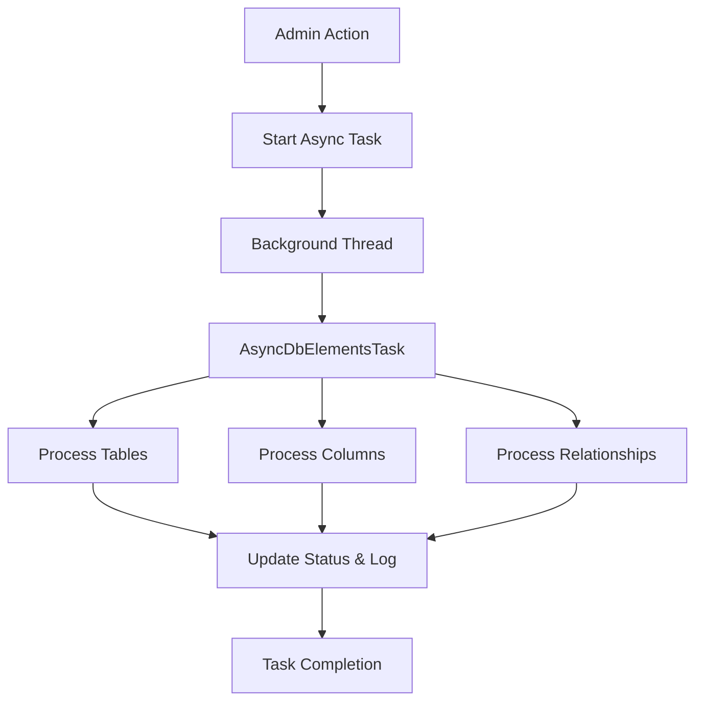

# Async Database Elements Creation Plan

## Overview
This document outlines the plan for implementing an async version of the table, column, and relationship creation action in the Django admin for SqlDb. The async implementation will prevent timeouts when processing large databases and provide better user experience with progress tracking.

## Current Implementation Analysis

### Synchronous Functions (in `backend/thoth_core/dbmanagement.py`)
- `create_tables()` - Creates table records from database metadata
- `create_columns()` - Creates column records for selected tables  
- `create_relationships()` - Creates relationship records from foreign key metadata
- `create_db_elements()` - Combined function that does all three steps sequentially

### Current Admin Actions (in `backend/thoth_core/admin_models/admin_sqldb.py`)
These functions are currently used as Django admin actions and execute synchronously, which can cause timeouts for large databases.

## Async Task Architecture Design



## Implementation Steps

### 1. Add New Status Fields to SqlDb Model

**File**: `backend/thoth_core/models.py`

Add these fields to the `SqlDb` class (around line 332, after existing async fields):

```python
# Async database element creation status and logs
db_elements_status = models.CharField(
    max_length=20,
    choices=TaskStatus.choices,
    default=TaskStatus.IDLE,
)
db_elements_task_id = models.CharField(max_length=255, blank=True, null=True)
db_elements_log = models.TextField(blank=True, null=True)
db_elements_start_time = models.DateTimeField(blank=True, null=True)
db_elements_end_time = models.DateTimeField(blank=True, null=True)
```

### 2. Create Async Task Validation Functions

**File**: `backend/thoth_core/utilities/task_validation.py`

Add these functions after the existing SqlDb validators (around line 378):

```python
def check_sqldb_db_elements_can_start(sql_db: SqlDb):
    """
    Check if database elements creation task can start.
    
    Args:
        sql_db: SqlDb instance
        
    Returns:
        tuple: (can_start: bool, message: str)
    """
    sql_db.refresh_from_db()
    
    current_status = sql_db.db_elements_status
    
    if current_status in (TaskStatus.IDLE, TaskStatus.COMPLETED, TaskStatus.FAILED):
        return True, "Ready to start"
    
    if current_status == TaskStatus.RUNNING:
        is_running = validate_and_cleanup_running_sqldb_task(sql_db, "db_elements")
        if not is_running:
            sql_db.refresh_from_db()
            return True, "Previous task was stale and has been cleaned up"
        return False, "A database elements creation task is currently running"
    
    return False, f"Unknown status: {current_status}"


def validate_and_cleanup_running_sqldb_db_elements_task(
    sql_db: SqlDb, timeout_hours: int = 2
) -> bool:
    """
    Validates if a database elements creation task marked as RUNNING is still legitimate.
    
    Args:
        sql_db: SqlDb instance
        timeout_hours: hours after which a running task is considered stale
        
    Returns:
        bool: True if task should still be considered running; False if reset
    """
    current_status = sql_db.db_elements_status
    if current_status != TaskStatus.RUNNING:
        return False
    
    start_time = sql_db.db_elements_start_time
    if start_time:
        cutoff_time = timezone.now() - timedelta(hours=timeout_hours)
        if start_time < cutoff_time:
            sql_db.db_elements_status = TaskStatus.FAILED
            sql_db.db_elements_end_time = timezone.now()
            old_log = sql_db.db_elements_log or ""
            sql_db.db_elements_log = (
                (old_log + "\n" if old_log else "")
                + f"Task auto-reset after exceeding {timeout_hours}h runtime."
            )
            sql_db.save(
                update_fields=["db_elements_status", "db_elements_end_time", "db_elements_log"]
            )
            return False
    
    return True


def force_reset_sqldb_db_elements_task_status(
    sql_db: SqlDb, reason: str = "Manual reset"
) -> bool:
    """
    Force reset of SqlDb database elements creation task status and metadata.
    """
    try:
        old_status = sql_db.db_elements_status
        old_task_id = sql_db.db_elements_task_id
        
        sql_db.db_elements_status = TaskStatus.IDLE
        sql_db.db_elements_task_id = None
        old_log = sql_db.db_elements_log or ""
        sql_db.db_elements_log = (
            (old_log + "\n" if old_log else "")
            + f"Force reset: {reason} (was: {old_status})"
        )
        sql_db.db_elements_end_time = timezone.now()
        
        sql_db.save(update_fields=[
            "db_elements_status", 
            "db_elements_task_id", 
            "db_elements_log", 
            "db_elements_end_time"
        ])
        
        logger.warning(
            f"Force reset db_elements for SqlDb {sql_db.id}: {reason} "
            f"(was: {old_status}, task_id: {old_task_id})"
        )
        return True
    except Exception as e:
        logger.error(
            f"Failed to force reset db_elements for SqlDb {sql_db.id}: {e}"
        )
        return False
```

### 3. Implement AsyncDbElementsTask Class

**File**: `backend/thoth_core/thoth_ai/thoth_workflow/async_db_elements.py`

```python
# Licensed under the Apache License, Version 2.0 (the "License");
# you may not use this file except in compliance with the License.
# You may obtain a copy of the License at
#
#     http://www.apache.org/licenses/LICENSE-2.0
#
# Unless required by applicable law or agreed to in writing, software
# distributed under the License is distributed on an "AS IS" BASIS,
# WITHOUT WARRANTIES OR CONDITIONS OF ANY KIND, either express or implied.
# See the License for the specific language governing permissions and
# limitations under the License.

"""
Async task functions for creating database elements (tables, columns, relationships).
This module provides background processing capabilities to prevent timeouts
when processing large databases.
"""

import logging
import threading
from typing import List, Dict, Any
from django.utils import timezone

from thoth_core.models import SqlDb, SqlTable, SqlColumn, Relationship
from thoth_core.dbmanagement import (
    get_table_names_and_comments,
    create_sql_tables,
    get_column_names_and_comments,
    create_sql_columns,
    get_db_manager,
)
from thoth_core.thoth_ai.thoth_workflow.log_handler import (
    create_db_comment_logger,
    update_sqldb_log,
)

logger = logging.getLogger(__name__)


class AsyncDbElementsTask:
    """Handles async processing of database elements creation."""

    @staticmethod
    def process_db_elements(
        workspace_id: int, sqldb_ids: List[int], user_id: int = None
    ) -> Dict[str, Any]:
        """
        Async task to create tables, columns, and relationships for specified databases.
        Processes each database sequentially: tables → columns → relationships

        Args:
            workspace_id: ID of the workspace
            sqldb_ids: List of SqlDb IDs to process
            user_id: ID of the user who initiated the task

        Returns:
            Dict with task results and status
        """
        try:
            total_databases = len(sqldb_ids)
            total_success = 0
            total_failed = 0
            failed_databases = []

            for sqldb_id in sqldb_ids:
                try:
                    sql_db = SqlDb.objects.get(id=sqldb_id)
                    
                    # Initialize DB-scoped status and log
                    sql_db.db_elements_status = "RUNNING"
                    sql_db.db_elements_task_id = f"db_elements_db_{sql_db.id}_{timezone.now().timestamp()}"
                    sql_db.db_elements_start_time = timezone.now()
                    sql_db.db_elements_end_time = None
                    sql_db.db_elements_log = ""
                    sql_db.save(update_fields=[
                        "db_elements_status",
                        "db_elements_task_id",
                        "db_elements_start_time",
                        "db_elements_end_time",
                        "db_elements_log",
                    ])

                    # Logger for this DB
                    custom_logger, memory_handler = create_db_comment_logger(
                        sql_db, base_logger_name="async_db_elements"
                    )
                    custom_logger.info(
                        f"Starting async database elements creation for DB '{sql_db.name}'"
                    )

                    # Step 1: Create tables
                    custom_logger.info("Step 1: Creating tables")
                    try:
                        table_info = get_table_names_and_comments(sql_db)
                        if not table_info:
                            raise Exception("Failed to retrieve table information")

                        created_tables, skipped_tables = create_sql_tables(sql_db, table_info)
                        
                        custom_logger.info(f"Tables created: {len(created_tables)}")
                        custom_logger.info(f"Tables skipped: {len(skipped_tables)}")
                        
                        for table, comment in created_tables:
                            custom_logger.info(f"  - {table} (Comment: {comment or 'None'})")
                            
                    except Exception as e:
                        raise Exception(f"Error creating tables: {str(e)}")

                    # Step 2: Create columns for each table
                    custom_logger.info("Step 2: Creating columns for each table")
                    tables_processed = 0
                    tables_failed = 0
                    
                    for sql_table in SqlTable.objects.filter(sql_db=sql_db):
                        try:
                            custom_logger.info(f"Processing table: {sql_table.name}")
                            column_info = get_column_names_and_comments(sql_db, sql_table.name)
                            if not column_info:
                                custom_logger.warning(f"No columns found for table {sql_table.name}")
                                continue

                            created_columns, skipped_columns = create_sql_columns(
                                sql_table, column_info
                            )
                            tables_processed += 1
                            custom_logger.info(
                                f"  Columns created: {len(created_columns)}, skipped: {len(skipped_columns)}"
                            )
                        except Exception as e:
                            custom_logger.error(f"Error processing table {sql_table.name}: {str(e)}")
                            tables_failed += 1

                    # Step 3: Create foreign key relationships
                    custom_logger.info("Step 3: Creating foreign key relationships")
                    try:
                        db_manager = get_db_manager(sql_db)
                        adapter = getattr(db_manager, "adapter", None)
                        if adapter and hasattr(adapter, "get_foreign_keys_as_documents"):
                            fk_docs = adapter.get_foreign_keys_as_documents()
                            relationships_info = [
                                {
                                    "source_table_name": d.source_table_name,
                                    "source_column_name": d.source_column_name,
                                    "target_table_name": d.target_table_name,
                                    "target_column_name": d.target_column_name,
                                }
                                for d in fk_docs
                            ]
                        else:
                            relationships_info = db_manager.get_foreign_keys()

                        # Limit to relationships whose tables exist in our catalog
                        existing_tables = set(
                            SqlTable.objects.filter(sql_db=sql_db).values_list("name", flat=True)
                        )
                        relationships_info = [
                            r
                            for r in relationships_info
                            if r.get("source_table_name") in existing_tables
                            and r.get("target_table_name") in existing_tables
                        ]

                        relationships_created = 0
                        for rel_data in relationships_info:
                            source_table_name = rel_data["source_table_name"]
                            source_column_name = rel_data["source_column_name"]
                            target_table_name = rel_data["target_table_name"]
                            target_column_name = rel_data["target_column_name"]

                            try:
                                source_table = SqlTable.objects.get(
                                    name=source_table_name, sql_db=sql_db
                                )
                                target_table = SqlTable.objects.get(
                                    name=target_table_name, sql_db=sql_db
                                )
                                
                                # Ensure columns exist; create on-the-fly if missing
                                try:
                                    source_column = SqlColumn.objects.get(
                                        original_column_name=source_column_name,
                                        sql_table=source_table,
                                    )
                                except SqlColumn.DoesNotExist:
                                    try:
                                        col_info = get_column_names_and_comments(
                                            sql_db, source_table.name
                                        )
                                        create_sql_columns(source_table, col_info)
                                        source_column = SqlColumn.objects.get(
                                            original_column_name=source_column_name,
                                            sql_table=source_table,
                                        )
                                    except Exception:
                                        raise
                                try:
                                    target_column = SqlColumn.objects.get(
                                        original_column_name=target_column_name,
                                        sql_table=target_table,
                                    )
                                except SqlColumn.DoesNotExist:
                                    try:
                                        col_info = get_column_names_and_comments(
                                            sql_db, target_table.name
                                        )
                                        create_sql_columns(target_table, col_info)
                                        target_column = SqlColumn.objects.get(
                                            original_column_name=target_column_name,
                                            sql_table=target_table,
                                        )
                                    except Exception:
                                        raise

                                relationship, created = Relationship.objects.get_or_create(
                                    source_table=source_table,
                                    target_table=target_table,
                                    source_column=source_column,
                                    target_column=target_column,
                                )
                                if created:
                                    relationships_created += 1
                            except Exception as e:
                                custom_logger.warning(f"Error creating relationship: {str(e)}")

                        Relationship.update_pk_fk_fields()
                        custom_logger.info(f"Relationships created: {relationships_created}")
                        
                    except Exception as e:
                        raise Exception(f"Error creating relationships: {str(e)}")

                    # Finalize task
                    sql_db.db_elements_end_time = timezone.now()
                    sql_db.db_elements_status = "COMPLETED"
                    update_sqldb_log(sql_db, memory_handler, "db_elements_log")
                    sql_db.save(update_fields=[
                        "db_elements_status",
                        "db_elements_end_time",
                        "db_elements_log",
                    ])
                    
                    custom_logger.info(
                        f"Successfully processed database '{sql_db.name}': "
                        f"{len(created_tables)} tables, {tables_processed} tables with columns, "
                        f"{relationships_created} relationships"
                    )
                    
                    total_success += 1

                except Exception as e:
                    error_msg = f"Failed to process database '{sql_db.name}': {str(e)}"
                    logger.error(error_msg)
                    
                    # Update status to failed
                    sql_db.db_elements_end_time = timezone.now()
                    sql_db.db_elements_status = "FAILED"
                    sql_db.db_elements_log = error_msg
                    sql_db.save(update_fields=[
                        "db_elements_status",
                        "db_elements_end_time",
                        "db_elements_log",
                    ])
                    
                    failed_databases.append((sql_db.name, str(e)))
                    total_failed += 1

            logger.info(
                f"Database elements creation completed: {total_success} successes, "
                f"{total_failed} failures out of {total_databases} databases"
            )

            return {
                "status": "success",
                "processed": total_success,
                "failed": total_failed,
                "total": total_databases,
                "failed_databases": failed_databases,
            }
            
        except Exception as e:
            logger.error(f"Critical error in async database elements creation: {str(e)}")
            return {
                "status": "error", 
                "error": str(e), 
                "processed": 0, 
                "failed": len(sqldb_ids) if sqldb_ids else 0
            }


def start_async_db_elements_creation(
    workspace_id: int, sqldb_ids: List[int], user_id: int = None
) -> str:
    """
    Start async database elements creation in a separate thread.

    Args:
        workspace_id: ID of the workspace
        sqldb_ids: List of SqlDb IDs to process
        user_id: ID of the user who initiated the task

    Returns:
        Task ID for tracking
    """

    def run_task():
        AsyncDbElementsTask.process_db_elements(workspace_id, sqldb_ids, user_id)

    thread = threading.Thread(target=run_task)
    thread.daemon = True
    thread.start()

    return f"db_elements_{workspace_id}_{timezone.now().timestamp()}"
```

### 4. Add New Admin Action

**File**: `backend/thoth_core/admin_models/admin_sqldb.py`

Add the new async action to the `SqlDbAdmin` class (around line 119, in the actions tuple):

```python
actions = (
    export_csv,
    import_csv,
    create_tables,
    create_relationships,
    create_db_elements,
    "create_db_elements_async",  # Add this new action
    "validate_db_fk_fields",
    export_db_structure_to_csv,
    "duplicate_sqldb",
    "associate_candidates_fk_to_pk",
    "test_connection",
    "generate_all_comments",
    generate_scope,
    generate_db_erd,
    generate_db_documentation,
    "scan_gdpr_compliance",
)
```

Add the import at the top of the file:

```python
from thoth_core.thoth_ai.thoth_workflow.async_db_elements import (
    start_async_db_elements_creation,
)
from thoth_core.utilities.task_validation import (
    check_sqldb_db_elements_can_start,
)
```

Add the action method to the `SqlDbAdmin` class (around line 894, before the final class definition):

```python
def create_db_elements_async(self, request, queryset):
    """
    Async version of create_db_elements that processes tables, columns, and relationships
    in the background without blocking the admin interface.
    """
    if queryset.count() == 0:
        messages.error(request, "Please select at least one database.")
        return

    # Check each database can start the task
    ready_databases = []
    skipped_databases = []
    
    for sqldb in queryset:
        can_start, message = check_sqldb_db_elements_can_start(sqldb)
        if can_start:
            ready_databases.append(sqldb)
        else:
            skipped_databases.append((sqldb.name, message))

    if not ready_databases:
        messages.error(
            request, 
            f"No databases are ready for processing. Skipped: {len(skipped_databases)}"
        )
        for db_name, reason in skipped_databases:
            messages.error(request, f"  - {db_name}: {reason}")
        return

    # Get workspace ID (use first workspace or default)
    workspace_id = 1  # Default fallback
    if hasattr(request, 'current_workspace') and request.current_workspace:
        workspace_id = request.current_workspace.id

    try:
        # Start async processing
        sqldb_ids = [db.id for db in ready_databases]
        task_id = start_async_db_elements_creation(workspace_id, sqldb_ids, request.user.id)

        # Success message
        messages.success(
            request,
            f"Started async database elements creation for {len(ready_databases)} database(s). "
            f"Task ID: {task_id}. Monitor progress in the database status fields.",
        )

        # Log skipped databases
        if skipped_databases:
            messages.warning(
                request,
                f"Skipped {len(skipped_databases)} database(s) that were not ready:"
            )
            for db_name, reason in skipped_databases:
                messages.warning(request, f"  - {db_name}: {reason}")

    except Exception as e:
        messages.error(request, f"Error starting async database elements creation: {str(e)}")

create_db_elements_async.short_description = (
    "Create all database elements (tables, columns, relationships) - ASYNC"
)
```

### 5. Update Admin Form and Fieldsets

**File**: `backend/thoth_core/admin_models/admin_sqldb.py`

Add the new status fields to the form (around line 86):

```python
"db_elements_log": forms.Textarea(
    attrs={"rows": 8, "style": "width: 100%; max-width: 100%;"}
),
```

Add the new status field to list_display (around line 100):

```python
list_display = (
    "name",
    "db_host",
    "db_type",
    "db_name",
    "schema",
    "vector_db_name",
    "column_comment_status",
    "table_comment_status",
    "db_elements_status",  # Add this
),
```

Add a new fieldset for the db elements status (around line 200):

```python
(
    "Database Elements Task Status",
    {
        "fields": (
            "db_elements_status",
            "db_elements_task_id",
            "db_elements_start_time",
            "db_elements_end_time",
            "db_elements_log",
        ),
        "classes": ("collapse",),
        "description": "Status and logs for database elements creation tasks.",
    },
),
```

### 6. Create Database Migration

After adding the new fields to the model, create and run a migration:

```bash
cd backend
uv run python manage.py makemigrations thoth_core
uv run python manage.py migrate
```

## Testing Plan

### Unit Tests
- Test async task validation functions
- Test AsyncDbElementsTask with mock data
- Test error handling and timeout scenarios

### Integration Tests
- Test admin action with different database types
- Test progress tracking and status updates
- Test concurrent task execution

### Performance Tests
- Test with large databases (many tables/columns)
- Test memory usage during async processing
- Test timeout and cleanup behavior

## Benefits of This Implementation

1. **Non-blocking**: Admin interface won't freeze during large database processing
2. **Progress tracking**: Users can monitor task status in real-time
3. **Error resilience**: Better error handling and recovery mechanisms
4. **Scalability**: Can handle larger databases without timeout issues
5. **Consistency**: Follows established async patterns in the codebase
6. **Logging**: Detailed logging for troubleshooting and monitoring

## Implementation Timeline

- **Day 1**: Model changes, validation functions, and basic async task structure
- **Day 2**: Complete async task implementation and admin integration
- **Day 3**: Testing, debugging, and documentation

## Risk Mitigation

1. **Database Compatibility**: Test with all supported database types
2. **Memory Management**: Implement chunking for large datasets
3. **Error Recovery**: Ensure proper cleanup on task failure
4. **Concurrency**: Handle multiple simultaneous tasks correctly
5. **Timeout Handling**: Implement proper timeout and stale task cleanup

## Future Enhancements

1. **Progress Percentage**: Add more granular progress tracking
2. **Task Cancellation**: Allow users to cancel running tasks
3. **Email Notifications**: Send notifications when tasks complete
4. **Batch Processing**: Optimize for very large databases
5. **Retry Mechanism**: Automatic retry for transient failures