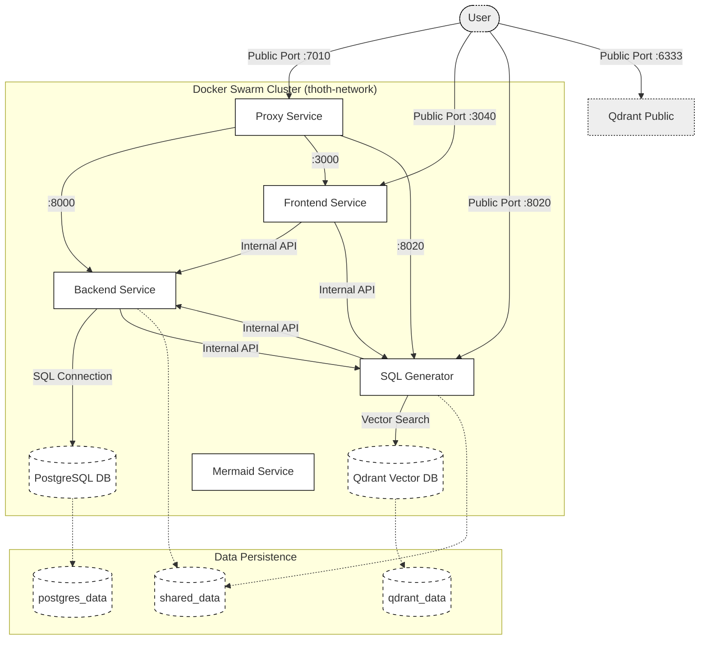

# Docker Stack Architecture

This document outlines the architecture and service composition of the `docker-stack.yml` configuration used for Docker Swarm deployments.

## Architecture Diagram



## Overview

The `docker-stack.yml` defines the production infrastructure for **ThothAI** running on Docker Swarm. It orchestrates multiple services acting as a cohesive platform for Text-to-SQL generation.

### Core Components

| Service | Image | Internal Port | Public Port | Description |
|---------|-------|---------------|-------------|-------------|
| **Backend** | `thoth-backend` | `8000` | - | Core Django REST API application. |
| **Frontend** | `thoth-frontend` | `3000` | `3040` | Next.js application UI. |
| **SQL Generator** | `thoth-sql-generator` | `8020` | `8020` | FastAPI service using PydanticAI for SQL generation. |
| **DB** | `postgres:16-alpine` | `5432` | - | Primary application database (PostgreSQL). |
| **Qdrant** | `qdrant/qdrant` | `6333` | `6333` | Vector database for RAG context retrieval. |
| **Proxy** | `thoth-proxy` | `80` | `7010` | Nginx gateway for routing requests. |
| **Mermaid** | `thoth-mermaid-service` | `8001` | `8003` | Self-hosted diagram generation service. |

## Service Details

### Backend (`backend`)
- **Role**: Central orchestrator for user management, request handling, and business logic.
- **Constraints**: Runs on `manager` nodes.
- **Dependencies**: Depends on `db` and `thoth_env_config` secret.
- **Healthcheck**: Checks `/admin/login/` every 30s.

### Frontend (`frontend`)
- **Role**: User interface for the platform.
- **Configuration**: Connects to Backend and SQL Generator via internal Docker DNS (`http://proxy:80`, `http://sql-generator:8020`) and public URLs for client-side operations.
- **Public Access**: Direct ingress on port `3040`.

### SQL Generator (`sql-generator`)
- **Role**: Dedicated AI service for converting natural language to SQL.
- **Integration**:
    - Consumes `backend` API.
    - Queries `thoth-qdrant` for context.
    - Shares data via `/app/data` volume.
- **Constraints**: Runs on `manager` nodes.

### Proxy (`proxy`)
- **Role**: Reverse proxy (Nginx).
- **Routing**:
    - `/` -> Frontend
    - `/api` -> Backend
    - `/generate` -> SQL Generator
- **Replicas**: 2 (for high availability).

### Databases
- **DB (`db`)**: Standard PostgreSQL 16. Persistent storage via `postgres_data`.
- **Qdrant (`thoth-qdrant`)**: Vector store. Persistent storage via `qdrant_data`.

## Infrastructure

### Networks
- **`thoth-network`**: External overlay network. All services communicate over this private network.

### Volumes (Bind Mounts)
Data persistence is handled via bind mounts to the host system based on `${THOTH_DATA_PATH}`:
- `backend_db`: Backend database files.
- `shared`: Shared data between Backend and SQL Generator.
- `logs`: Centralized logs.
- `static` / `media`: Static assets served by backend/proxy.
- `secrets`: Secret file storage.
- `data_exchange`: Volume for data synchronization tools.

### Secrets & Configs
- **Secrets**: `thoth_env_config` (External) - Managed environment secrets.
- **Configs**: `thoth_env_docker` (External) - Environment configuration file.

## Deployment

To deploy this stack to the Swarm:

```bash
docker stack deploy -c docker-stack.yml thoth
```

Ensure all environment variables (e.g., `THOTH_DATA_PATH`, `DB_PASSWORD`) are set in the shell or `.env` file before deployment.
