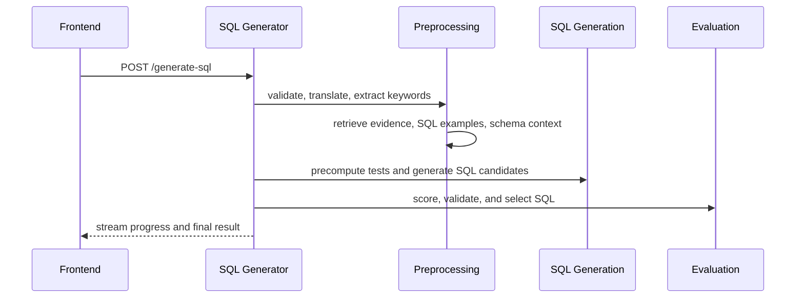

# Pipeline

The current SQL generation pipeline is implemented in `frontend/sql_generator/main.py` and the `helpers/main_helpers/` modules.

## Request Contract

The main request model includes:

- `question`
- `workspace_id`
- `functionality_level`
- `flags`

## Phase Order

The runtime orchestrates the request in this sequence:

1. request initialization
2. question validation and translation
3. keyword extraction
4. context retrieval
5. test precomputation
6. SQL candidate generation
7. evaluation and selection
8. final response preparation

## Sequence Diagram

## Failure Model

The pipeline can stop early when:

- the workspace cannot be initialized
- the validator rejects the question
- the keyword extraction agent is missing
- the vector database is unavailable
- SQL candidate generation fails critically

Warnings are streamed for partial retrieval failures, but the request can continue when the runtime still has enough context to proceed.
