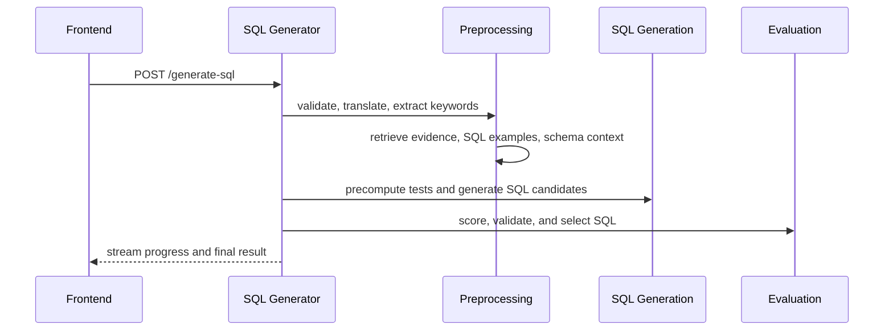

# Pipeline

The current SQL generation pipeline is implemented in `frontend/sql_generator/main.py` and the `helpers/main_helpers/` modules.

## Request Contract

The main request model includes:

- `question`
- `workspace_id`
- `functionality_level`
- `flags`

## Phase Order

The runtime orchestrates the request in this sequence:

1. request initialization
2. question validation and translation
3. keyword extraction
4. context retrieval
5. test precomputation
6. SQL candidate generation
7. evaluation and selection
8. final response preparation

## Request Initialization In Detail

The pipeline begins in `_initialize_request_state()`.

This step is more than shape validation:

1. it normalizes `functionality_level` to uppercase
2. it builds `RequestContext`
3. it calls `_setup_dbmanager_and_agents()`
4. it resolves workspace scope and target language
5. it verifies that both `dbmanager` and `vdbmanager` are ready
6. it fetches `full_schema` from the target SQL database

The request cannot proceed if the schema fetch fails, because every later phase depends on `full_schema`.

## Validation And Translation In Detail

Validation is controlled by `SystemState.run_question_validation_with_translation()`.

The implemented methodology is:

1. use the validator as the control agent
2. register the translator as a callable tool on that validator
3. let the validator decide whether translation is required
4. return either:
   - a validation failure
   - or a valid question, possibly translated into the configured workspace language

If the specialized agents are unavailable, the code falls back to `_run_question_validation()`.

## Keyword Extraction In Detail

Keyword extraction is mandatory in the current runtime.

If `keyword_extraction_agent` is missing, `_extract_keywords_phase()` emits a critical error and the request stops.

That strictness exists because the next retrieval steps depend on `state.keywords` for:

- evidence search
- similar SQL retrieval
- LSH schema matching
- semantic schema enrichment

## Sequence Diagram

## Failure Model

The pipeline can stop early when:

- the workspace cannot be initialized
- the validator rejects the question
- the keyword extraction agent is missing
- the vector database is unavailable
- SQL candidate generation fails critically

Warnings are streamed for partial retrieval failures, but the request can continue when the runtime still has enough context to proceed.

## Developer Reading Order

If you want to trace the code path end to end, start here:

1. `main.py`
2. `main_request_initialization.py`
3. `main_preprocessing_phases.py`
4. `main_schema_link_strategy.py`
5. `main_sql_generation.py`
6. `main_generation_phases.py`
7. `main_evaluation.py`
8. `sql_selection.py`
