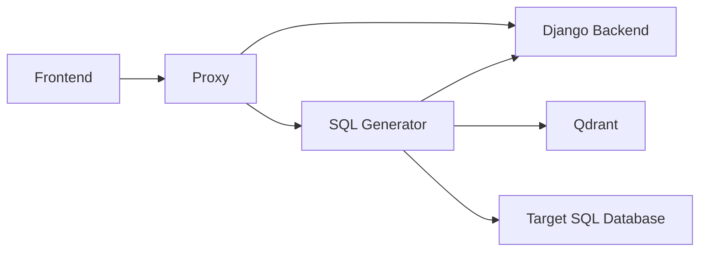

# Agents And Services

The SQL Generator runtime builds a workspace-specific agent set through `frontend/sql_generator/agents/core/agent_manager.py`.

## Current Runtime Agent Roles

The active codebase centers on these roles:

- question validator
- question translator
- keyword extraction
- SQL generation at Basic, Advanced, and Expert levels
- test generation agents
- evaluator agent
- SQL explainer agent
- SQL output and test validators

`ThothAgentManager` wires these through `AgentInitializer` and the validation layers in `agents/validators/`.

## Important Clarification

The current public runtime is documented around `Basic`, `Advanced`, and `Expert` functionality levels because that is what the request model exposes.

## Service Interaction

## Initialization Path

During request handling the SQL Generator:

1. resolves the workspace
2. initializes database plugins
3. sets up the database manager and agent manager
4. loads retrieval configuration for the active workspace
5. streams phase-by-phase progress back to the client
