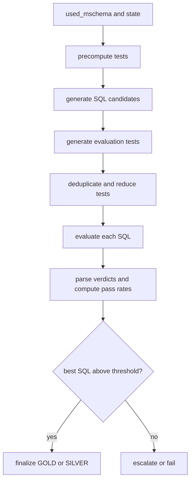
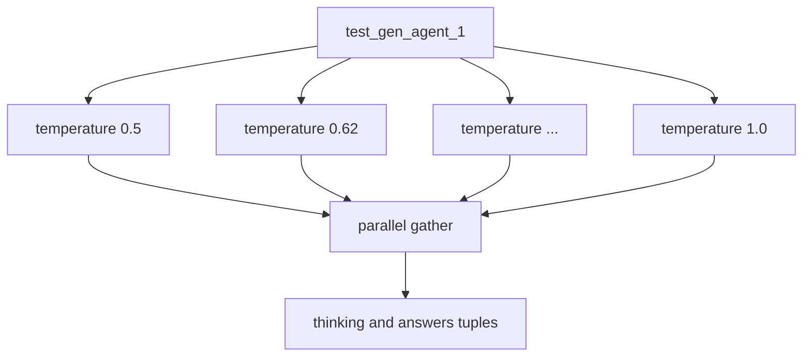
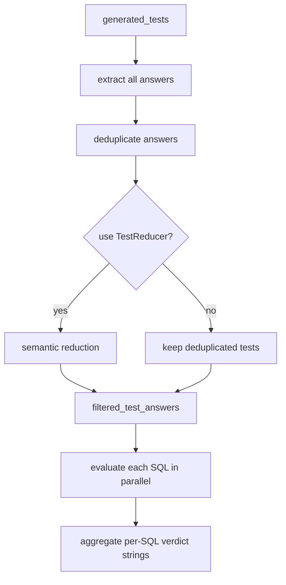
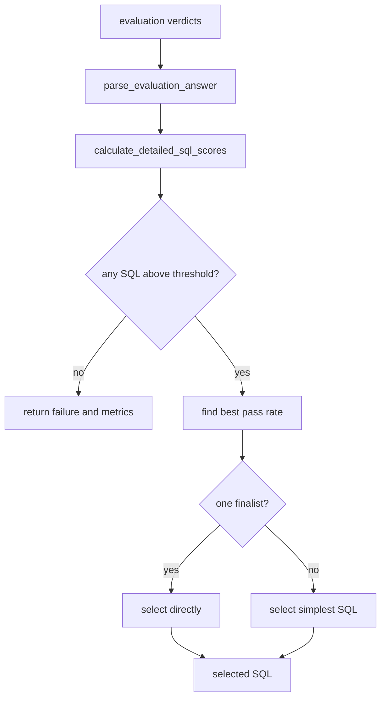
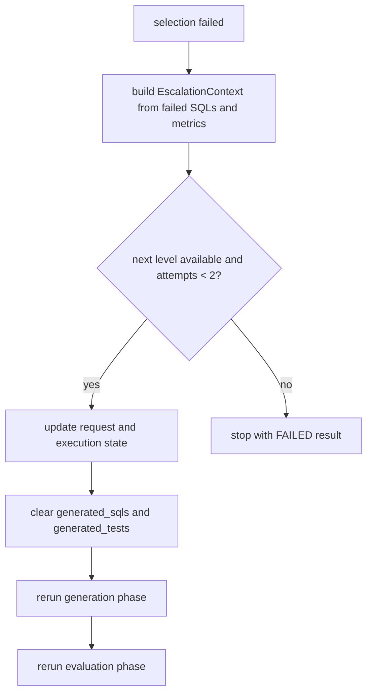

# Evaluation And Selection

This page documents how ThothAI turns a bag of candidate SQL statements into either:

- a selected SQL query
- an escalated retry at a higher level
- or a final failure

The key modules are:

- `helpers/main_helpers/main_generation_phases.py`
- `helpers/main_helpers/main_test_generation.py`
- `helpers/main_helpers/main_evaluation.py`
- `helpers/main_helpers/sql_selection.py`

## 1. There Are Two Test-Generation Moments

This is one of the most important developer details in the current runtime.

Tests are generated twice in the broad lifecycle:

1. `_precompute_tests_phase()` before SQL generation
2. `_evaluate_and_select_phase()` before final evaluation

The first pass exists to establish validation constraints early and detect evidence-critical requirements.
The second pass exists to feed the actual evaluation stage.

## Evaluation Macro Flow

## 2. `_precompute_tests_phase()`

The precompute phase calls `generate_test_units(...)` before SQL generation.

It:

- stores the full generated test batches in `state.generated_tests`
- deduplicates answers across batches
- writes the reduced list to `state.filtered_tests`
- counts evidence-critical tests

That means the runtime has an early notion of what must be true before any candidate SQL is evaluated.

## 3. How `generate_test_units(...)` Works

The implementation in `main_test_generation.py` is intentionally simple and consistent:

- it always uses `test_gen_agent_1`
- it scales temperature linearly from `0.5` to `1.0`
- it builds a dynamic `mschema` for every run
- it disables schema shuffle for test generation
- it includes the candidate SQL list in the template payload

The no-shuffle rule is important: test generation wants a stable schema representation, not the extra diversity that SQL generation uses.

## Test Generation Fan-Out

## 4. The Main Evaluation Phase

`_evaluate_and_select_phase()` is the orchestrator for the second half of the pipeline.

Its responsibilities are:

- optionally bypass evaluation through `SQLGEN_BYPASS_EVALUATION`
- generate evaluation tests
- evaluate SQL candidates
- populate execution telemetry
- run SQL selection
- trigger escalation if needed

## 5. Deduplication And `TestReducer`

`evaluate_sql_candidates(...)` starts by extracting all answers from all generated test batches and deduplicating them.

If enough tests exist and multiple generators are considered active, it may run `TestReducer`.

### Why `TestReducer` exists

The evaluation phase tries to avoid scoring SQL against a noisy or redundant test set.
`TestReducer` semantically compresses the test list when:

- the runtime has enough tests to justify reduction
- there is meaningful overlap between generated checks

This creates a single consolidated evaluation basis rather than a pile of near-duplicate assertions.

## Evaluation Inner Loop

## 6. Evaluating Each SQL Candidate

`evaluate_single_sql(...)` builds a template for one candidate SQL against the full reduced test set and runs the evaluator agent at fixed temperature `0.2`.

This produces:

- a `thinking` string
- a list of per-test answers for that SQL

If the evaluator returns the wrong number of answers, the function pads or truncates the result so the downstream logic still has a consistent verdict structure.

That is a defensive design decision:

- malformed evaluator output degrades quality
- but it does not crash the whole evaluation step

## 7. Verdict Aggregation

The output format expected by selection is not a complex nested object.
`aggregate_test_results_to_sql_verdict(...)` turns per-test answers into strings like:

`SQL #1: OK, KO - reason, OK`

This string format is then parsed again by `sql_selection.py`.

The design is a little old-school, but it makes the selection stage easy to log and inspect in textual form.

## 8. SQL Selection

`select_best_sql(...)` is where the runtime converts evaluator output into a final decision.

The main steps are:

1. parse the verdict strings
2. compute `passed_count`, `total_tests`, and `pass_rate` for every SQL
3. collect failure reasons
4. compare each candidate against the workspace threshold
5. select finalists with the best pass rate
6. if needed, choose the simplest SQL among tied finalists

## Selection Logic

## 9. GOLD, SILVER, FAILED

The final status is normalized by `_finalize_execution_state_status(...)`.

This function writes the final quality classification into `ExecutionState`:

- `GOLD`
- `SILVER`
- `FAILED`

It also updates `evaluation_case` and preserves stronger statuses when later logic would accidentally downgrade them.

That is why final selection is not only "pick a SQL".
It also classifies the quality of the selection for downstream logging and UI behavior.

## 10. Escalation After Failed Evaluation

If selection fails because no candidate meets the threshold, `_evaluate_and_select_phase()` builds an `EscalationContext` and may escalate to a higher level.

The phase then:

- updates escalation counters
- clears generation, test, and evaluation artefacts
- reruns generation at the higher level
- reruns evaluation and selection

This is distinct from the earlier generation-time escalation that happens when no SQL exists at all.

## Escalation After Selection Failure

## 11. Why The Developer View Needs This Level Of Detail

From the outside, the last part of the pipeline looks like "generate tests, score SQL, pick one".
The code is more nuanced:

- tests are generated both before and during evaluation
- test sets are deduplicated before scoring
- semantic reduction can change the effective evaluation basis
- verdicts are parsed into structured scorecards
- final status classification is separate from candidate selection
- escalation can happen after generation failure or after evaluation failure

A developer debugging quality issues has to know which of those sub-steps was responsible for the outcome.

## Practical Debugging Questions

When the selected SQL looks wrong, these questions map directly to the runtime:

- Were the precomputed tests already too weak?
- Did the evaluation pass generate a better or worse reduced test set?
- Did `TestReducer` remove useful constraints?
- Did the evaluator output malformed verdict strings?
- Did selection choose the simplest finalist among tied pass rates?
- Did the request actually escalate, or did it stop at the current level?

Those are usually better debugging entry points than "the model hallucinated".
