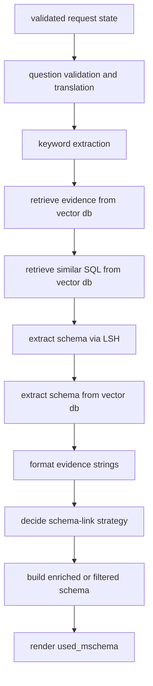
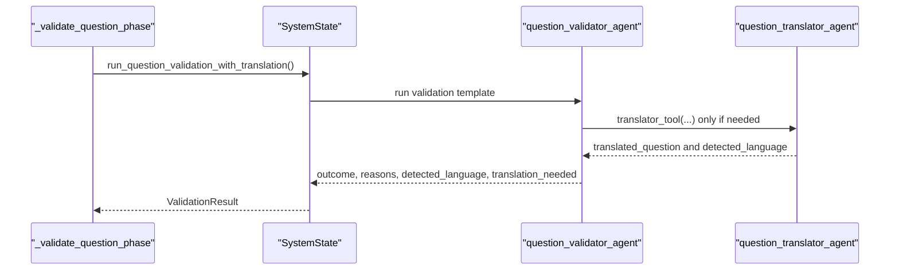
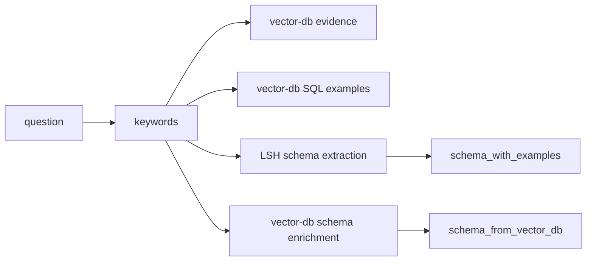
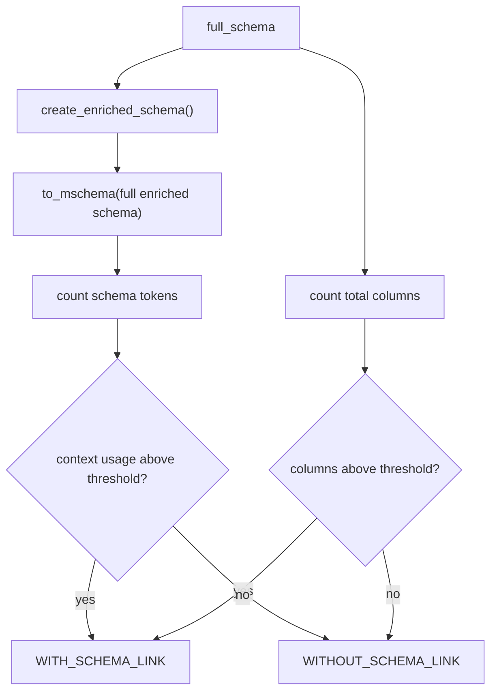
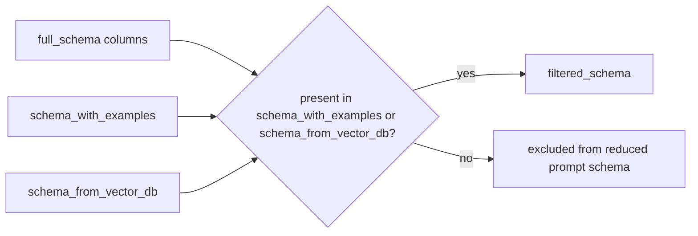

# Preprocessing And Schema Linking

This page covers the part of the pipeline that transforms a raw user question into a generation-ready prompt context.

The main modules are:

- `helpers/main_helpers/main_preprocessing_phases.py`
- `model/system_state.py`
- `helpers/main_helpers/main_schema_link_strategy.py`
- `helpers/main_helpers/main_generate_mschema.py`

## Preprocessing Flow

## 1. Validation And Translation

The validation phase is `_validate_question_phase()`, but the core logic lives in `SystemState.run_question_validation_with_translation()`.

### Why the validator owns translation

The runtime does not run a blind language-detection step followed by a separate translation step.
Instead:

1. the validator agent is the control point
2. the translator is registered as a tool on the validator
3. the validator decides whether translation is needed

This keeps these concerns under one decision surface:

- language detection
- out-of-scope detection
- meaningless or malformed question rejection
- optional translation to the workspace language

## Validation Sequence

### Tool registration behavior

`run_question_validation_with_translation()` checks whether `translator_tool` is already registered on the validator.
If not, it registers the tool dynamically.

That avoids duplicate tool registration across requests and makes the validator-tool relationship explicit in the code.

### State mutations after validation

If translation happened:

- `state.translated_question` is filled
- `state.submitted_question` becomes the translated text

If translation did not happen:

- `state.submitted_question` remains the original question

If validation fails:

- the function yields a structured validation failure
- no keyword extraction or retrieval is attempted

## 2. Keyword Extraction

Keyword extraction is handled by `_extract_keywords_phase()`.

This phase is strict by design:

- it records phase timings on `ExecutionState`
- it requires `keyword_extraction_agent`
- it stores the output in `state.keywords`

If the keyword extraction agent is missing, the phase returns a critical error and stops the request.

### Why the runtime treats it as mandatory

Downstream retrieval depends on `state.keywords` for:

- evidence search
- similar SQL search
- schema extraction via LSH
- vector-db schema enrichment

Without keywords, the runtime would have no reliable retrieval anchor.

## 3. Evidence And Similar SQL Retrieval

The first retrieval step inside `_retrieve_context_phase()` is vector-db based:

- `state.get_evidence_from_vector_db()`
- `state.get_sql_from_vector_db()`

These calls populate the semantic context with:

- short evidence items
- prior question-SQL-example material
- SQL documents that are later turned into few-shot prompt blocks

### Failure handling

The vector-db retrieval logic is partially degradable:

- if `vdbmanager` itself is missing, the request fails hard
- if evidence or SQL retrieval fail while `vdbmanager` exists, the phase emits warnings and continues

That distinction is important:

- service absence is treated as critical
- partial retrieval failure is treated as a quality degradation

## 4. LSH-Based Schema Extraction

`state.extract_schema_via_lsh()` is treated as a critical step.

Its role is to recover high-signal schema fragments before prompt construction by combining:

- lexical similarity
- approximate matching
- example-value retrieval

The resulting artefacts are written into:

- `state.similar_columns`
- `state.schema_with_examples`

## Retrieval Sources

### Why LSH is critical

The runtime comments call it "VITAL, not optional" for a reason.
This is the phase that injects example values into the schema context, and those examples often carry the business vocabulary that the raw schema alone does not express clearly.

If this step raises an exception, `_retrieve_context_phase()` aborts the request.

## 5. Vector-DB Schema Enrichment

`state.extract_schema_from_vectordb()` is the semantic counterpart to LSH extraction.

Its typical contribution is:

- column descriptions
- semantic hints for already relevant schema elements

Unlike LSH extraction, this step is not treated as fatal.
If it fails, the runtime logs a warning, resets `state.schema_from_vector_db` to `{}`, and continues.

## 6. Evidence Formatting

After retrieval, `_retrieve_context_phase()` normalizes evidence into two string forms:

- `state.semantic.evidence_for_template`
- `state.evidence_str`

These are the values that later get injected into prompt templates.

That means the retrieval layer is responsible not only for fetching evidence objects, but also for converting them into a generator-ready textual representation.

## 7. Exact Schema-Link Strategy

The decision point lives in `main_schema_link_strategy.py::decide_schema_link_strategy(state)`.

Its job is to decide whether the full enriched schema is still feasible for prompting or whether the runtime needs schema reduction.

### Decision inputs

The function evaluates two separate pressure signals:

1. the token cost of the full enriched schema
2. the total number of columns in `full_schema`

It then compares those signals against workspace-level settings:

- `max_columns_before_schema_linking`
- `max_context_usage_before_linking`

It also needs the model context window, which is resolved by `_get_model_context_window(state)`.

## Strategy Decision

### What the two outputs mean

- `WITHOUT_SCHEMA_LINK`: the runtime keeps the full enriched schema
- `WITH_SCHEMA_LINK`: the runtime builds a reduced schema before generation

For large databases, the current implementation solves complexity through schema reduction, not by adding a separate full-context generation branch.

## 8. Enriched Schema Path

If the decision is `WITHOUT_SCHEMA_LINK`, `_retrieve_context_phase()` does this:

1. `state.create_enriched_schema()`
2. `to_mschema(state.enriched_schema)`
3. `state.full_mschema = ...`
4. `state.used_mschema = state.full_mschema`

`create_enriched_schema()` copies the entire `full_schema` and merges example data from `schema_with_examples` where available.

This path preserves the full relational surface while augmenting it with retrieved examples.

## 9. Filtered Schema Path

If the decision is `WITH_SCHEMA_LINK`, `_retrieve_context_phase()` executes:

1. `state.create_filtered_schema()`
2. `to_mschema(state.filtered_schema)`
3. `state.reduced_mschema = ...`
4. `state.used_mschema = state.reduced_mschema`

### Important runtime detail

There are two filtered-schema implementations in the repository, but the live orchestration path uses `SystemState.create_filtered_schema()`.

That method keeps columns that appear in the union of:

- `schema_with_examples`
- `schema_from_vector_db`

and then merges:

- examples from the LSH path
- column descriptions from the vector-db path

## Filtered Schema Construction

### Developer note on helper overlap

`helpers/main_helpers/main_generate_mschema.py` also contains a standalone `create_filtered_schema(...)` helper with slightly different inclusion semantics.
If you need to understand live behavior, prioritize the `SystemState` method because that is the method invoked by `_retrieve_context_phase()`.

## 10. `mschema` Rendering

The prompt does not receive raw JSON schema.
It receives an LLM-facing text representation built by `to_mschema(...)`.

`to_mschema(...)` renders:

- a `【Schema】` section
- `CREATE TABLE` style blocks
- inline primary-key markers
- column descriptions or value descriptions
- example values
- a `【Foreign keys】` section when FK metadata is available

This representation is deliberately halfway between DDL and documentation.
It is structured enough for SQL reasoning, but smaller and more legible than raw metadata dumps.

## Practical Summary

From a developer perspective, preprocessing is the phase where the system decides what the model is actually allowed to know.

It:

- validates and possibly translates the question
- turns the question into retrieval keys
- retrieves evidence and prior SQL material
- narrows and enriches the schema
- chooses between full and reduced schema context
- serializes the final prompt schema into `used_mschema`

Everything after this phase is generation and evaluation over the context that preprocessing assembled.
