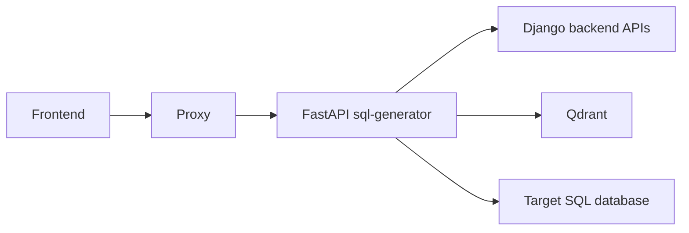
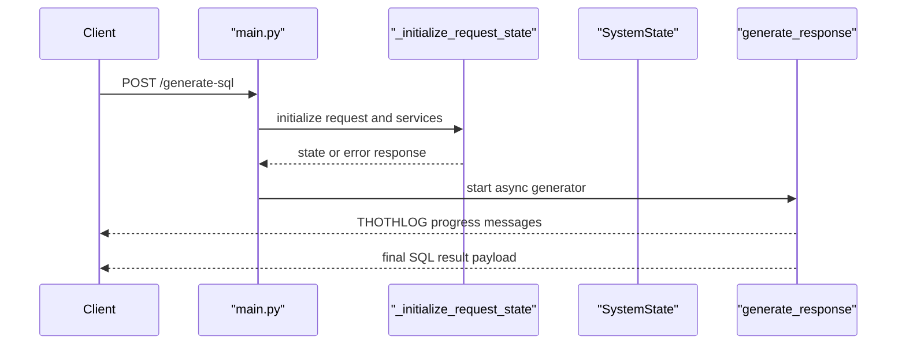
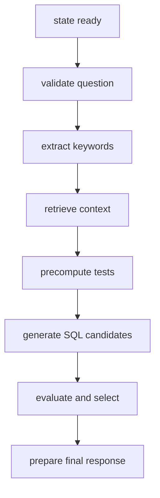

# Runtime Entry Points

This page describes how a request enters the SQL Generator and how the orchestration layer builds the initial execution state before any retrieval or LLM generation happens.

The canonical entrypoint is `frontend/sql_generator/main.py`.

## Top-Level Services

## What `main.py` Owns

`main.py` does more than expose an HTTP route.
It is responsible for:

- loading environment variables
- configuring logging and optional Logfire instrumentation
- validating the runtime environment
- creating the FastAPI application
- defining the `GenerateSQLRequest` and response models
- exposing `/health`
- orchestrating `/generate-sql` through a streaming generator

## Request Contract

The public request shape is defined by `GenerateSQLRequest`:

- `question`
- `workspace_id`
- `functionality_level`
- `flags`

The route itself is intentionally thin.
It delegates almost all nontrivial work to helper modules once the request enters the service.

## Entry Sequence

## `_initialize_request_state()` In Detail

The first hard boundary is `helpers/main_helpers/main_request_initialization.py::_initialize_request_state()`.

This helper performs four different jobs that are easy to miss if you only read `main.py`:

1. It normalizes user input into context objects.
2. It resolves workspace-bound external services.
3. It reconstructs `SystemState` with populated service and database contexts.
4. It enforces infrastructure readiness before the pipeline starts.

### Step 1: Build request and database contexts

The function imports `RequestContext` and `DatabaseContext` lazily, then:

- uppercases `request.functionality_level`
- stores the original question in both `question` and `original_question`
- reads `X-Username` from the HTTP headers
- seeds an empty `DatabaseContext`

This is the point where the request contract becomes strongly typed.
The validation of `functionality_level` is later enforced by `RequestContext`, not by the FastAPI route itself.

### Step 2: Build an initial `SystemState`

Before services are resolved, the helper creates a provisional `SystemState` containing:

- the request context
- an empty database context
- empty semantic, schema, generation, and execution contexts
- `submitted_question` equal to the original user question

That first `SystemState` exists only to give the setup phase a coherent object model.

### Step 3: Resolve workspace resources

The helper then calls `_setup_dbmanager_and_agents(request.workspace_id, request)`.

That call is the real bootstrap point for:

- workspace configuration
- SQL database manager
- vector database manager
- `ThothAgentManager`
- SQL database metadata used later in prompt construction

If setup fails, the function returns a `PlainTextResponse` immediately and the route never starts streaming.

### Step 4: Rebuild `SystemState` with populated services

After setup, `_initialize_request_state()` does not mutate the provisional `SystemState` in place.
It rebuilds the state using:

- an updated `RequestContext` carrying `workspace_name`, `scope`, and `language`
- an updated `DatabaseContext` carrying `dbmanager` and `treat_empty_result_as_error`
- an `ExternalServices` context carrying `vdbmanager`, `agents_and_tools`, workspace config, and filtered UI flags

That matters because the second `SystemState` is the one that all later phases consume.

## Initialization Dataflow

```mermaid
flowchart TD
    A["GenerateSQLRequest"] --> B["RequestContext"]
    A --> C["DatabaseContext"]
    B --> D["Provisional SystemState"]
    C --> D
    D --> E["_setup_dbmanager_and_agents"]
    E --> F["workspace_config"]
    E --> G["dbmanager"]
    E --> H["vdbmanager"]
    E --> I["agent_manager"]
    F --> J["Updated RequestContext"]
    G --> K["Updated DatabaseContext"]
    H --> L["ExternalServices"]
    I --> L
    J --> M["Final SystemState"]
    K --> M
    L --> M
```

## Flag Filtering

`_filter_ui_flags()` is a small but important boundary.
It strips backend-technical flags and persists only the UI-facing flags that are meant to survive in `ExternalServices.request_flags`:

- `show_sql`
- `explain_generated_query`
- `treat_empty_result_as_error`
- `belt_and_suspenders`

This keeps the request state from silently persisting transport noise that should not influence downstream phases.

## Infrastructure Readiness Gates

After rebuilding `SystemState`, `_initialize_request_state()` performs two critical checks.

### Manager validation

It checks `dbmanager_status` and `vdbmanager_status` through `_is_positive(...)`.
If one of them is not healthy, the helper emits a diagnostic error response and stops the request.

### Schema retrieval

It then calls `get_db_schema(state.dbmanager.db_id, state.dbmanager.schema)`.
If the schema is missing or empty, the function returns a hard failure.

This is a deliberate design choice:

- setup errors are treated as infrastructure errors
- schema absence is treated as a hard blocker
- model orchestration is never attempted without an authoritative `full_schema`

## The Streaming Orchestrator

Once initialization succeeds, `generate_sql()` defines `generate_response()`.
That async generator is the runtime conductor for the pipeline phases.

Its phase list is:

1. question validation
2. keyword extraction
3. context retrieval
4. test precomputation
5. SQL generation

Evaluation and final response preparation happen after that phase list through dedicated helpers.

## Phase Orchestration Model

Each phase is implemented as an async generator or coroutine that works against the same `SystemState`.
The route streams progress messages such as `THOTHLOG`, warnings, or critical errors while those phases mutate the state.

## Developer Notes

There are a few implementation details worth remembering when debugging entrypoint behavior:

- `SESSION_CACHE` exists in `main.py`, but `_initialize_request_state()` currently calls setup directly rather than using cache-backed state reuse.
- request normalization happens before workspace lookup, so malformed `functionality_level` values fail at the context layer rather than the routing layer.
- the first authoritative schema load happens during initialization, not during retrieval.
- all later pages in this developer section assume that initialization completed successfully and that `state.full_schema` is already populated.
