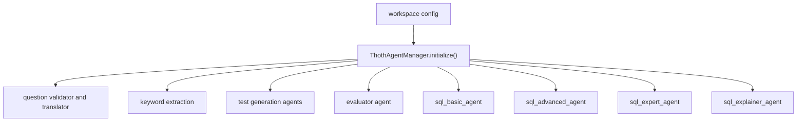
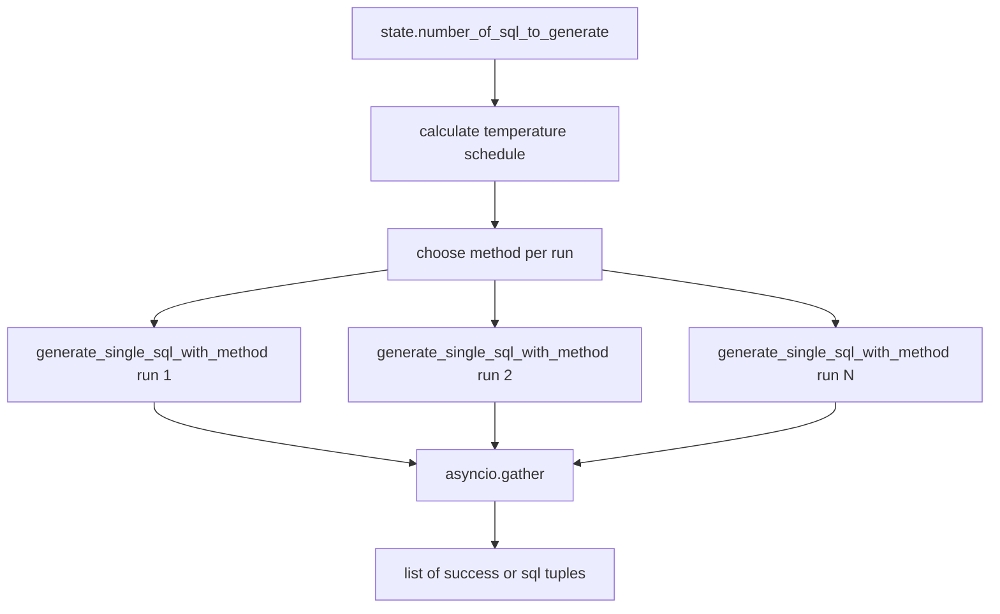
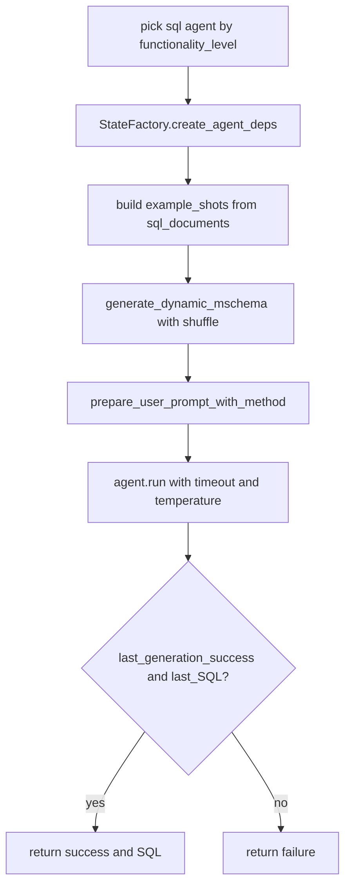
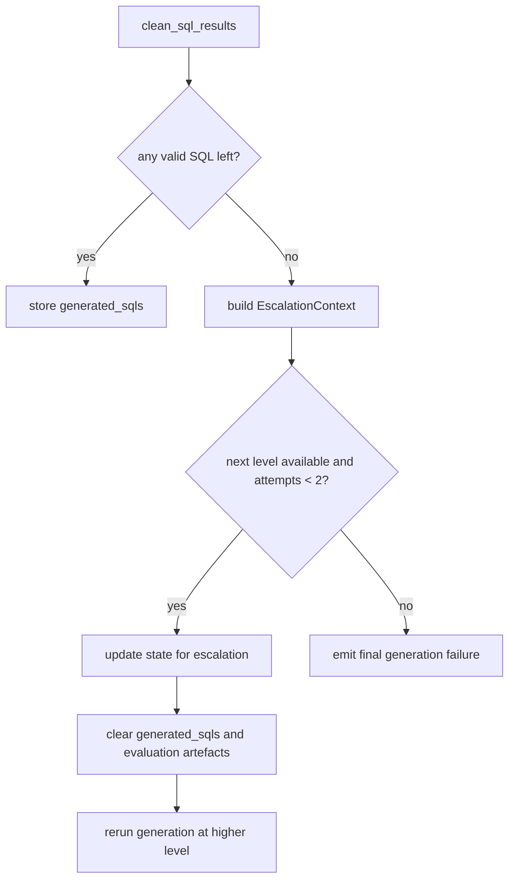

# SQL Generation And Escalation

This page documents how the runtime turns `used_mschema`, evidence, and prior SQL examples into multiple candidate SQL statements, and how it escalates when generation completely fails.

The main modules are:

- `agents/core/agent_manager.py`
- `helpers/main_helpers/main_sql_generation.py`
- `helpers/main_helpers/main_generation_phases.py`
- `helpers/main_helpers/escalation_manager.py`

## 1. Agent Initialization

The live agent factory is `ThothAgentManager`.

It creates one configured agent per active role:

- `question_validator_agent`
- `question_translator_agent`
- `keyword_extraction_agent`
- `test_gen_agent_1`, `test_gen_agent_2`, `test_gen_agent_3`
- `evaluator_agent`
- `sql_basic_agent`
- `sql_advanced_agent`
- `sql_expert_agent`
- `sql_explainer_agent`

The current runtime does not build a monolithic SQL pool and then choose arbitrarily.
It creates explicit named agents for each functionality level.

## Agent Construction Map

## 2. Generation Phase Boundary

The orchestration entrypoint for candidate generation is `_generate_sql_candidates_phase()`.

This phase:

- emits observability messages about evidence-critical tests
- records timing in `ExecutionState`
- calls `generate_sql_units(...)`
- cleans and deduplicates the results
- decides whether escalation is needed if no valid SQL survives

## 3. Candidate Fan-Out Strategy

`generate_sql_units(...)` is where the runtime creates diversity.

It does not ask one model for one query.
It fans out multiple runs over the same functionality level.

### Diversity dimensions

The function varies generation across three axes:

1. functionality level
2. method template
3. temperature

### Functionality level to agent mapping

- `BASIC` -> `sql_basic_agent`
- `ADVANCED` -> `sql_advanced_agent`
- `EXPERT` -> `sql_expert_agent`

### Prompt methodologies

The function rotates these methods in round-robin order:

- `query_plan`
- `step_by_step`
- `divide_and_conquer`

### Temperature strategy

The code computes temperature values in three bands:

- low: `0.1`, `0.2`, `0.3`
- medium: `0.5`, `0.6`, `0.7`
- high: `0.8`, `0.9`, `1.0`

This is not random noise.
It is an explicit attempt to create controlled candidate diversity.

## Parallel Generation Pattern

## 4. Prompt Construction

Every single SQL run goes through `generate_single_sql_with_method(...)`.

This function builds a user prompt from:

- `state.question`
- database type from `dbmanager`
- a dynamic `mschema`
- directives
- evidence string
- few-shot SQL examples from `sql_documents`
- the chosen generation method

### Method-specific templates

`prepare_user_prompt_with_method(...)` maps the selected method to a dedicated template file:

- `template_generate_sql_query_plan.txt`
- `template_generate_sql_step_by_step.txt`
- `template_generate_sql_divide_and_conquer.txt`

It also injects explicit NULL-handling rules depending on the target database type.

### Why that matters

Prompt diversity in this runtime is not only "temperature diversity".
It is also template diversity, with method-specific reasoning instructions.

## 5. Dynamic `mschema` During Generation

Generation uses `generate_dynamic_mschema(state, apply_shuffle=True)`.

That means each candidate can receive:

- the full enriched schema or the filtered schema, depending on `state.schema_link_strategy`
- a shuffled ordering of tables and columns

The shuffle is deliberate: it adds another small source of diversity without changing the actual schema content.

## Per-Run Generation Logic

## 6. Lightweight Dependencies And Telemetry Flush

`generate_single_sql_with_method(...)` creates `sql_deps` through `StateFactory.create_agent_deps(state, "sql_generation")`.

Those deps are not throwaway plumbing.
They carry transient per-run fields such as:

- `last_generation_success`
- `last_SQL`
- retry history
- relevance guard events
- model retry events

At the end of each run, `flush_validator_telemetry()` moves those signals back into `SystemState`.

That means the runtime preserves per-run guardrail telemetry even though generation is parallelized.

## 7. Timeout And Failure Semantics

Each agent run is wrapped by `asyncio.wait_for(...)`.

If a run times out:

- that run returns `(False, "")`
- the rest of the batch can still continue

If the model raises `UnexpectedModelBehavior`, the code treats it as a critical resource failure and returns a special `CRITICAL_DB_ERROR` marker.

This marker is later surfaced by cleanup logic as a database-level failure mode rather than a normal bad candidate.

## 8. Result Cleanup

After `generate_sql_units(...)` finishes, `_generate_sql_candidates_phase()` calls `clean_sql_results(...)`.

That helper:

- extracts SQL from `(success, sql)` tuples
- removes failed runs
- removes `GENERATION FAILED`
- strips duplicates
- preserves a special `CRITICAL_DATABASE_ERROR` signal when all runs failed because of database or resource issues

This is the point where the batch becomes a clean list of unique SQL candidates.

## 9. Escalation When No SQL Exists

If cleanup yields no valid SQL, `_generate_sql_candidates_phase()` does not fail immediately.
It may escalate to a higher functionality level.

The escalation path uses:

- `GeneratorType`
- `EscalationManager`
- `EscalationContext`

### Escalation chain

- `BASIC -> ADVANCED`
- `ADVANCED -> EXPERT`

The phase increments `state.escalation_attempts`, writes `state.escalation_context`, clears prior generation artefacts, updates `request.functionality_level`, and recursively re-enters `_generate_sql_candidates_phase()`.

## Escalation On Generation Failure

## 10. What This Means For Developers

The generation phase is not a single-model pipeline.
It is a controlled search process over:

- one selected functionality tier
- multiple reasoning templates
- multiple temperatures
- multiple shuffled schema renderings

Escalation only happens when no valid SQL survives generation.
If valid SQL exists but later fails evaluation, escalation is handled by the evaluation phase, not here.
