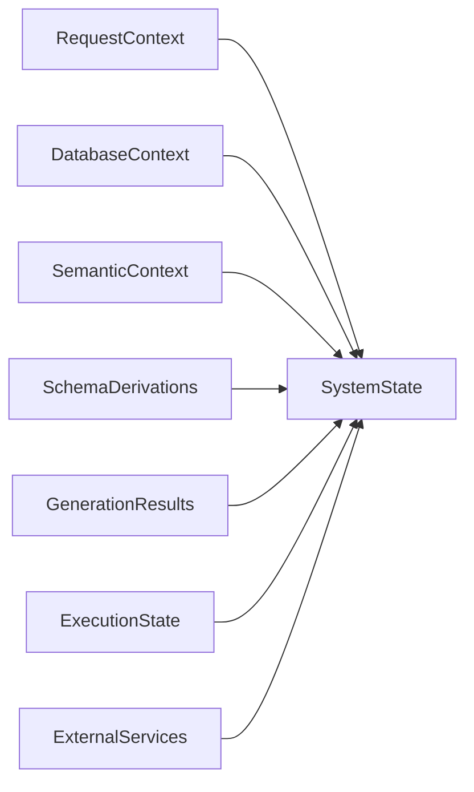
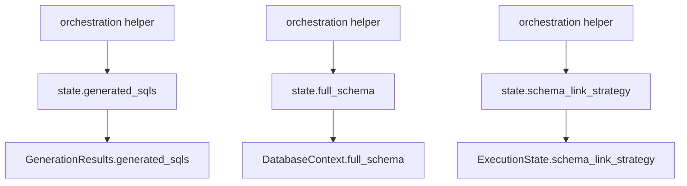

# System State And Contexts

`SystemState` is the center of the SQL Generator runtime.
The important design choice is that it is not a flat bag of fields anymore: it is a coordinator over smaller context objects, exposed through bridge properties for backward compatibility.

The main implementation is in `frontend/sql_generator/model/system_state.py`.

## Context Decomposition

## Why The Decomposition Matters

The runtime still reads like a classic mutable state machine, but the data is grouped by concern:

- request identity and user intent
- database configuration and authoritative schema
- retrieval artefacts such as keywords, evidence, and SQL examples
- derived schemas and `mschema` variants
- generated tests and SQL candidates
- execution telemetry, timings, statuses, and escalation metadata
- external service handles such as `dbmanager`, `vdbmanager`, and the agent manager

That decomposition lets the orchestration helpers mutate state without having to know where every field is physically stored.

## What Each Context Owns

### `RequestContext`

Owns the data that identifies the request:

- question
- original question
- username
- workspace id and name
- functionality level
- target language
- scope
- original language when translation happened

It validates that `functionality_level` is one of `BASIC`, `ADVANCED`, or `EXPERT`.

### `DatabaseContext`

Owns authoritative database information and database behavior flags:

- `full_schema`
- `dbmanager`
- directives
- `treat_empty_result_as_error`

### `SemanticContext`

Owns retrieval-time semantic artefacts:

- keywords
- evidence
- formatted evidence for prompt templates
- SQL shots
- SQL documents

### `SchemaDerivations`

Owns the schema variants generated during preprocessing:

- `similar_columns`
- `schema_with_examples`
- `schema_from_vector_db`
- `enriched_schema`
- `filtered_schema`
- `full_mschema`
- `reduced_mschema`
- `used_mschema`

### `GenerationResults`

Owns intermediate and final generation artefacts:

- generated SQL candidates
- generated tests
- serialized JSON forms of both
- evaluation results

### `ExecutionState`

Owns runtime metadata:

- timings for every major phase
- `schema_link_strategy`
- `available_context_tokens`
- `full_schema_tokens_count`
- final SQL status
- evaluation case
- escalation attempts and flags
- failure messages
- telemetry for retries and relevance-guard events

### `ExternalServices`

Owns integration handles and workspace-level settings:

- `vdbmanager`
- `agents_and_tools`
- SQL database config
- workspace config
- `number_of_tests_to_generate`
- `number_of_sql_to_generate`
- filtered request flags

## Property Bridges

The most important implementation detail is that `SystemState` exposes bridge properties.

Examples:

- `state.question` maps to `submitted_question`
- `state.full_schema` maps to `database.full_schema`
- `state.keywords` maps to `semantic.keywords`
- `state.filtered_schema` maps to `schemas.filtered_schema`
- `state.generated_sqls` maps to `generation.generated_sqls`
- `state.schema_link_strategy` maps to `execution.schema_link_strategy`
- `state.vdbmanager` maps to `services.vdbmanager`

This keeps older helper code readable while still using a structured internal model.

## Bridge Model

## Mutable Vs Immutable Data

The runtime treats different parts of the state differently.

### Mostly stable after initialization

- `workspace_id`
- `workspace_name`
- `scope`
- `language`
- `dbmanager`
- `vdbmanager`
- `full_schema`

### Mutated repeatedly during the pipeline

- `submitted_question`
- `translated_question`
- `keywords`
- `schema_with_examples`
- `schema_from_vector_db`
- `enriched_schema`
- `filtered_schema`
- `used_mschema`
- `generated_tests`
- `generated_sqls`
- `evaluation_results`
- execution timing fields
- escalation fields

## State Mutation Timeline

```mermaid
flowchart LR
    INIT["initialization"] --> Q["question or translated_question"]
    Q --> K["keywords"]
    K --> RET["evidence, sql_documents, schema fragments"]
    RET --> SCH["enriched_schema or filtered_schema"]
    SCH --> MS["used_mschema"]
    MS --> SQL["generated_sqls"]
    SQL --> TEST["generated_tests"]
    TEST --> EVAL["evaluation_results and selection_metrics"]
    EVAL --> FINAL["execution.sql_status and last_SQL"]
```

## `submitted_question` Is The Working Question

This is a subtle but important behavior.

- `RequestContext.question` captures the request payload as received.
- `submitted_question` is the working text the pipeline should use.
- `state.question` is just a bridge to `submitted_question`.

When translation happens, the runtime does not rewrite the original request object blindly.
It updates `state.translated_question` and then sets `state.submitted_question` to the translated value.

That is why most later phases read `state.question` rather than `state.request.question`.

## Schema Operations Live On `SystemState`

The orchestration layer calls methods such as:

- `create_enriched_schema()`
- `create_filtered_schema()`
- `extract_schema_via_lsh()`
- `extract_schema_from_vectordb()`
- `run_question_validation_with_translation()`

That means `SystemState` is not only storage.
It is also the facade through which orchestration helpers trigger domain logic.

## Important Developer Caveat

There are two different implementations of filtered-schema logic in the codebase:

- `SystemState.create_filtered_schema()`
- `helpers/main_helpers/main_generate_mschema.py::create_filtered_schema(...)`

The runtime path in `_retrieve_context_phase()` calls `state.create_filtered_schema()`.
If you are debugging actual behavior, use the `SystemState` method as the source of truth for the live orchestration path.

## ExecutionState Is Not Just Logging

It is easy to treat `ExecutionState` as passive telemetry, but the code uses it actively for control and observability:

- timing metrics are written during each phase
- schema-link strategy is persisted there
- escalation attempts are counted there
- SQL status is finalized there
- model retry and relevance-guard events are accumulated there

This means `ExecutionState` is part of the behavior contract, not just reporting.

## Practical Debugging Heuristic

When the runtime behaves unexpectedly, first ask which context should have been mutated by the previous phase.

For example:

- missing retrieval quality usually means `SemanticContext` or `SchemaDerivations` did not get populated
- missing SQL candidates usually means `GenerationResults` never received valid `generated_sqls`
- wrong final status usually means `ExecutionState` was finalized with the wrong selection or escalation data

That approach is usually faster than reading the pipeline linearly from top to bottom.
