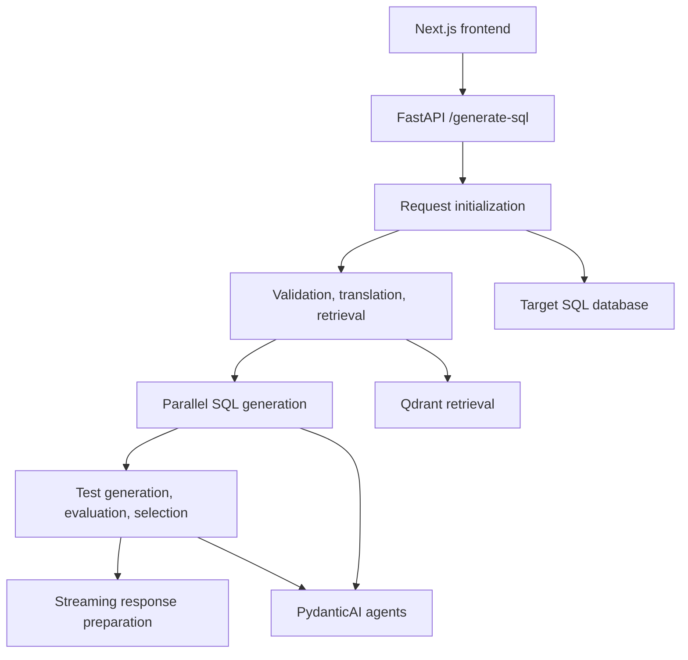
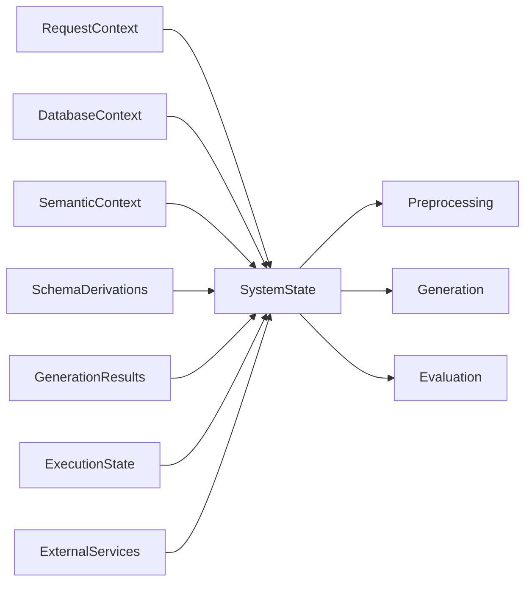

# Developer View

This section is the code-first map of the current SQL Generator runtime.

It documents only the implementation that exists in the active codebase. The runtime contract exposed by `RequestContext` is limited to `BASIC`, `ADVANCED`, and `EXPERT`, and the developer documentation below is organized around the Python modules that actually execute the pipeline.

## What This Section Covers

The developer section is split into pages that mirror the real runtime boundaries:

- [Runtime Entry Points](developer-pipeline/runtime-entrypoints.md): FastAPI startup, request models, `_initialize_request_state()`, and the streaming orchestrator in `main.py`
- [System State And Contexts](developer-pipeline/system-state-and-contexts.md): the decomposition of `SystemState` into request, database, semantic, schema, generation, execution, and services contexts
- [Preprocessing And Schema Linking](developer-pipeline/preprocessing-and-schema-linking.md): validation, translation, keyword extraction, evidence retrieval, LSH, vector-db enrichment, and schema reduction
- [SQL Generation And Escalation](developer-pipeline/sql-generation-and-escalation.md): agent initialization, prompt construction, candidate fan-out, cleanup, and escalation when no valid SQL is produced
- [Evaluation And Selection](developer-pipeline/evaluation-and-selection.md): precomputed tests, evaluation, `TestReducer`, scoring, final selection, and escalation after failed evaluation

## Runtime Map

## Code Reading Order

If you want to understand the pipeline in the same order as the runtime:

1. `frontend/sql_generator/main.py`
2. `frontend/sql_generator/helpers/main_helpers/main_request_initialization.py`
3. `frontend/sql_generator/model/system_state.py`
4. `frontend/sql_generator/helpers/main_helpers/main_preprocessing_phases.py`
5. `frontend/sql_generator/helpers/main_helpers/main_schema_link_strategy.py`
6. `frontend/sql_generator/helpers/main_helpers/main_sql_generation.py`
7. `frontend/sql_generator/helpers/main_helpers/main_generation_phases.py`
8. `frontend/sql_generator/helpers/main_helpers/main_test_generation.py`
9. `frontend/sql_generator/helpers/main_helpers/main_evaluation.py`
10. `frontend/sql_generator/helpers/main_helpers/sql_selection.py`

## Why The Documentation Is Split This Way

The pipeline is not a single LLM prompt wrapped by a web endpoint.
It is a staged execution engine that:

- constructs a validated `SystemState`
- mutates different context objects as the request advances
- retrieves evidence and schema fragments before prompt construction
- generates multiple SQL candidates in parallel with diversified prompting
- builds tests before and during evaluation
- selects or rejects SQL using explicit pass-rate logic

That makes a single page hard to use for development work.
The pages below therefore separate the concerns in the same way the codebase does.

## State-Centric View

## Practical Reading Paths

Use these paths depending on what you are changing:

- If you are debugging startup, request validation, or workspace bootstrapping, start from [Runtime Entry Points](developer-pipeline/runtime-entrypoints.md).
- If you are tracing why a question was translated, rejected, or linked to the wrong schema, start from [Preprocessing And Schema Linking](developer-pipeline/preprocessing-and-schema-linking.md).
- If you are tuning candidate diversity or escalation behavior, start from [SQL Generation And Escalation](developer-pipeline/sql-generation-and-escalation.md).
- If you are changing evaluation thresholds, SQL ranking, or test reduction, start from [Evaluation And Selection](developer-pipeline/evaluation-and-selection.md).

## Important Scope Note

The developer pages are intentionally literal about the implementation.
When two helper modules expose similar concepts, the docs call out which code path is actually executed by the runtime so that a developer can distinguish:

- canonical orchestration paths
- helper utilities that are available but not necessarily invoked by `main.py`
- state mutations that are required for later phases to work
