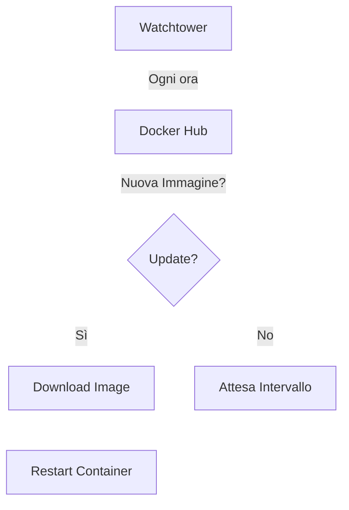

# Aggiornamenti Automatici (Watchtower)

Questa guida spiega come configurare **Watchtower** per mantenere ThothAI automaticamente aggiornato all'ultima versione delle immagini Docker.

## 1. Come Funziona
Watchtower è un container che monitora i container in esecuzione. Quando rileva che su Docker Hub (o altro registry) è disponibile una nuova immagine con lo stesso tag (es. `:latest`), scarica la nuova immagine e riavvia il container in modo trasparente.



## 2. Configurazione su Docker Locale (Standalone)

Per abilitare gli aggiornamenti automatici per i container ThothAI:

1.  Aggiungi il servizio Watchtower al tuo `docker-compose.yml` (opzionale) oppure avvialo come container separato.
2.  Comando rapido per avviare Watchtower monitorando **solo** i container ThothAI (tramite label o nomi):

```bash
docker run -d \
  --name watchtower \
  -v /var/run/docker.sock:/var/run/docker.sock \
  containrrr/watchtower \
  --interval 3600 \
  --cleanup \
  thoth-backend thoth-frontend thoth-sql-generator thoth-proxy thoth-mermaid-service
```
*   `--interval 3600`: Controlla ogni ora.
*   `--cleanup`: Rimuove le vecchie immagini dopo l'aggiornamento.
*   Lista finale: Nomi dei container da monitorare.

## 3. Configurazione su Docker Swarm

Su Swarm, Watchtower deve essere deployato come servizio globale o sul manager, e configurato per aggiornare i servizi dello stack.

Esempio di aggiunta al `docker-stack.yml` (o stack separato di monitoraggio):

```yaml
services:
  watchtower:
    image: containrrr/watchtower
    volumes:
      - /var/run/docker.sock:/var/run/docker.sock
    command: --interval 300 --cleanup --label-enable
    deploy:
      mode: global
```

**Nota:** Con `--label-enable`, Watchtower aggiornerà solo i container che hanno la label `com.centurylinklabs.watchtower.enable=true`. Dovrai aggiungere questa label ai servizi Thoth nel `docker-stack.yml`.

In alternativa, per semplicità su Swarm, si consiglia spesso di gestire gli aggiornamenti tramite pipeline CI/CD o script di deploy manuale controllato (`install-swarm.sh`), per evitare riavvii imprevisti in produzione.

## 4. Verifica

Per controllare i log di Watchtower e vedere se sta aggiornando:
```bash
docker logs -f watchtower
```
