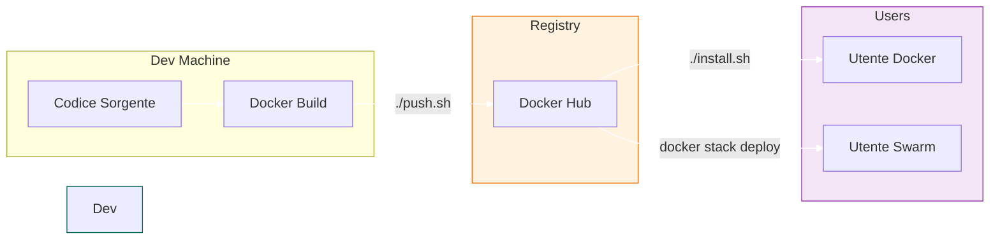

# Guida Build e Pubblicazione (Sviluppatore)

Questa guida è destinata allo **Sviluppatore** o **Release Manager** che deve creare le immagini Docker di ThothAI e pubblicarle su Docker Hub affinché gli utenti possano installarle.

## 1. Prerequisiti

*   Account Docker Hub.
*   Accesso di scrittura al repository (es. `tylconsulting/thoth-backend`).
*   Login effettuato:
    ```bash
    docker login
    ```

## 2. Script di Pubblicazione

Abbiamo predisposto lo script `push.sh` che automatizza l'intero processo di compilazione (build), tagging e upload (push).

### Utilizzo

```bash
./push.sh <REGISTRY_URL> <VERSION> [OPTIONS]
```

*   `REGISTRY_URL`: Il tuo username o URL del registry (es. `tylconsulting`).
*   `VERSION`: Il tag della versione (es. `1.0.2` o `beta`). Lo script taggherà anche come `latest`.

### Esempio Rapido

```bash
# Compila e pubblica la versione 0.5.0 sul namespace tylconsulting
./push.sh tylconsulting 0.5.0
```

## 3. Workflow Tipico di Rilascio

1.  **Test Locale:** Verifica che tutto funzioni con `docker-compose-local.yml` o build locale.
2.  **Commit & Tag Git:**
    ```bash
    git commit -m "Release 0.5.0"
    git tag v0.5.0
    git push origin --tags
    ```
3.  **Build & Push Docker:**
    ```bash
    ./push.sh tylconsulting 0.5.0 --no-cache
    ```
4.  **Verifica:** Controlla su Docker Hub che le immagini siano aggiornate.
5.  **Annuncio:** Gli utenti possono ora aggiornare eseguendo il loro `install.sh`.



## 4. Dettagli sullo Script

Lo script `push.sh`:
*   Legge i `Dockerfile` predefiniti.
*   Costruisce le immagini per: `backend`, `frontend`, `sql-generator`, `proxy`, `mermaid-service`.
*   Esegue il `docker push` sia del tag specifico che di `latest`.
*   Gestisce il re-tagging dell'immagine `qdrant` ufficiale per coerenza (opzionale).
