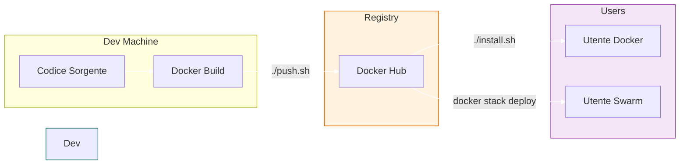

# Guida Build e Pubblicazione (Sviluppatore)

Questa guida è destinata allo **Sviluppatore** o **Release Manager** che deve creare le immagini Docker di ThothAI e pubblicarle su Docker Hub affinché gli utenti possano installarle.

## 1. Prerequisiti

*   **Account Docker Hub:** Devi avere un account su [Docker Hub](https://hub.docker.com/). Se non ne hai uno, registrati gratuitamente su https://hub.docker.com/signup.
*   **Accesso di scrittura al repository:** Devi avere i permessi di scrittura sul repository dove pubblicherai le immagini (es. `tylconsulting/thoth-backend`).
*   **Login effettuato:**
    ```bash
    docker login
    ```

### Come funziona `docker login`

Il comando `docker login` autentica il tuo ambiente locale con Docker Hub. Ecco cosa succede:

1. **Dove avviene il login:** Il login avviene nel tuo terminale locale, non su Docker Hub direttamente.
2. **Autenticazione:** Quando esegui `docker login`, Docker ti chiederà di inserire:
   - Il tuo **username** Docker Hub (o indirizzo email per account più recenti)
   - La tua **password** (o un **Access Token** se hai abilitato l'autenticazione a due fattori)
3. **Come funziona:** Dopo un login riuscito, Docker salva le tue credenziali in `~/.docker/config.json` (su Linux/macOS) o `%USERPROFILE%\.docker\config.json` (su Windows). Queste credenziali vengono usate automaticamente quando esegui `docker push` per caricare le immagini.
4. **Access Token vs Password:** Per maggiore sicurezza, Docker consiglia di usare un **Access Token** invece della password. Puoi crearlo su Docker Hub → Account Settings → Security → Access Tokens.

### Persistenza delle credenziali

**Una volta effettuato il login, Docker memorizza le tue credenziali e non ti chiederà più di inserirle.**

Ecco come funziona in dettaglio:

1. **Memorizzazione automatica:** Dopo il primo `docker login`, Docker salva le tue credenziali nel file `~/.docker/config.json` (su Linux/macOS) o `%USERPROFILE%\.docker\config.json` (su Windows).

2. **Login successivi:** Quando esegui nuovamente `docker login` in futuro, Docker userà automaticamente le credenziali memorizzate e non ti chiederà di reinserire username e password/token.

3. **Durata delle credenziali:** Le credenziali rimangono memorizzate finché non effettui esplicitamente il logout con il comando `docker logout`. Questo significa che puoi eseguire più `docker push` senza dover reinserire le credenziali ogni volta.

4. **Applicazione a entrambe le modalità:** Questo comportamento si applica sia all'autenticazione con **password** che con **Access Token**. Una volta memorizzate, entrambe le modalità funzionano allo stesso modo per i login successivi.

5. **Logout:** Se vuoi rimuovere le credenziali memorizzate, esegui:
   ```bash
   docker logout
   ```
   Questo rimuoverà le credenziali dal file di configurazione e il prossimo `docker login` ti richiederà di reinserirle.

### Come accedere a Docker Hub

Per accedere al tuo Docker Hub:
1. Vai su https://hub.docker.com/
2. Fai clic su "Sign In" in alto a destra
3. Inserisci il tuo username e password
4. Una volta loggato, potrai vedere tutti i tuoi repository, le immagini pubblicate e gestire i token di accesso

## 2. Script di Pubblicazione

Abbiamo predisposto lo script `push.sh` che automatizza l'intero processo di compilazione (build), tagging e upload (push).

### Utilizzo

```bash
./push.sh <REGISTRY_URL> <VERSION> [OPTIONS]
```

*   `REGISTRY_URL`: L'URL completo del registry Docker (es. `docker.io/tylconsulting` per Docker Hub, o un registry privato come `registry.example.com/namespace`).
*   `VERSION`: Il tag della versione (es. `1.0.2` o `beta`). Lo script taggherà anche come `latest`.

### Dove trovo il REGISTRY_URL?

Per **Docker Hub**, il `REGISTRY_URL` deve essere nel formato `docker.io/TUO_USERNAME`. Ecco come trovarlo:

1. Accedi al tuo account su https://hub.docker.com/
2. Guarda l'URL nella barra del browser: sarà simile a `https://hub.docker.com/u/TUO_USERNAME/`
3. La parte dopo `/u/` è il tuo username (es. `tylconsulting`)
4. Prependi `docker.io/` al tuo username per ottenere il REGISTRY_URL completo

**Esempi per Docker Hub:**
- Se il tuo username Docker Hub è `mario-rossi`, userai: `./push.sh docker.io/mario-rossi 1.0.0`
- Se il tuo username Docker Hub è `tylconsulting`, userai: `./push.sh docker.io/tylconsulting 1.0.0`

**Nota:** È importante includere `docker.io/` prima del username per Docker Hub, altrimenti Docker cercherà di connettersi a un registry personalizzato con quel nome.

### Come assegnare una versione al progetto

La versione deve seguire lo standard **Semantic Versioning (SemVer)**: `MAJOR.MINOR.PATCH`

**Struttura del numero di versione:**
- **MAJOR** (es. `1` in `1.2.3`): Cambiamenti incompatibili con le versioni precedenti
- **MINOR** (es. `2` in `1.2.3`): Nuove funzionalità retrocompatibili
- **PATCH** (es. `3` in `1.2.3`): Correzioni di bug retrocompatibili

**Esempi di versioni valide:**
- `0.1.0` - Prima release (versione iniziale)
- `0.2.0` - Nuove funzionalità aggiunte (ancora in sviluppo)
- `1.0.0` - Prima release stabile
- `1.0.1` - Fix di bug sulla release stabile
- `1.1.0` - Nuove funzionalità retrocompatibili
- `2.0.0` - Cambiamenti breaking (non retrocompatibili)

**Versioni pre-release (opzionale):**
Puoi aggiungere suffissi per versioni non definitive:
- `1.0.0-alpha` - Versione alpha (test interno)
- `1.0.0-beta` - Versione beta (test pubblico)
- `1.0.0-rc.1` - Release Candidate (pronta per produzione)

**Come scegliere la versione:**
1. Se è la prima volta che pubblichi: inizia con `0.1.0`
2. Se hai solo corretto bug: incrementa PATCH (es. `0.1.0` → `0.1.1`)
3. Se hai aggiunto nuove funzionalità: incrementa MINOR (es. `0.1.0` → `0.2.0`)
4. Se hai modificato l'API in modo incompatibile: incrementa MAJOR (es. `1.0.0` → `2.0.0`)

### Esempio Rapido

```bash
# Compila e pubblica la versione 0.5.0 su Docker Hub con username tylconsulting
./push.sh docker.io/tylconsulting 0.5.0
```

## 3. Workflow Tipico di Rilascio

1.  **Test Locale:** Verifica che tutto funzioni con `docker-compose-local.yml` o build locale.
2.  **Commit & Tag Git:**
    ```bash
    git commit -m "Release 0.5.0"
    git tag v0.5.0
    git push origin --tags
    ```
3.  **Build & Push Docker:**
    ```bash
    ./push.sh docker.io/tylconsulting 0.5.0 --no-cache
    ```
4.  **Verifica:** Controlla su Docker Hub che le immagini siano aggiornate.
5.  **Annuncio:** Gli utenti possono ora aggiornare eseguendo il loro `install.sh`.



## 4. Dettagli sullo Script

Lo script `push.sh`:
*   Legge i `Dockerfile` predefiniti.
*   Costruisce le immagini per: `backend`, `frontend`, `sql-generator`, `proxy`, `mermaid-service`.
*   Esegue il `docker push` sia del tag specifico che di `latest`.
*   Gestisce il re-tagging dell'immagine `qdrant` ufficiale per coerenza (opzionale).

### Devo fare due push (uno con il numero e uno latest), o solo uno?

**Devi eseguire solo un comando!** Lo script `push.sh` gestisce automaticamente entrambi i push:

1. **Primo push:** Carica l'immagine con il tag di versione specificato (es. `docker.io/tylconsulting/thoth-backend:0.5.0`)
2. **Secondo push:** Carica la stessa immagine anche con il tag `latest` (es. `docker.io/tylconsulting/thoth-backend:latest`)

**Perché due tag?**
- Il tag con la versione (es. `0.5.0`) permette agli utenti di usare una versione specifica e stabile
- Il tag `latest` punta sempre alla versione più recente, utile per chi vuole sempre l'ultima versione
- Entrambi i tag puntano alla stessa immagine Docker, quindi non occupano spazio extra

**Esempio pratico:**
```bash
./push.sh docker.io/tylconsulting 0.5.0
```
Questo comando creerà e pubblicherà:
- `docker.io/tylconsulting/thoth-backend:0.5.0`
- `docker.io/tylconsulting/thoth-backend:latest`
- (e lo stesso per frontend, sql-generator, proxy, ecc.)

### Cosa significa "Gestisce il re-tagging dell'immagine qdrant ufficiale per coerenza (opzionale)"?

Questa frase si riferisce a un'operazione opzionale che lo script può eseguire sull'immagine **Qdrant**, che è un database vettoriale open source usato da ThothAI.

**Spiegazione dettagliata:**

1. **Cos'è Qdrant:** Qdrant è un servizio esterno che ThothAI usa come database vettoriale. L'immagine ufficiale è `qdrant/qdrant`.

2. **Perché il re-tagging:** Per coerenza con le altre immagini di ThothAI, lo script può:
    - Scaricare l'immagine ufficiale `qdrant/qdrant:latest`
    - Ri-taggiarla con il tuo namespace (es. `docker.io/tylconsulting/qdrant:latest`)
    - Pubblicarla sul tuo Docker Hub

3. **Vantaggi:**
   - Tutte le immagini usate da ThothAI provengono dallo stesso namespace
   - Gli utenti non devono configurare registry multipli
   - Maggiore controllo sulla versione specifica di Qdrant usata

4. **È opzionale:** Questa operazione non è obbligatoria. Se non viene eseguita, gli utenti useranno direttamente l'immagine ufficiale `qdrant/qdrant` da Docker Hub.

5. **Impatto pratico:**
    - **Con re-tagging:** Gli utenti installeranno `docker.io/tylconsulting/qdrant:latest`
    - **Senza re-tagging:** Gli utenti installeranno `qdrant/qdrant:latest` direttamente

In sintesi: questa opzione permette di avere un registry Docker uniforme per tutte le componenti di ThothAI, ma non è essenziale per il funzionamento del sistema.
