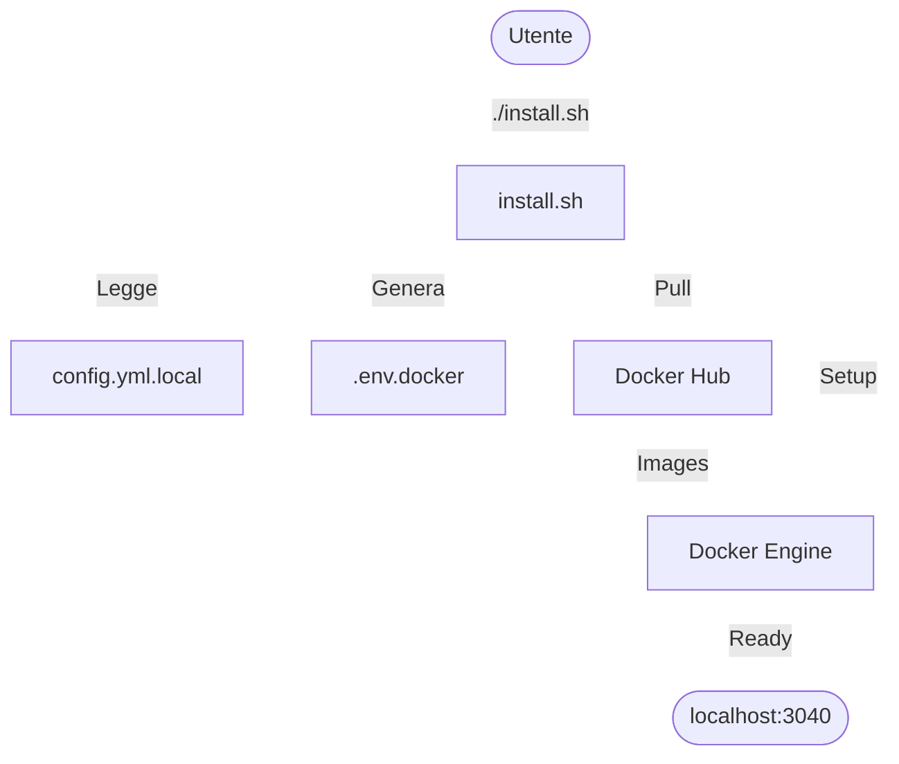

# Installazione ThothAI su Docker (Utente)

Questa è la procedura standard consigliata per l'**utilizzo** di ThothAI. È progettata per essere semplice, rapida e non richiede competenze di programmazione.

## 1. Prerequisiti

*   **Docker Desktop** (o Docker Engine su Linux) installato e attivo.
*   **Connessione Internet** per scaricare le immagini da Docker Hub.
*   **Python 3.9+** (opzionale ma consigliato per script di utilità, altrimenti lo script `install.sh` proverà a usare quello di sistema).

## 2. Preparazione Configurazione

1.  Scarica/Clona la cartella del progetto (o ottieni il pacchetto di installazione).
2.  Copia il file di configurazione template:
    ```bash
    cp config.yml config.yml.local
    ```
3.  Edita `config.yml.local` con un editor di testo:
    *   Inserisci le tue **API Key** (OpenAI, Anthropic, Gemini, ecc.).
    *   Configura eventuali preferenze di porta se quelle di default sono occupate.
    *   Imposta username e password (o lasciali di default per il primo avvio).

## 3. Installazione e Avvio

Abbiamo semplificato il processo in un unico script che scarica tutto il necessario.

**Da Terminale (Mac/Linux):**
```bash
./install.sh
```

**Cosa fa questo comando:**
1.  Verifica la configurazione in `config.yml.local`.
2.  Genera i file di ambiente necessari (`.env.docker`).
3.  Scarica (Pull) le ultime versioni delle immagini ufficiali di ThothAI da Docker Hub.
4.  Crea la rete e i volumi Docker per i dati persistenti.
5.  Avvia l'applicazione.



## 4. Accesso

Una volta completato lo script, l'applicazione è disponibile a:

*   **Interfaccia Principale (Frontend):** `http://localhost:3040`
*   **Pannello Admin:** `http://localhost:8040/admin`

## 5. Aggiornamento

Per aggiornare ThothAI all'ultima versione disponibile:

1.  Apri il terminale nella cartella del progetto.
2.  Esegui nuovamente:
    ```bash
    ./install.sh
    ```
    Lo script scaricherà le nuove immagini e riavvierà i container preservando i dati nei volumi.

Per configurare aggiornamenti completamente automatici, consulta la guida **AUTOMATIC_UPDATES_IT.md**.
