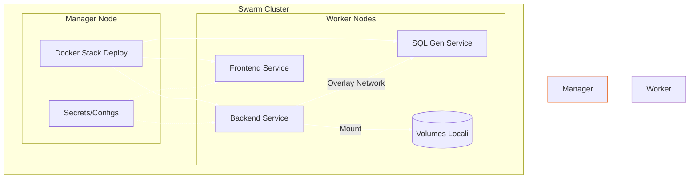

# Installazione ThothAI su Docker Swarm

Questa guida dettaglia l'installazione di ThothAI in un cluster **Docker Swarm**. Questa modalità è ideale per ambienti di produzione che richiedono alta disponibilità, scaling e gestione orchestrata.

## 1. Prerequisiti Cluster

*   Un nodo Manager con Docker attivo.
*   Inizializzazione Swarm eseguita (`docker swarm init`).
*   Configurazione `swarm_config.env` pronta (vedi sezione Configurazione).

## 2. Architettura Swarm

ThothAI su Swarm utilizza:
*   **Docker Stack**: Definito in `docker-stack.yml`.
*   **Overlay Network**: Rete criptata per la comunicazione tra servizi.
*   **Secrets & Configs**: Gestione sicura delle credenziali.



## 3. Deployment (Procedura Admin)

### 3.1 Preparazione Configurazione
Sul nodo Manager (o sul PC locale se si usa `install-swarm.sh` per deploy remoto):

1.  Copia il template:
    ```bash
    cp swarm_config.env.template swarm_config.env
    ```
2.  Modifica `swarm_config.env`:
    *   Definisci `DOCKER_USERNAME` (namespace delle immagini su Hub).
    *   Definisci le porte esposte (`FRONTEND_PORT`, ecc.).

### 3.2 Metodo A: Script Automatizzato (Consigliato)
Lo script `install-swarm.sh` gestisce build, push e deploy. Se hai già le immagini pronte su Hub e vuoi solo fare il deploy, puoi modificare lo script o usare il Metodo B.

Per un deploy completo (Build Locale -> Push -> Remote Deploy):
```bash
./install-swarm.sh --server user@host --key /path/to/ssh_key
```

### 3.3 Metodo B: Deploy Manuale di Stack Esistente
Se le immagini sono già su Docker Hub e sei già loggato sul server Manager:

1.  Crea i secret e le config:
    ```bash
    docker config create thoth_env_docker .env.docker
    # ... altri secret se necessari
    ```
2.  Lancia lo stack:
    ```bash
    # Assicurati che le variabili d'ambiente (es. DOCKER_USERNAME) siano esportate
    export DOCKER_USERNAME=tylconsulting
    docker stack deploy -c docker-stack.yml thoth
    ```

## 4. Gestione Porte e Volumi

### 4.1 Porte
Le porte sono rimappabili tramite variabili d'ambiente passate allo stack.
*   Frontend: Default 3040
*   Backend: Default 8040

### 4.2 Volumi
I volumi sono definiti come **Named Volumes** nel cluster.
*   **Persistenza**: I dati DB e Qdrant persistono nel volume locale del nodo.
*   **Vincoli**: I servizi stateful (`backend`, `qdrant`) hanno vincoli `node.role == manager` per garantire che rimangano sul nodo dove risiedono i dati fisici.

Per interagire con i volumi (es. backup):
```bash
# Esegui sul nodo dove gira il container
docker run --rm -v thoth_thoth-backend-db:/data alpine cp /data/db.sqlite3 /backup/
```

## 5. Aggiornamento Stack

Per aggiornare i servizi:
1.  Pull delle nuove immagini su tutti i nodi (opzionale, Swarm lo fa spesso in automatico al deploy, ma forzare è meglio):
    ```bash
    docker service update --image username/thoth-backend:newtag thoth_backend
    ```

Per i dettagli completi sul workflow cross-platform, consultare il documento originale `docs/docker_and_swarm/3_DOCKER_SWARM_IT.md`.
