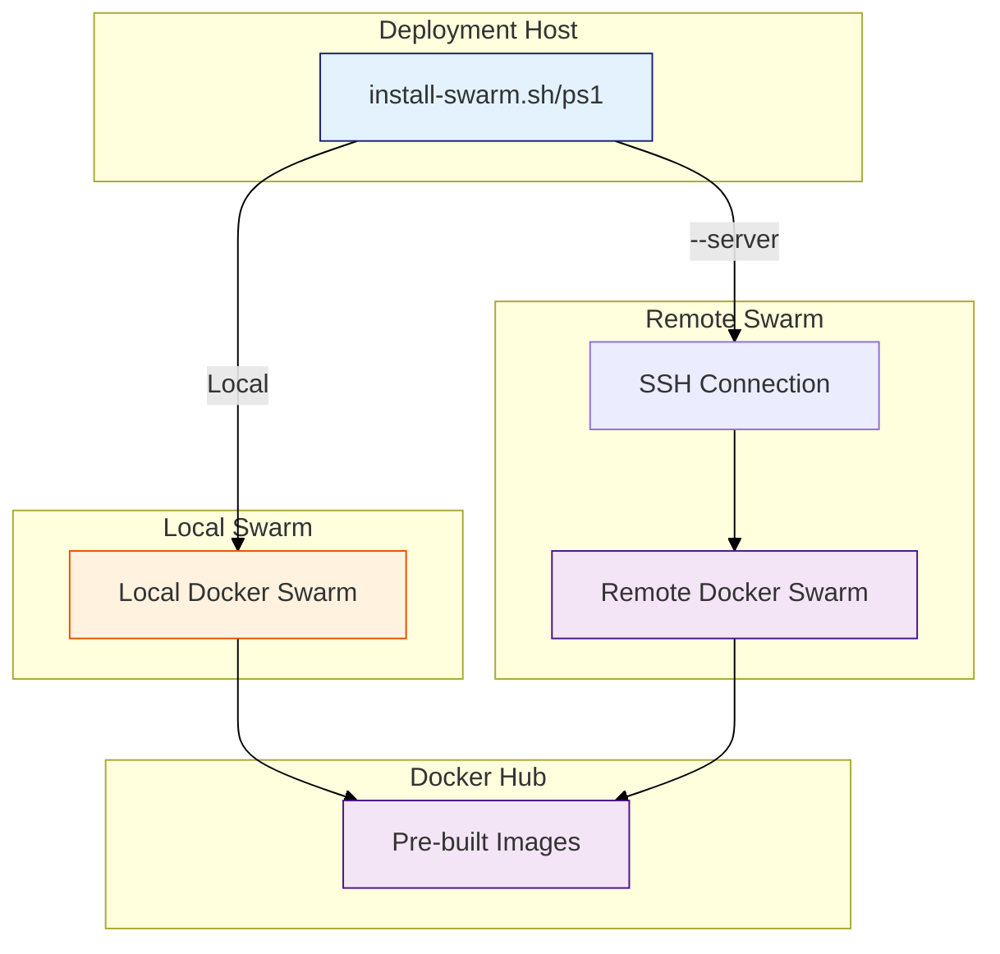

# Installazione ThothAI su Docker Swarm (Produzione)

Questa guida dettaglia l'installazione di ThothAI in un cluster **Docker Swarm** su server remoto. Questa modalità è ideale per ambienti di produzione che richiedono alta disponibilità, scaling e gestione orchestrata.

**⚠️ IMPORTANTE**: Il deployment utilizza esclusivamente le immagini pre-compilate da Docker Hub. Non è richiesta alcuna build locale.

---

## 1. Panoramica del Deployment Remoto

ThothAI offre un percorso di deployment remoto su Docker Swarm:

### 1.1 Deployment Remoto (e Locale)

**Script**: [`install-swarm.sh`](../../install-swarm.sh) (Linux/macOS) o [`install-swarm.ps1`](../../install-swarm.ps1) (Windows)

**Caratteristiche**:
- Deployment locale o su server remoto via SSH
- Gestione automatica della connessione SSH per deployment remoto
- Immagini prelevate da Docker Hub
- Nessuna build locale richiesta
- Ideale per produzione o test Swarm locali

---

## 2. Prerequisiti Cluster

*   Un nodo Manager con Docker attivo.
*   Inizializzazione Swarm eseguita (`docker swarm init`).
*   Configurazione `swarm_config.env` pronta (vedi sezione Configurazione).
*   Per deployment remoto: Accesso SSH al server remoto.

---

## 3. Architettura Swarm

ThothAI su Swarm utilizza:
*   **Docker Stack**: Definito in `docker-stack.yml`.
*   **Overlay Network**: Rete criptata per la comunicazione tra servizi.
*   **Secrets & Configs**: Gestione sicura delle credenziali.



---

## 4. Configurazione

### 4.1 Creazione del File di Configurazione

Copia il template di configurazione Swarm:

```bash
cp swarm_config.env.template swarm_config.env
```

### 4.2 Modifica di swarm_config.env

Modifica `swarm_config.env` con i tuoi parametri:

```bash
# Nome utente Docker Hub (OBBLIGATORIO)
DOCKER_USERNAME=your-dockerhub-username

# Nome dello stack Swarm
STACK_NAME=thoth

# Versione delle immagini
VERSION=latest

# Porte di esposizione (opzionale, valori default mostrati)
FRONTEND_PORT=3040
BACKEND_PROXY_PORT=8040
SQL_GENERATOR_PORT=8020
QDRANT_PORT=6333
MERMAID_SERVICE_PORT=8003
WEB_PORT=7000
BACKEND_PORT=7002
```

**Nota importante**: Il `DOCKER_USERNAME` deve corrispondere al tuo account Docker Hub dove sono ospitate le immagini ThothAI.

---

## 5. Note per Sviluppatori

Per testare la procedura di deployment su Swarm in locale prima di applicarla su un server remoto, consulta la documentazione dedicata per sviluppatori:

[`../developer/DOCKER_SWARM_LOCAL_BUILD_IT.md`](../developer/DOCKER_SWARM_LOCAL_BUILD_IT.md)

Questa documentazione include:
- Istruzioni complete per deployment locale
- Configurazione di `swarm_config.env`
- Troubleshooting specifico per ambiente locale
- Comandi utili per sviluppo e test

---

## 6. Deployment Remoto

### 6.1 Prerequisiti
1.  **Server Remoto**: Una macchina Linux accessibile via SSH (`user@server`).
2.  **Docker Swarm sul Server**:
    *   Collegati: `ssh user@server`
    *   Inizializza: `docker swarm init`
3.  **Docker Hub Account**: Necessario per ospitare le immagini che il server scaricherà.

### 6.2 Esecuzione del Deployment

**Linux/macOS:**
```bash
# Deployment con server specificato
./install-swarm.sh --server user@192.168.1.100

# Deployment con porta SSH personalizzata
./install-swarm.sh --server user@swarm.example.com --port 2222

# Deployment con chiave SSH personalizzata
./install-swarm.sh --server user@192.168.1.100 --key ~/.ssh/custom_key

# Deployment senza pull immagini
./install-swarm.sh --server user@192.168.1.100 --skip-pull

# Deployment senza ricreare secrets
./install-swarm.sh --server user@192.168.1.100 --skip-secrets
```

**Windows (PowerShell):**
```powershell
# Deployment con server specificato
.\install-swarm.ps1 -Server user@192.168.1.100

# Deployment con porta SSH personalizzata
.\install-swarm.ps1 -Server user@swarm.example.com -Port 2222

# Deployment con chiave SSH personalizzata
.\install-swarm.ps1 -Server user@192.168.1.100 -Key C:\Users\user\.ssh\custom_key

# Deployment senza pull immagini
.\install-swarm.ps1 -Server user@192.168.1.100 -SkipPull

# Deployment senza ricreare secrets
.\install-swarm.ps1 -Server user@192.168.1.100 -SkipSecrets
```

### 6.3 Gestione dell'Accesso SSH

Lo script di deployment remoto gestisce automaticamente:

1. **Prompt interattivo**: Se il server non viene specificato, lo script chiederà di inserire la stringa di connessione SSH.
2. **Test connessione**: Prima del deploy, lo script verifica che la connessione SSH funzioni.
3. **Configurazione DOCKER_HOST**: Imposta automaticamente `DOCKER_HOST=ssh://user@server:port` per comunicare con il Docker del server remoto.
4. **Gestione chiavi SSH**: Supporta chiavi SSH personalizzate e verifica che siano accessibili.

### 6.4 Cosa Fa lo Script Remoto

Lo script `install-swarm` (remoto) esegue automaticamente:

1. **Verifica prerequisiti**: Controlla Docker, SSH e Swarm
2. **Test connessione SSH**: Verifica che il server sia raggiungibile
3. **Carica configurazione**: Legge `swarm_config.env`
4. **Pull immagini**: Scarica le immagini da Docker Hub (localmente, poi il server le scaricherà)
5. **Prepara stack file**: Crea `docker-stack-swarm.yml` con le porte configurate
6. **Crea secrets/configs**: Crea i secrets e configs sul server remoto
7. **Deploy stack**: Esegue `docker stack deploy` sul server remoto
8. **Attende servizi**: Controlla che tutti i servizi siano avviati
9. **Mostra status**: Visualizza lo stato dei servizi e gli URL di accesso

### 6.5 Accesso ai Servizi

Dopo il deployment remoto, i servizi saranno accessibili sul server:
- **Frontend**: http://SERVER_IP:3040
- **Backend Admin**: http://SERVER_IP:8040/admin
- **Backend API**: http://SERVER_IP:8040/api
- **SQL Generator**: http://SERVER_IP:8020
- **Qdrant Dashboard**: http://SERVER_IP:6333/dashboard

### 6.6 Procedura per l'Utilizzatore (Admin del Server)

Se sei l'amministratore del server e vuoi solo aggiornare o gestire lo stack già deployato:

1.  Collegati al server: `ssh user@server`.
2.  Verifica lo stato:
    ```bash
    docker stack ps thoth
    docker service ls
    ```
3.  Aggiornamento manuale (se nuove immagini sono già su Hub):
    ```bash
    docker service update --image username/thoth-backend:latest thoth_backend --force
    ```

---

## 7. Gestione Porte e Volumi

### 7.1 Porte

Le porte sono rimappabili tramite variabili d'ambiente passate allo stack.
*   Frontend: Default 3040
*   Backend: Default 8040
*   SQL Generator: Default 8020
*   Qdrant: Default 6333
*   Mermaid Service: Default 8003
*   Web (Proxy): Default 7000

### 7.2 Volumi

I volumi sono definiti come **Named Volumes** nel cluster.
*   **Persistenza**: I dati DB e Qdrant persistono nel volume locale del nodo.
*   **Vincoli**: I servizi stateful (`backend`, `qdrant`) hanno vincoli `node.role == manager` per garantire che rimangano sul nodo dove risiedono i dati fisici.

Per interagire con i volumi (es. backup):
```bash
# Esegui sul nodo dove gira il container
docker run --rm -v thoth_thoth-backend-db:/data alpine cp /data/db.sqlite3 /backup/
```

---

## 8. Aggiornamento Stack

Per aggiornare i servizi:
1.  Modifica `VERSION` in `swarm_config.env`
2.  Riesegui lo script di deployment appropriato:
    ```bash
    # Locale
    ./install-swarm.sh
    
    # Remoto
    ./install-swarm.sh --server user@server
    ```

Oppure forzare l'aggiornamento manuale:
```bash
docker service update --image username/thoth-backend:newtag thoth_backend
```

---

## 9. Monitoraggio e Gestione

### 9.1 Comandi Utili

```bash
# Visualizza i servizi
docker stack services thoth

# Visualizza i task
docker stack ps thoth

# Visualizza i logs
docker service logs -f thoth_backend

# Visualizza i nodi
docker node ls

# Rimuovi lo stack
docker stack rm thoth
```

### 9.2 Troubleshooting

#### Problema: Connessione SSH Fallita

**Soluzione**:
- Verifica che l'indirizzo IP/hostname sia corretto
- Verifica che la porta SSH sia corretta (default 22)
- Verifica che la chiave SSH sia accessibile
- Verifica che il server sia raggiungibile: `ping server_ip`

#### Problema: Swarm Non Attivo

**Soluzione**:
```bash
# Inizializza Swarm
docker swarm init
```

#### Problema: Immagini Non Trovate

**Soluzione**:
- Verifica che `DOCKER_USERNAME` sia corretto in `swarm_config.env`
- Verifica che le immagini esistano su Docker Hub:
  ```bash
  docker pull your-username/thoth-backend:latest
  ```

#### Problema: Servizi Non Partono

**Soluzione**:
- Controlla i logs dei servizi:
  ```bash
  docker service logs thoth_backend --tail 100
  ```
- Verifica che i secrets/configs siano stati creati correttamente:
  ```bash
  docker secret ls
  docker config ls
  ```

---

## 10. Confronto dei Percorsi

| Caratteristica | Locale | Remoto |
|---------------|---------|--------|
| Script | `install-swarm-local.sh/ps1` | `install-swarm.sh/ps1` |
| Target | Macchina locale | Server remoto via SSH |
| Accesso | localhost | IP/hostname del server |
| SSH | Non richiesto | Richiesto e gestito |
| Immagini | Da Docker Hub | Da Docker Hub |
| Build locale | Non necessaria | Non necessaria |
| Uso | Sviluppo, test | Produzione |
| Prompt server | No | Sì, se non specificato |

---

## 11. Riferimenti

- **Documentazione Swarm Locale**: [`../docker_and_swarm/DOCKER_SWARM_LOCAL_BUILD_IT.md`](../docker_and_swarm/DOCKER_SWARM_LOCAL_BUILD_IT.md)
- **Guida Swarm Completa**: [`../docker_and_swarm/3_DOCKER_SWARM_IT.md`](../docker_and_swarm/3_DOCKER_SWARM_IT.md)
- **Docker Stack**: `docker-stack.yml`
- **Script deploy**: `install-swarm.sh`, `install-swarm.ps1`
- **Script gestione**: `deploy-swarm.sh`, `deploy-swarm.ps1`
