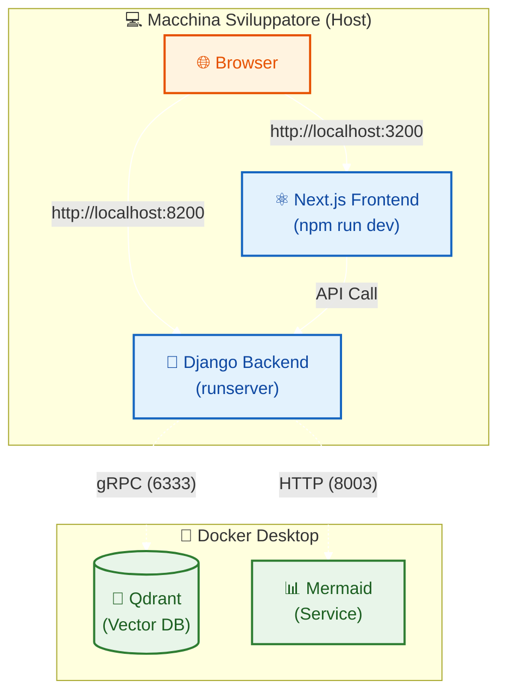

# Installazione Locale per Sviluppo

Questa guida illustra come installare ThothAI in modalità **Sviluppo Locale**.
**ATTENZIONE:** Questa modalità è riservata esclusivamente a chi deve personalizzare il codice sorgente o contribuire allo sviluppo dell'applicazione. Per il semplice utilizzo, si raccomanda l'installazione via Docker.

## 1. Prerequisiti

*   **Python 3.13+** (gestito via `uv`)
*   **Node.js 18+** e `npm`
*   **Docker Desktop** (necessario solo per i servizi di supporto)
*   **Git**

## 2. Architettura di Sviluppo



In questa modalità:
1.  **Backend (Django)** e **Frontend (Next.js)** girano nativamente sulla macchina host per permettere il debug e l'hot-reload.
2.  **Servizi di Supporto** (Qdrant, Mermaid Service) girano su Docker per semplificare la configurazione.

## 3. Avvio Automatico (Consigliato)

Il metodo più semplice per avviare l'ambiente di sviluppo è utilizzare lo script `start-all.sh`, che si occupa automaticamente di:
1. Avviare i container di supporto (Qdrant, Mermaid) usando `docker-compose-local.yml`.
2. Avviare il Backend Django (porta 8200).
3. Avviare il Frontend Next.js (porta 3200).
4. Avviare il Generatore SQL (porta 8180).

Esegui dalla root del progetto:

```bash
./start-all.sh
```

Per fermare tutti i servizi, premi `Ctrl+C`.

## 4. Configurazione Servizi di Supporto (Avvio Manuale)

Se preferisci gestire i servizi manualmente, puoi avviare solo i container di supporto.

1.  Assicurati che Docker sia attivo.
2.  Avvia i servizi di supporto:
    ```bash
    docker compose -f docker-compose-local.yml up -d
    ```
    Questo avvierà:
    *   **Thoth Qdrant**: DB Vettoriale (Porta 6333)
    *   **Mermaid Service**: Servizio di generazione diagrammi (Porta 8003)

## 5. Installazione e Avvio Backend (Manuale)

1.  Spostati nella root del progetto.
2.  Installa `uv` (se non presente):
    ```bash
    curl -LsSf https://astral.sh/uv/install.sh | sh
    ```
3.  Crea l'ambiente virtuale e installa le dipendenze:
    ```bash
    # Sincronizza l'ambiente usando uv (legge pyproject.toml/uv.lock)
    uv sync
    source .venv/bin/activate
    ```
4.  Configura le variabili d'ambiente:
    *   Copia `.env.local` (generato da `config.yml.local` via script di setup o creato manualmente) come `.env` nella cartella `backend/`.
    *   Ricorda che in modalità manuale devi esportare le variabili o usare un `.env` valido.
    
5.  Esegui le migrazioni e avvia il server:
    ```bash
    cd backend
    uv run python manage.py migrate
    uv run python manage.py runserver 0.0.0.0:8200
    ```

## 6. Installazione e Avvio Frontend (Manuale)

1.  In un nuovo terminale, vai nella cartella `frontend`:
    ```bash
    cd frontend
    ```
2.  Installa le dipendenze:
    ```bash
    npm install
    ```
3.  Avvia il server di sviluppo:
    ```bash
    PORT=3200 npm run dev
    ```
    Il frontend sarà accessibile su `http://localhost:3200`.

## 7. Accesso all'Applicazione

*   Frontend (Dev): `http://localhost:3200`
*   Backend API (Dev): `http://localhost:8200`
*   Qdrant Dashboard: `http://localhost:6333/dashboard`

## 7. Troubleshooting

*   **Problemi di connessione DB:** Verifica che i container di supporto siano attivi con `docker ps`.
*   **Errori CORS:** In modalità sviluppo, assicurarsi che le porte 3200 e 8200 siano correttamente configurate nelle whitelist CORS del backend.
