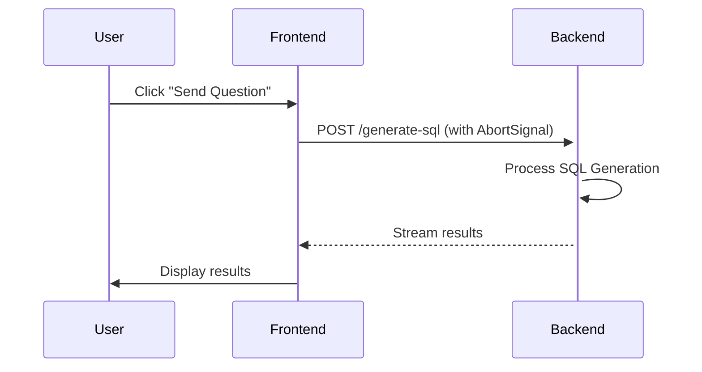
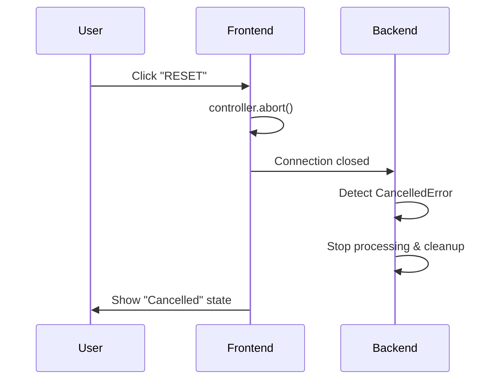

# RESET Button Implementation Plan: Cancelling Async Operations

## Executive Summary

This document outlines the implementation plan for enabling the RESET button to interrupt asynchronous operations in the Thoth UI application. The solution uses standard web APIs (AbortController) on the frontend and proper async cancellation handling on the backend to provide users with the ability to stop long-running SQL generation operations.

## Current State Analysis

### Problem Statement
- The RESET button currently only logs to console without actual functionality
- SQL generation operations can take 10-30+ seconds with no way to cancel
- Users must wait for operations to complete even if they realize they made a mistake
- Server resources are consumed for operations the user no longer wants
- The UI becomes unresponsive during long operations

### Existing Architecture
```
Frontend (Next.js/React) → API Proxy → Backend (FastAPI) → AI Processing
                         ↓
                    Streaming Response
```

### Key Files Involved
- **Frontend:**
  - `/components/sidebar/reset-button.tsx` - RESET button component
  - `/lib/sql-generator-api.ts` - API client for SQL generation
  - `/lib/contexts/sidebar-context.tsx` - Sidebar state management
  - `/app/chat/page.tsx` - Main chat interface
  
- **Backend:**
  - `/sql_generator/main.py` - FastAPI endpoints for SQL generation

## Conceptual Overview

### Core Concept: Cancellation Chain

The solution implements a cancellation chain that propagates from the UI through to the backend:

```
User Action → Frontend Signal → Network Abort → Backend Detection → Cleanup
```

### Key Technologies

1. **AbortController (Frontend)**
   - Browser-native API for cancelling fetch requests
   - Creates a signal that can be passed to fetch()
   - Calling abort() immediately terminates the request

2. **AsyncIO Cancellation (Backend)**
   - Python's asyncio.CancelledError exception
   - FastAPI detects client disconnection
   - Allows graceful cleanup of async operations

### How It Works

#### Normal Operation Flow:


#### Cancellation Flow:


## Detailed Implementation Plan

### Phase 1: Frontend - API Client Enhancement

#### File: `/lib/sql-generator-api.ts`

**Changes Required:**

1. Add abort controller management to the SqlGeneratorApiClient class:

```typescript
class SqlGeneratorApiClient {
  private currentAbortController: AbortController | null = null;
  
  // New method to cancel current request
  cancelCurrentRequest(): void {
    if (this.currentAbortController) {
      this.currentAbortController.abort();
      this.currentAbortController = null;
    }
  }
  
  // Modified generateSQLStream method
  async generateSQLStream(
    request: GenerateSQLRequest, 
    username?: string, 
    onMessage?: (message: string) => void
  ): Promise<void> {
    // Cancel any existing request
    this.cancelCurrentRequest();
    
    // Create new controller for this request
    this.currentAbortController = new AbortController();
    
    try {
      const response = await fetch(url, {
        method: 'POST',
        headers,
        body: JSON.stringify(request),
        signal: this.currentAbortController.signal // Add abort signal
      });
      
      // ... rest of streaming logic
    } catch (error) {
      if (error.name === 'AbortError') {
        console.log('Request was cancelled');
        throw new Error('Operation cancelled by user');
      }
      // ... handle other errors
    } finally {
      this.currentAbortController = null;
    }
  }
}
```

### Phase 2: Frontend - Context State Management

#### File: `/lib/contexts/sidebar-context.tsx`

**Changes Required:**

1. Add operation tracking and cancellation to the context:

```typescript
interface SidebarContextType {
  // ... existing properties
  isOperationInProgress: boolean;
  cancelCurrentOperation: () => void;
  setOperationInProgress: (inProgress: boolean) => void;
}

export function SidebarProvider({ children }: { children: React.ReactNode }) {
  const [isOperationInProgress, setIsOperationInProgress] = useState(false);
  
  const cancelCurrentOperation = useCallback(() => {
    // Cancel the API request
    sqlGeneratorApi.cancelCurrentRequest();
    
    // Reset operation state
    setIsOperationInProgress(false);
    
    // Reset other states as needed
    // Could emit an event or call callbacks here
  }, []);
  
  // ... rest of implementation
}
```

### Phase 3: Frontend - RESET Button Implementation

#### File: `/components/sidebar/reset-button.tsx`

**Changes Required:**

1. Connect to sidebar context and implement cancellation:

```typescript
export function ResetButton() {
  const { 
    cancelCurrentOperation, 
    isOperationInProgress,
    resetToDefaults 
  } = useSidebar();
  const [isCancelling, setIsCancelling] = useState(false);
  
  const handleReset = async () => {
    setIsCancelling(true);
    
    try {
      if (isOperationInProgress) {
        // Cancel ongoing operation
        cancelCurrentOperation();
        
        // Optional: Show toast notification
        toast.info('Operation cancelled');
      }
      
      // Reset sidebar to defaults
      resetToDefaults();
      
      // Clear any other application state
      // This could emit a global reset event
      window.dispatchEvent(new CustomEvent('app-reset'));
      
    } finally {
      setIsCancelling(false);
    }
  };
  
  return (
    <button
      onClick={handleReset}
      disabled={isCancelling}
      className="..."
    >
      {isCancelling ? (
        <Loader2 className="h-4 w-4 animate-spin" />
      ) : (
        <RefreshCw className="h-4 w-4" />
      )}
      <span>{isCancelling ? 'Cancelling...' : 'Reset'}</span>
    </button>
  );
}
```

### Phase 4: Frontend - Chat Page Integration

#### File: `/app/chat/page.tsx`

**Changes Required:**

1. Integrate with sidebar context for operation tracking:

```typescript
export default function ChatPage() {
  const { setOperationInProgress } = useSidebar();
  
  // Listen for reset events
  useEffect(() => {
    const handleReset = () => {
      // Clear messages
      setMessages([]);
      // Clear input
      setMessage('');
      // Clear any other state
      setThothLogMessage('');
      setIsProcessing(false);
    };
    
    window.addEventListener('app-reset', handleReset);
    return () => window.removeEventListener('app-reset', handleReset);
  }, []);
  
  const handleSubmit = async (e: React.FormEvent) => {
    e.preventDefault();
    
    try {
      setIsProcessing(true);
      setOperationInProgress(true); // Track operation
      
      await sqlGeneratorApi.generateSQLStream(
        // ... parameters
      );
      
    } catch (error) {
      if (error.message === 'Operation cancelled by user') {
        // Handle cancellation gracefully
        console.log('User cancelled the operation');
        // Clear partial results
        setMessages([]);
      } else {
        // Handle other errors
        console.error('Error:', error);
      }
    } finally {
      setIsProcessing(false);
      setOperationInProgress(false); // Clear operation tracking
    }
  };
}
```

### Phase 5: Backend - Cancellation Handling

#### File: `/sql_generator/main.py`

**Changes Required:**

1. Add proper cancellation handling in the streaming endpoint:

```python
import asyncio
from fastapi import Request
from starlette.requests import ClientDisconnect

@app.post("/generate-sql")
async def generate_sql(request: GenerateSQLRequest, http_request: Request):
    """
    Generate SQL with cancellation support
    """
    
    async def generate_response():
        try:
            # Check if client is still connected periodically
            if await http_request.is_disconnected():
                logger.info("Client disconnected, stopping generation")
                return
            
            # ... existing generation logic ...
            
            # In long-running loops, check for cancellation
            for step in processing_steps:
                # Check if client disconnected
                if await http_request.is_disconnected():
                    logger.info(f"Client disconnected at step {step}")
                    break
                    
                # Process step
                await process_step(step)
                
        except asyncio.CancelledError:
            # Handle cancellation gracefully
            logger.info("Request cancelled by client")
            # Cleanup resources if needed
            if hasattr(state, 'cleanup'):
                await state.cleanup()
            raise  # Re-raise to properly cancel
            
        except ClientDisconnect:
            logger.info("Client disconnected during streaming")
            return
            
        except Exception as e:
            logger.error(f"Error in generate_sql: {e}")
            yield f"ERROR: {str(e)}\n"
    
    return StreamingResponse(generate_response(), media_type="text/plain")
```

## Implementation Phases

### Phase 1: Basic Cancellation (MVP)
**Goal:** Enable basic request cancellation
- Implement AbortController in API client
- Add cancel method to API client
- Update RESET button to call cancel
- Handle AbortError in chat page

**Estimated Time:** 2-3 hours

### Phase 2: State Management
**Goal:** Proper state tracking and cleanup
- Add operation tracking to sidebar context
- Implement global reset event system
- Clean up all UI state on cancellation
- Add visual feedback during cancellation

**Estimated Time:** 2-3 hours

### Phase 3: Backend Integration
**Goal:** Proper backend cancellation handling
- Add disconnection detection in FastAPI
- Implement cleanup in async generators
- Add cancellation logging
- Test with long-running operations

**Estimated Time:** 3-4 hours

### Phase 4: Polish and Testing
**Goal:** Production-ready implementation
- Add loading states and animations
- Implement toast notifications
- Add comprehensive error handling
- Write tests for cancellation scenarios

**Estimated Time:** 2-3 hours

## Testing Strategy

### Unit Tests
1. Test AbortController creation and cleanup
2. Test context state updates
3. Test error handling for AbortError
4. Test backend cancellation detection

### Integration Tests
1. Test full cancellation flow from UI to backend
2. Test multiple rapid cancellations
3. Test cancellation at different stages of processing
4. Test state cleanup after cancellation

### Manual Testing Scenarios
1. **Quick Cancel:** Start operation and immediately cancel
2. **Mid-Process Cancel:** Cancel during SQL generation
3. **Multiple Operations:** Start new operation after cancellation
4. **Network Issues:** Test cancellation with network problems
5. **Concurrent Requests:** Ensure only current request is cancelled

## Potential Challenges and Solutions

### Challenge 1: Race Conditions
**Problem:** User might start a new operation before cancellation completes
**Solution:** Disable input during cancellation, queue requests, or cancel previous before starting new

### Challenge 2: Partial Results
**Problem:** Some results might already be displayed when cancelled
**Solution:** Clear all results on cancellation, mark partial results clearly

### Challenge 3: Backend Resource Cleanup
**Problem:** Backend might not clean up resources properly
**Solution:** Implement proper cleanup in finally blocks, use context managers

### Challenge 4: WebSocket Alternative
**Problem:** If we later move to WebSockets, cancellation is different
**Solution:** Design abstraction layer that works with both HTTP streaming and WebSockets

## Success Metrics

1. **User Control:** Users can cancel operations within 1 second
2. **Resource Efficiency:** Cancelled operations free resources within 2 seconds
3. **State Consistency:** UI always in consistent state after cancellation
4. **Error Rate:** Less than 1% error rate for cancellation operations
5. **User Satisfaction:** Positive feedback on responsiveness

## Future Enhancements

1. **Progress Indication:** Show progress bar with cancel button
2. **Pause/Resume:** Allow pausing operations instead of just cancelling
3. **Selective Cancel:** Cancel specific parts of multi-step operations
4. **Auto-Cancel:** Timeout for operations taking too long
5. **Cancel Analytics:** Track why users cancel (too slow, wrong query, etc.)

## Conclusion

This implementation plan provides a robust solution for cancelling async operations using standard web technologies. The phased approach allows for incremental implementation and testing, ensuring a stable and user-friendly feature rollout.

The solution balances technical correctness with user experience, providing immediate feedback while properly cleaning up resources on both frontend and backend. By following this plan, the RESET button will become a powerful tool for users to control their interaction with the AI-powered SQL generation system.