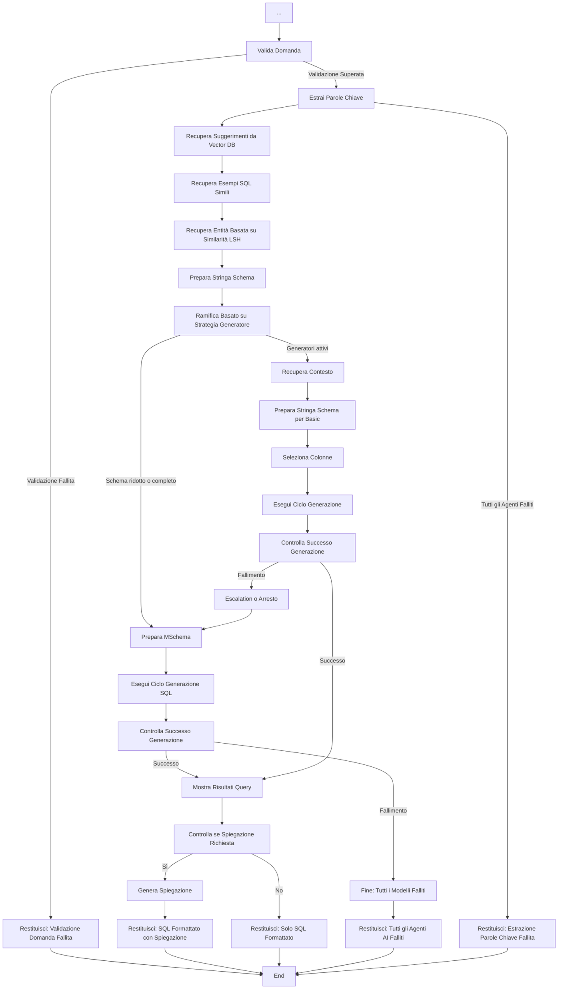

# Principale

=== "Diagramma di Flusso"

    ```mermaid
    graph TD
        A[Inizio: Domanda Utente] --> B[Inizializza Stato Sistema]

        B --> C[Imposta Vector DB]
        C --> D[Ottieni Schema Tentativo]
        D --> E[Seleziona Strategia Generatore SQL]
        E --> F[Configura Stato con DB Manager, Schema, Domanda]
        F --> G[Valida Domanda]

    ```

=== "Spiegazione"

    **Spiegazione del Flusso di Lavoro (Parte 1):**

    - **Inizio: Domanda Utente** - Il processo inizia quando un utente pone una domanda.
    - **Inizializza Stato Sistema** - Inizializza il gestore di stato creando un dizionario di backup nello stato della sessione, se non esiste.     
    Questo metodo assicura che il gestore di stato abbia un posto dove memorizzare i valori di backup per i flag della barra laterale, le impostazioni dell'area di lavoro e altre chiavi persistenti. Viene chiamato prima di qualsiasi altra operazione di gestione dello stato.
    - **Imposta Vector DB** - Inizializza e restituisce un'istanza del database vettoriale basata sulla configurazione dell'area di lavoro fornita.
    - **Ottieni Schema Tentativo** - Ottiene lo schema tentativo dal gestore del database. È chiamato `tentativo` perché legge le definizioni complete dalle applicazioni backend salvate nel database Thoth come metadati in tabelle SQL DB, colonne SQL e Relazioni
    - **Seleziona Strategia Generatore SQL** - Legge il livello iniziale scelto dall'utente e prepara il workflow corrente. Il runtime attuale utilizza una cascata di generatori `Basic`, `Advanced` ed `Expert`; quando lo schema è ampio, la complessità viene gestita riducendo lo schema con similarità LSH e database vettoriale, così da mantenere solo tabelle e colonne più rilevanti insieme alle chiavi necessarie alle join.
    
    - **Configura Stato con DB Manager, Schema, Domanda** - Configura lo stato del sistema e inizializza tutti gli strumenti necessari per l'elaborazione delle query.
    Questa funzione crea e configura lo strumento di recupero entità, lo strumento di recupero contesto, gli strumenti di selezione schema e inizializza lo stato del sistema con questi strumenti.
    - **Valida Domanda** - Esegue una validazione di base del modulo sull'input dell'utente prima della generazione SQL. Controlla se il testo è significativo (non senza senso), nella lingua prevista e potenzialmente correlato al database. Restituisce un codice di stato ("OK", "Meaningless", "Gibberish", "Unrecognized language", o "Out of scope") e una breve spiegazione. Questa attività, eseguita da un Agente AI, è intenzionalmente permissiva, concentrandosi solo sulla qualità strutturale piuttosto che sul contenuto semantico o sulla fattibilità SQL.



