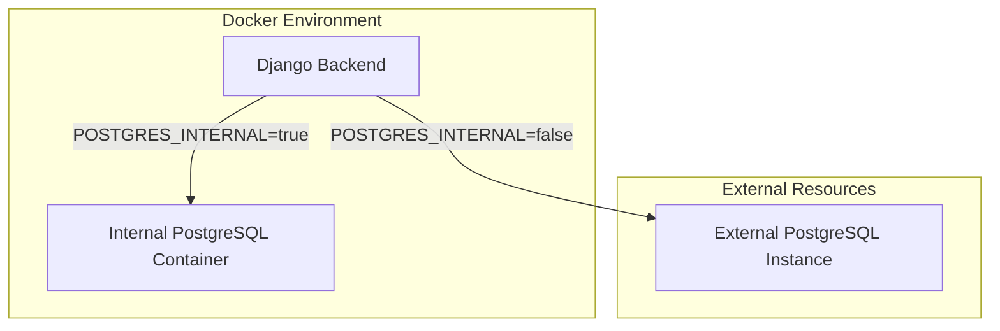

# Design: PostgreSQL Migration

## Architecture Overview
The migration involves decoupling the database engine from the hardcoded SQLite configuration and allowing dynamic selection via environment variables.

### Environment Variable Mapping
The following variables will be introduced to `.env.local` and `.env.docker`:

| Variable | Description | Default |
|----------|-------------|---------|
| `DB_ENGINE` | Database engine (`django.db.backends.postgresql` or `django.db.backends.sqlite3`) | `django.db.backends.postgresql` |
| `DB_NAME` | Database name | `thoth_db` |
| `DB_USER` | Database user | `thoth_user` |
| `DB_PASSWORD` | Database password | `thoth_pass` |
| `DB_HOST` | Database host | `localhost` |
| `DB_PORT` | Database port | `5432` |
| `POSTGRES_INTERNAL` | (Docker only) Whether to use an internal Postgres container | `true` |

### Docker Orchestration
In `docker-compose.yml` and `docker-stack.yml`, a new `postgres` service will be added.

#### Component Diagram

### Implementation Strategy
1. **Django Settings**: Modify `DATABASES` dictionary to use environment variables. Fallback to SQLite if `DB_ENGINE` is not set or set to `sqlite3`.
2. **Environment Templates**: Document all new Postgres variables in `.env.local.template` and `.env.docker.template`.
3. **Docker Compose**: 
   - Add `db` service using `postgres:latest`.
   - Use healthchecks to ensure `backend` wait for `db` if internal.
   - Use environment variables for all DB settings in both `db` and `backend` services.
4. **CLI Updates**: Ensure `thothai` CLI (if applicable) handles the new environment variables during initialization.
