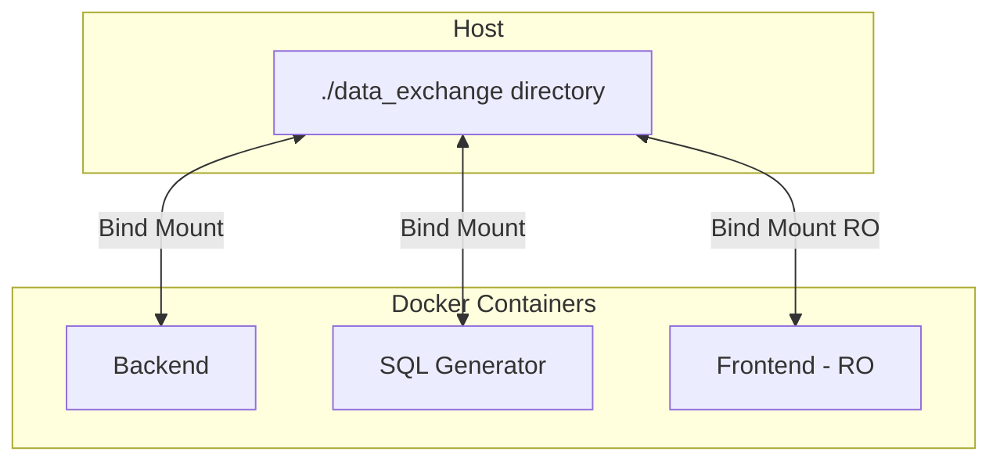
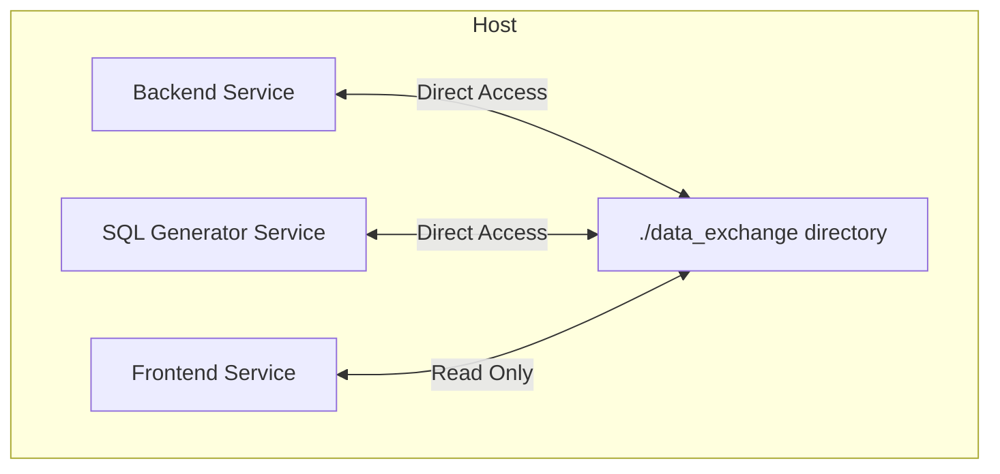
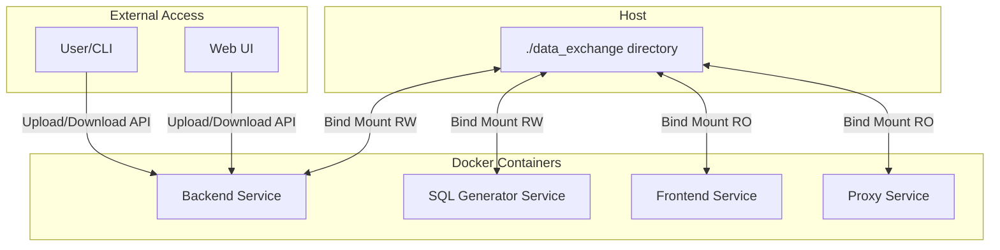
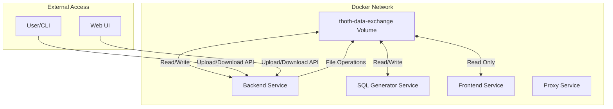

# Data Exchange Hybrid Solution - Implementation Plan

## Executive Summary

This plan addresses three deployment scenarios with a unified solution:
1. **Local development** (without Docker): Direct filesystem access to `./data_exchange`
2. **Single Docker** (docker-compose): Bind mount to `./data_exchange` for direct access
3. **Docker Swarm**: Named volume `thoth-data-exchange` for distributed deployment

**Solution**: True hybrid approach - bind mounts for local development and single Docker, Docker named volume for Swarm, with API-based file upload/download endpoints available in all scenarios for remote access.

---

## Current Architecture



**Problems**:
- Host directory `./data_exchange` must exist on deployment server (for Swarm)
- No access to files from outside the host (no API endpoints)
- Docker Swarm stack has no `data_exchange` mount at all

---

## Proposed Architecture

### Scenario 1: Local Development (No Docker)



### Scenario 2: Single Docker (docker-compose)



### Scenario 3: Docker Swarm



**Advantages**:
- **Local dev**: Direct filesystem access for quick edits
- **Single Docker**: Bind mount for host access + API for remote access
- **Swarm**: Named volume for distributed deployment + API for remote access
- **Unified API**: Same API endpoints work in all scenarios
- **Flexible**: Choose the right approach for each deployment

---

## Implementation Steps

### Step 1: Update Docker Configuration

#### 1.1 Keep `docker-compose.yml` with Bind Mounts (No Changes)

The `docker-compose.yml` should continue using bind mounts for local development:

```yaml
# docker-compose.yml - NO CHANGES NEEDED
services:
  backend:
    volumes:
      - ./data_exchange:/app/data_exchange
  
  sql-generator:
    volumes:
      - ./data_exchange:/app/data_exchange
  
  frontend:
    volumes:
      - ./data_exchange:/app/data_exchange:ro
  
  proxy:
    volumes:
      - ./data_exchange:/vol/data_exchange:ro
```

#### 1.2 Update `docker-stack.yml` with Named Volume

Add missing `data_exchange` volume and mounts for Docker Swarm:

```yaml
# docker-stack.yml - ADD THIS
volumes:
  thoth-data-exchange:
    driver: local

services:
  backend:
    volumes:
      - thoth-data-exchange:/app/data_exchange
  
  sql-generator:
    volumes:
      - thoth-data-exchange:/app/data_exchange
  
  frontend:
    volumes:
      - thoth-data-exchange:/app/data_exchange:ro
  
  proxy:
    volumes:
      - thoth-data-exchange:/vol/data_exchange:ro
```

---

### Step 2: Create API Endpoints

#### 2.1 New API Views

Create `backend/thoth_core/api_views/data_exchange_views.py`:

```python
from django.http import JsonResponse, HttpResponse
from django.views.decorators.csrf import csrf_exempt
from django.views.decorators.http import require_http_methods
from django.contrib.auth.decorators import login_required
import os
import json
from pathlib import Path
from ..utilities.shared_paths import get_data_exchange_path

@require_http_methods(["GET"])
@login_required
def list_files(request):
    """List all files in data_exchange directory"""
    data_exchange_path = Path(get_data_exchange_path())
    
    if not data_exchange_path.exists():
        data_exchange_path.mkdir(parents=True, exist_ok=True)
    
    files = []
    for item in data_exchange_path.iterdir():
        if item.is_file():
            files.append({
                'name': item.name,
                'size': item.stat().st_size,
                'modified': item.stat().st_mtime
            })
    
    return JsonResponse({'files': files})

@require_http_methods(["POST"])
@login_required
@csrf_exempt
def upload_file(request):
    """Upload a file to data_exchange directory"""
    if 'file' not in request.FILES:
        return JsonResponse({'error': 'No file provided'}, status=400)
    
    uploaded_file = request.FILES['file']
    data_exchange_path = Path(get_data_exchange_path())
    data_exchange_path.mkdir(parents=True, exist_ok=True)
    
    file_path = data_exchange_path / uploaded_file.name
    
    with open(file_path, 'wb+') as destination:
        for chunk in uploaded_file.chunks():
            destination.write(chunk)
    
    return JsonResponse({
        'success': True,
        'filename': uploaded_file.name,
        'path': str(file_path)
    })

@require_http_methods(["GET"])
@login_required
def download_file(request, filename):
    """Download a file from data_exchange directory"""
    data_exchange_path = Path(get_data_exchange_path())
    file_path = data_exchange_path / filename
    
    if not file_path.exists():
        return JsonResponse({'error': 'File not found'}, status=404)
    
    with open(file_path, 'rb') as f:
        response = HttpResponse(f.read(), content_type='application/octet-stream')
        response['Content-Disposition'] = f'attachment; filename="{filename}"'
        return response

@require_http_methods(["DELETE"])
@login_required
def delete_file(request, filename):
    """Delete a file from data_exchange directory"""
    data_exchange_path = Path(get_data_exchange_path())
    file_path = data_exchange_path / filename
    
    if not file_path.exists():
        return JsonResponse({'error': 'File not found'}, status=404)
    
    file_path.unlink()
    
    return JsonResponse({'success': True, 'filename': filename})
```

#### 2.2 Update URLs

Add to `backend/thoth_core/urls.py`:

```python
from .api_views import data_exchange_views

urlpatterns = [
    # ... existing patterns ...
    path('api/data-exchange/list/', data_exchange_views.list_files, name='data_exchange_list'),
    path('api/data-exchange/upload/', data_exchange_views.upload_file, name='data_exchange_upload'),
    path('api/data-exchange/download/<str:filename>/', data_exchange_views.download_file, name='data_exchange_download'),
    path('api/data-exchange/delete/<str:filename>/', data_exchange_views.delete_file, name='data_exchange_delete'),
]
```

---

### Step 3: Create CLI Helper Script

Create `scripts/data-exchange-cli.py`:

```python
#!/usr/bin/env python3
"""
CLI helper for data exchange operations.
Allows file upload/download without accessing the host filesystem.
Works with local development, docker-compose, and Docker Swarm deployments.
"""

import argparse
import requests
import os
import sys
from pathlib import Path

# Configuration - can be overridden via environment
DEFAULT_API_BASE = os.getenv('THOTH_API_BASE', 'http://localhost:8040')
DEFAULT_API_KEY = os.getenv('THOTH_API_KEY', '')

def list_files(base_url, api_key):
    """List all files in data_exchange"""
    headers = {}
    if api_key:
        headers['Authorization'] = f'Bearer {api_key}'
    
    response = requests.get(f'{base_url}/api/data-exchange/list/', headers=headers)
    response.raise_for_status()
    
    data = response.json()
    files = data.get('files', [])
    
    if not files:
        print("No files found in data_exchange")
        return
    
    print(f"\n{'Filename':<40} {'Size (bytes)':<15} {'Modified'}")
    print("-" * 70)
    for f in files:
        print(f"{f['name']:<40} {f['size']:<15} {f['modified']}")

def upload_file(base_url, api_key, file_path):
    """Upload a file to data_exchange"""
    if not os.path.exists(file_path):
        print(f"Error: File '{file_path}' not found")
        sys.exit(1)
    
    headers = {}
    if api_key:
        headers['Authorization'] = f'Bearer {api_key}'
    
    filename = os.path.basename(file_path)
    
    with open(file_path, 'rb') as f:
        files = {'file': (filename, f)}
        response = requests.post(
            f'{base_url}/api/data-exchange/upload/',
            headers=headers,
            files=files
        )
    
    response.raise_for_status()
    print(f"Successfully uploaded: {filename}")

def download_file(base_url, api_key, filename, output_path=None):
    """Download a file from data_exchange"""
    headers = {}
    if api_key:
        headers['Authorization'] = f'Bearer {api_key}'
    
    response = requests.get(
        f'{base_url}/api/data-exchange/download/{filename}/',
        headers=headers,
        stream=True
    )
    response.raise_for_status()
    
    if output_path is None:
        output_path = filename
    
    with open(output_path, 'wb') as f:
        for chunk in response.iter_content(chunk_size=8192):
            f.write(chunk)
    
    print(f"Successfully downloaded to: {output_path}")

def delete_file(base_url, api_key, filename):
    """Delete a file from data_exchange"""
    headers = {}
    if api_key:
        headers['Authorization'] = f'Bearer {api_key}'
    
    response = requests.delete(
        f'{base_url}/api/data-exchange/delete/{filename}/',
        headers=headers
    )
    response.raise_for_status()
    
    print(f"Successfully deleted: {filename}")

def main():
    parser = argparse.ArgumentParser(
        description='Thoth Data Exchange CLI',
        formatter_class=argparse.RawDescriptionHelpFormatter,
        epilog="""
Examples:
  # List all files
  python data-exchange-cli.py list
  
  # Upload a file
  python data-exchange-cli.py upload my_data.csv
  
  # Download a file
  python data-exchange-cli.py download export.csv
  
  # Delete a file
  python data-exchange-cli.py delete old_data.csv
  
Environment Variables:
  THOTH_API_BASE    API base URL (default: http://localhost:8040)
  THOTH_API_KEY     API key for authentication (optional)
        """
    )
    
    parser.add_argument('--base-url', default=DEFAULT_API_BASE,
                        help='API base URL (default: from THOTH_API_BASE or http://localhost:8040)')
    parser.add_argument('--api-key', default=DEFAULT_API_KEY,
                        help='API key (default: from THOTH_API_KEY)')
    
    subparsers = parser.add_subparsers(dest='command', required=True)
    
    # List command
    subparsers.add_parser('list', help='List all files in data_exchange')
    
    # Upload command
    upload_parser = subparsers.add_parser('upload', help='Upload a file')
    upload_parser.add_argument('file', help='Path to file to upload')
    
    # Download command
    download_parser = subparsers.add_parser('download', help='Download a file')
    download_parser.add_argument('filename', help='Name of file to download')
    download_parser.add_argument('-o', '--output', help='Output path (default: same as filename)')
    
    # Delete command
    delete_parser = subparsers.add_parser('delete', help='Delete a file')
    delete_parser.add_argument('filename', help='Name of file to delete')
    
    args = parser.parse_args()
    
    try:
        if args.command == 'list':
            list_files(args.base_url, args.api_key)
        elif args.command == 'upload':
            upload_file(args.base_url, args.api_key, args.file)
        elif args.command == 'download':
            download_file(args.base_url, args.api_key, args.filename, args.output)
        elif args.command == 'delete':
            delete_file(args.base_url, args.api_key, args.filename)
    except requests.exceptions.RequestException as e:
        print(f"Error: {e}")
        sys.exit(1)

if __name__ == '__main__':
    main()
```

---

### Step 4: Update Documentation

Update `docs/DATA-EXCHANGE.md` with new architecture:

```markdown
# DATA-EXCHANGE.md

## Overview

ThothAI's data exchange system enables file transfer between external systems and the application using a hybrid approach that supports three deployment scenarios.

## Deployment Scenarios

### 1. Local Development (No Docker)

Direct filesystem access to `./data_exchange` directory.

**Access Methods:**
- Direct file access (edit files in `./data_exchange/`)
- API endpoints (optional, for testing)

### 2. Single Docker (docker-compose)

Bind mount to `./data_exchange` directory.

**Access Methods:**
- Direct file access (edit files in `./data_exchange/`)
- API endpoints (for remote access)

### 3. Docker Swarm

Named volume `thoth-data-exchange` managed by Docker.

**Access Methods:**
- API endpoints (required - no direct filesystem access)

## Architecture

### Services Using data_exchange

- **Backend**: Read/Write access to `/app/data_exchange`
- **SQL Generator**: Read/Write access to `/app/data_exchange`
- **Frontend**: Read-only access to `/app/data_exchange`
- **Proxy**: Read-only access to `/vol/data_exchange`

## API Endpoints

Available in all deployment scenarios.

### List Files
```
GET /api/data-exchange/list/
Authentication: Required
```

### Upload File
```
POST /api/data-exchange/upload/
Authentication: Required
Content-Type: multipart/form-data
Body: file (binary)
```

### Download File
```
GET /api/data-exchange/download/<filename>/
Authentication: Required
Response: Binary file
```

### Delete File
```
DELETE /api/data-exchange/delete/<filename>/
Authentication: Required
```

## CLI Tool

Use the provided CLI tool for file operations:

```bash
# List all files
python scripts/data-exchange-cli.py list

# Upload a file
python scripts/data-exchange-cli.py upload my_data.csv

# Download a file
python scripts/data-exchange-cli.py download export.csv

# Delete a file
python scripts/data-exchange-cli.py delete old_data.csv
```

## Deployment

### Local Development
```bash
# Start services
./start-all.sh

# Access files directly
ls ./data_exchange/
```

### Docker Compose
```bash
# Start services
docker-compose up -d

# Access files directly or via API
ls ./data_exchange/
python scripts/data-exchange-cli.py list
```

### Docker Swarm
```bash
# Deploy stack
docker stack deploy -c docker-stack.yml thoth

# Access files via API only
python scripts/data-exchange-cli.py list
```

The volume is automatically created and managed by Docker.
```

---

### Step 5: Testing Strategy

#### 5.1 Local Development Testing

```bash
# Start services
./start-all.sh

# Test direct file access
ls ./data_exchange/
echo "test data" > ./data_exchange/test.csv
cat ./data_exchange/test.csv

# Test API endpoints (optional)
python scripts/data-exchange-cli.py list
python scripts/data-exchange-cli.py upload test.csv
python scripts/data-exchange-cli.py download test.csv -o downloaded.csv
python scripts/data-exchange-cli.py delete test.csv
```

#### 5.2 Docker Compose Testing

```bash
# Start services
docker-compose up -d

# Test bind mount access
ls ./data_exchange/
echo "test data" > ./data_exchange/test.csv
cat ./data_exchange/test.csv

# Test API endpoints
python scripts/data-exchange-cli.py list
python scripts/data-exchange-cli.py upload test.csv
python scripts/data-exchange-cli.py download test.csv -o downloaded.csv
python scripts/data-exchange-cli.py delete test.csv
```

#### 5.3 Docker Swarm Testing

```bash
# Deploy stack
docker stack deploy -c docker-stack.yml thoth

# Verify volume
docker volume ls | grep thoth-data-exchange

# Test API endpoints (only way to access files)
python scripts/data-exchange-cli.py list
echo "test data" > test.csv
python scripts/data-exchange-cli.py upload test.csv
python scripts/data-exchange-cli.py download test.csv -o downloaded.csv
python scripts/data-exchange-cli.py delete test.csv
```

---

## Migration Path

### For Existing Deployments

#### Local Development / Docker Compose

No migration needed - bind mounts continue to work as before. API endpoints are added as an additional option.

#### Docker Swarm (from bind mount to named volume)

1. **Backup existing data**:
    ```bash
    docker cp thoth-backend:/app/data_exchange ./data_exchange_backup
    ```

2. **Update docker-stack.yml** (Step 1.2)

3. **Deploy new configuration**:
    ```bash
    docker stack rm thoth
    docker stack deploy -c docker-stack.yml thoth
    ```

4. **Restore data via API**:
    ```bash
    for file in ./data_exchange_backup/*; do
        python scripts/data-exchange-cli.py upload "$file"
    done
    ```

---

## Security Considerations

1. **Authentication**: All API endpoints require authentication
2. **File Size Limits**: Configure max upload size in Django settings
3. **File Type Validation**: Add validation for CSV files
4. **Rate Limiting**: Implement rate limiting on upload endpoints
5. **Sanitization**: Validate filenames to prevent path traversal

---

## Future Enhancements

1. **Batch Operations**: Support for uploading/downloading multiple files
2. **Web UI**: Add file manager interface in admin panel
3. **S3 Integration**: Optional S3 backend for large-scale deployments
4. **Versioning**: Keep multiple versions of files
5. **Audit Log**: Track all file operations
