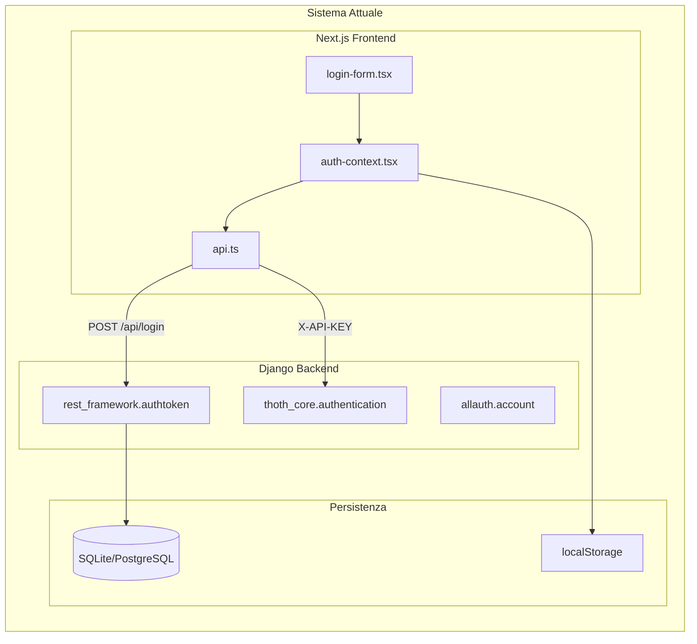
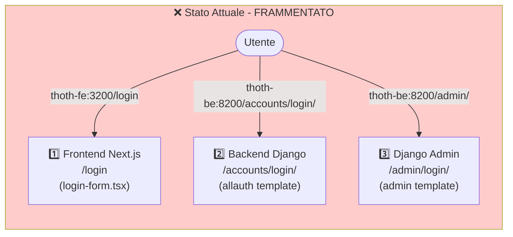
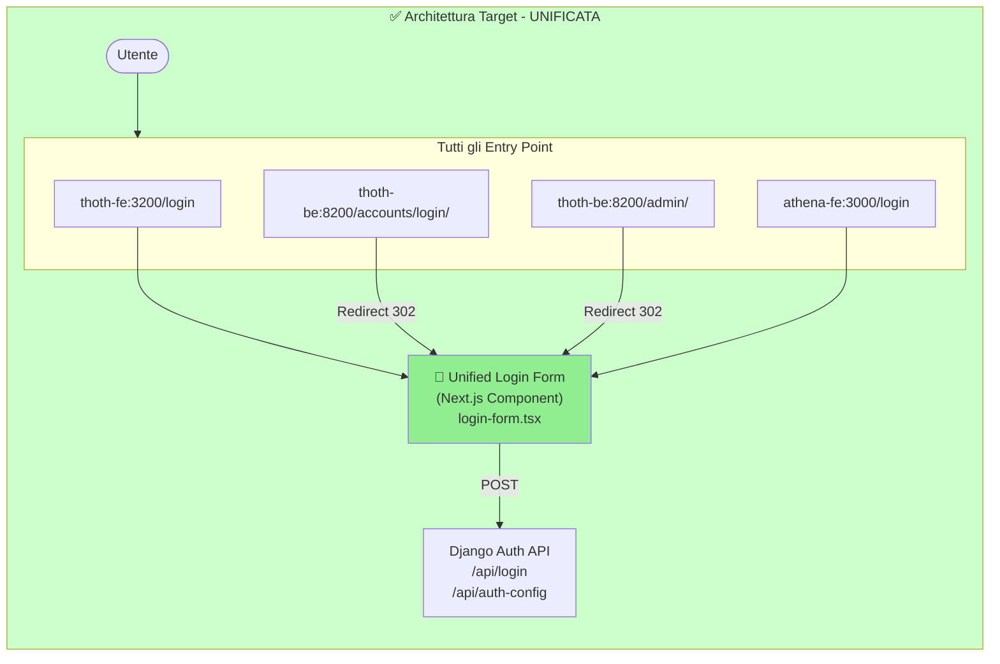
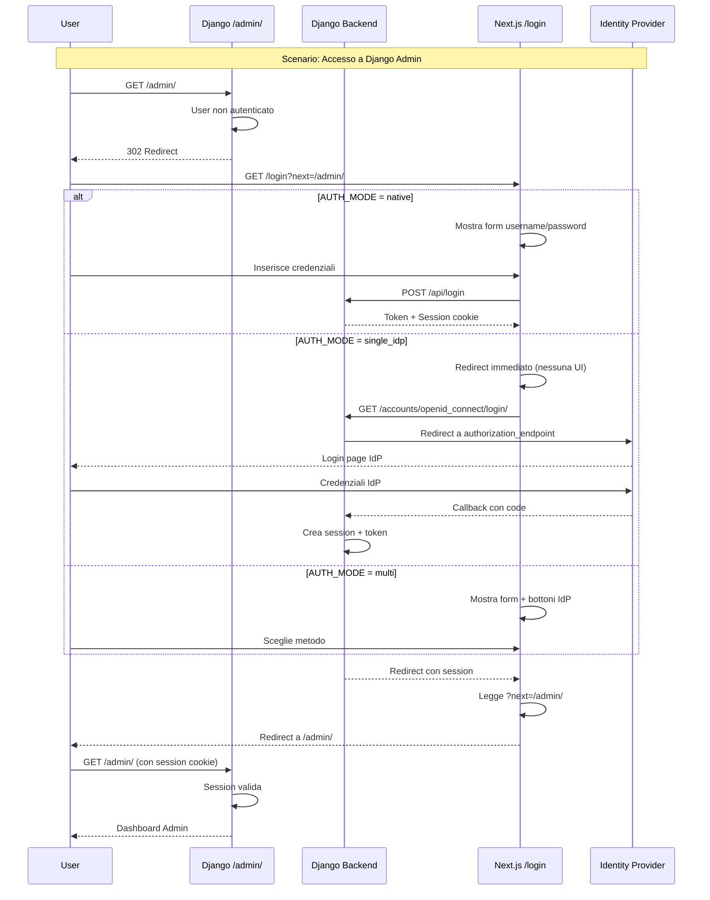
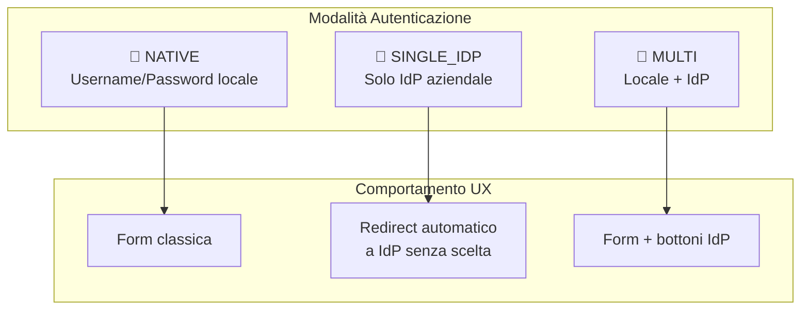
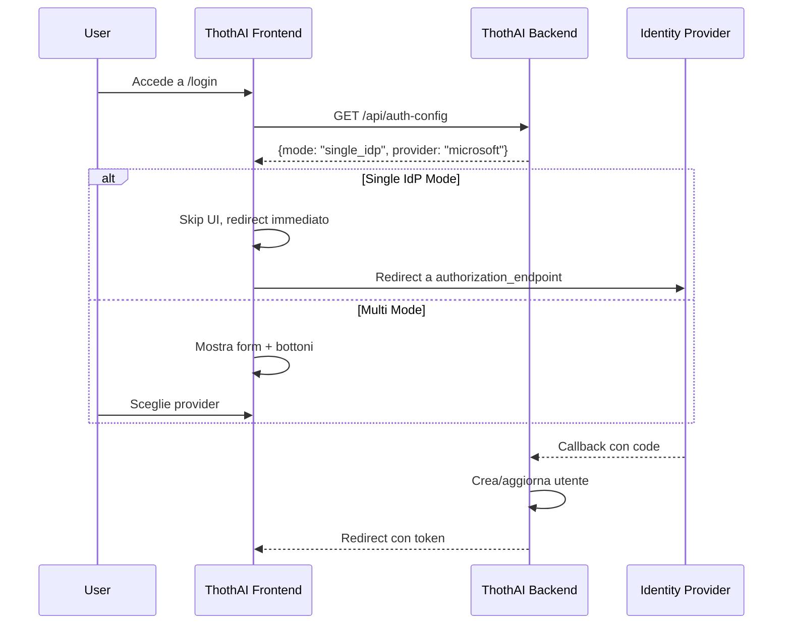
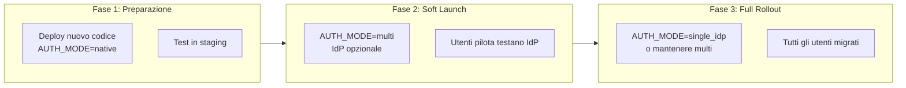

# ThothAI Authentication Restructuring Analysis

## Obiettivo

Potenziare il sistema di autenticazione di ThothAI per supportare **Identity Provider esterni** (Microsoft Entra ID, Keycloak) mantenendo la compatibilità con l'autenticazione locale esistente.

> [!IMPORTANT]
> **Contesto Produzione**: ThothAI è già in produzione con autenticazione locale.  
> Questo piano include una strategia di migrazione graduale senza downtime.

---

## 1. Stato Attuale del Sistema

### 1.1 Componenti Autenticazione



### 1.2 File Coinvolti

| File | Ruolo | Modifiche Richieste |
|------|-------|---------------------|
| `Thoth/settings.py` | Configurazione Django | ✏️ Aggiungere socialaccount, OIDC config |
| `Thoth/urls.py` | URL routing | ✏️ Aggiungere callback URLs |
| `thoth_core/authentication.py` | API Key auth | ➕ Estendere per JWT validation |
| `thoth_core/views.py` | Login endpoints | ✏️ Aggiungere auth-config endpoint |
| `frontend/lib/auth-context.tsx` | Auth state | ✏️ Supporto redirect OIDC |
| `frontend/lib/api.ts` | API client | ✏️ Gestione nuovi token types |
| `frontend/components/login-form.tsx` | UI login | ✏️ Bottoni IdP dinamici |
| `pyproject.toml` | Dipendenze | ✏️ Upgrade django-allauth |

### 1.3 Configurazione Allauth Attuale

```python
# Thoth/settings.py (produzione attuale)
INSTALLED_APPS = [
    ...
    "allauth",
    "allauth.account",  # Solo autenticazione locale
]
# Nessuna configurazione SOCIALACCOUNT_PROVIDERS
```

---

## 2. Strategia Unified Login Form

### 2.0 Problema Attuale: Tre Form di Login Separate

> [!CAUTION]
> **Attualmente ThothAI ha TRE form di login diverse**, creando frammentazione UX:



| Entry Point | Form Attuale | Tecnologia | Stile |
|-------------|--------------|------------|-------|
| `http://localhost:3200/login` | Frontend Next.js | React TSX | Moderno |
| `http://localhost:8200/accounts/login/` | Allauth Django | HTML/Bootstrap | Django template |
| `http://localhost:8200/admin/` | Django Admin | HTML | Admin default |

### 2.1 Soluzione: Una Sola Form Next.js per Tutti

> [!TIP]
> **Obiettivo**: Indipendentemente dall'entry point, mostrare **sempre la stessa form Next.js**.



### 2.2 Quale Form Appare per Ogni Scenario

| Scenario | URL Iniziale | Cosa Succede | Form Mostrata |
|----------|--------------|--------------|---------------|
| **Frontend ThothAI** | `thoth-fe:3200/login` | Apertura diretta | ✅ **Next.js Form** |
| **Backend Django** | `thoth-be:8200/accounts/login/` | Redirect a Next.js | ✅ **Next.js Form** |
| **Django Admin** | `thoth-be:8200/admin/` | Redirect a Next.js con `?next=/admin/` | ✅ **Next.js Form** |
| **Athena Frontend** | `athena-fe:3000/login` | Usa stessa form (o redirect) | ✅ **Next.js Form** |
| **Single IdP Mode** | Qualsiasi | Redirect immediato a IdP | ⚡ **Spinner → IdP** |

### 2.3 Implementazione Redirect Django → Next.js

```python
# Thoth/settings.py - CONFIGURAZIONE REDIRECT

# URL della form unificata Next.js
UNIFIED_LOGIN_URL = os.environ.get(
    "UNIFIED_LOGIN_URL", 
    "http://localhost:3200/login"  # Frontend ThothAI
)

# Django usa questa URL per tutti i redirect a login
LOGIN_URL = UNIFIED_LOGIN_URL

# Dopo login, dove redirect
LOGIN_REDIRECT_URL = os.environ.get("LOGIN_REDIRECT_URL", "/")
```

```python
# thoth_core/admin.py - OVERRIDE DJANGO ADMIN LOGIN

from django.contrib import admin
from django.shortcuts import redirect
from django.conf import settings
from django.http import HttpResponseRedirect
from urllib.parse import urlencode

class ThothAdminSite(admin.AdminSite):
    """
    Custom Admin Site che redirige al login unificato Next.js.
    """
    
    def login(self, request, extra_context=None):
        """
        Override: invece di mostrare il template admin/login.html,
        redirige alla form Next.js con ?next=/admin/
        """
        # Se già autenticato e staff, procedi normalmente
        if request.user.is_authenticated and request.user.is_staff:
            return super().login(request, extra_context)
        
        # Altrimenti, redirect alla form unificata
        next_url = request.GET.get('next', '/admin/')
        login_url = settings.UNIFIED_LOGIN_URL
        params = urlencode({'next': next_url})
        return HttpResponseRedirect(f"{login_url}?{params}")

# Sostituisci il site admin default
thoth_admin_site = ThothAdminSite(name='thoth_admin')
```

```python
# Thoth/urls.py - REGISTRAZIONE ADMIN CUSTOM

from thoth_core.admin import thoth_admin_site

urlpatterns = [
    # Usa il custom admin site invece di admin.site
    path("admin/", thoth_admin_site.urls),
    
    path("accounts/", include("allauth.urls")),
    path("", include("thoth_core.urls")),
]
```

```python
# thoth_core/middleware.py - REDIRECT ALLAUTH LOGIN

from django.conf import settings
from django.shortcuts import redirect
from django.urls import reverse

class UnifiedLoginMiddleware:
    """
    Intercetta richieste a /accounts/login/ e redirige alla form Next.js.
    """
    
    def __init__(self, get_response):
        self.get_response = get_response
    
    def __call__(self, request):
        # Intercetta /accounts/login/
        if request.path == '/accounts/login/' and not request.user.is_authenticated:
            next_url = request.GET.get('next', '/')
            login_url = settings.UNIFIED_LOGIN_URL
            return redirect(f"{login_url}?next={next_url}")
        
        return self.get_response(request)
```

```python
# Thoth/settings.py - REGISTRAZIONE MIDDLEWARE

MIDDLEWARE = [
    ...
    "thoth_core.middleware.UnifiedLoginMiddleware",  # NUOVO
    "allauth.account.middleware.AccountMiddleware",
]
```

### 2.4 Flusso Completo con Redirect



### 2.5 Riepilogo Form per AUTH_MODE

| AUTH_MODE | Entry Point | Cosa Vede l'Utente |
|-----------|-------------|-------------------|
| `native` | Qualsiasi | Form username/password classica |
| `single_idp` | Qualsiasi | Spinner → Redirect automatico a IdP |
| `multi` | Qualsiasi | Form credenziali + bottoni "Accedi con..." |

> [!IMPORTANT]
> **In TUTTI i casi, la form è la stessa** (`login-form.tsx` in Next.js).  
> L'unica differenza è il contenuto mostrato, determinato da `/api/auth-config`.

---

## 3. Modalità di Autenticazione

Il sistema supporterà **tre modalità** configurabili via environment:



| Modalità | `AUTH_MODE` | Comportamento Login | Use Case |
|----------|-------------|---------------------|----------|
| **Native** | `native` | Form username/password | Sviluppo, demo, piccole installazioni |
| **Single IdP** | `single_idp` | **Redirect diretto** a IdP, nessuna scelta | Aziende con un solo IdP |
| **Multi** | `multi` | Form locale + bottoni IdP | Scenari ibridi |

### 2.2 Logica Single IdP (UX Semplificata)

> [!TIP]
> **Requisito Utente**: Se configurato un solo IdP senza social, non mostrare alternative.



**Implementazione Frontend:**

```typescript
// login-form.tsx
export function LoginPage() {
  const [authConfig, setAuthConfig] = useState<AuthConfig | null>(null);
  const router = useRouter();

  useEffect(() => {
    async function loadConfig() {
      const config = await fetch('/api/auth-config').then(r => r.json());
      setAuthConfig(config);
      
      // ⚡ SINGLE IDP: Redirect immediato senza UI
      if (config.mode === 'single_idp' && config.providers.length === 1) {
        const provider = config.providers[0];
        window.location.href = `${BACKEND_URL}${provider.login_url}`;
        return;
      }
    }
    loadConfig();
  }, []);

  // Se single_idp, mostra solo spinner durante redirect
  if (authConfig?.mode === 'single_idp') {
    return <LoadingSpinner message="Reindirizzamento all'autenticazione..." />;
  }

  // Altrimenti mostra form normale
  return <UnifiedLoginForm config={authConfig} />;
}
```

---

## 3. Modifiche Backend Dettagliate

### 3.1 Upgrade Dipendenze

```bash
# pyproject.toml
- "django-allauth==65.7.0"
+ "django-allauth==65.13.1"
```

```bash
# Comando di upgrade
cd /Users/mp/ThothAI/backend
uv pip install "django-allauth==65.13.1"
python manage.py migrate
```

### 3.2 Configurazione settings.py

```python
# Thoth/settings.py - NUOVA CONFIGURAZIONE

import os

# ============================================
# AUTHENTICATION MODE CONFIGURATION
# ============================================

# Modalità: "native" | "single_idp" | "multi"
AUTH_MODE = os.environ.get("AUTH_MODE", "native")

# Provider primario (usato in single_idp mode)
PRIMARY_IDP = os.environ.get("PRIMARY_IDP", None)  # "microsoft" | "keycloak"

# ============================================
# INSTALLED APPS - Aggiornamento
# ============================================

INSTALLED_APPS = [
    ...
    "allauth",
    "allauth.account",
    "allauth.socialaccount",  # NUOVO
    "allauth.socialaccount.providers.openid_connect",  # NUOVO
]

# ============================================
# SOCIALACCOUNT PROVIDERS
# ============================================

SOCIALACCOUNT_PROVIDERS = {
    "openid_connect": {
        "APPS": []
    }
}

# Microsoft Entra ID Configuration
if os.environ.get("ENTRA_ENABLED", "false").lower() == "true":
    SOCIALACCOUNT_PROVIDERS["openid_connect"]["APPS"].append({
        "provider_id": "microsoft",
        "name": "Microsoft Entra ID",
        "client_id": os.environ.get("ENTRA_CLIENT_ID", ""),
        "secret": os.environ.get("ENTRA_CLIENT_SECRET", ""),
        "settings": {
            "server_url": os.environ.get(
                "ENTRA_ISSUER",
                "https://login.microsoftonline.com/common/v2.0"
            ),
            "token_auth_method": "client_secret_basic",
        },
    })

# Keycloak Configuration
if os.environ.get("KEYCLOAK_ENABLED", "false").lower() == "true":
    SOCIALACCOUNT_PROVIDERS["openid_connect"]["APPS"].append({
        "provider_id": "keycloak",
        "name": "Keycloak",
        "client_id": os.environ.get("KEYCLOAK_CLIENT_ID", ""),
        "secret": os.environ.get("KEYCLOAK_CLIENT_SECRET", ""),
        "settings": {
            "server_url": os.environ.get(
                "KEYCLOAK_ISSUER",
                "http://localhost:8080/realms/thoth/.well-known/openid-configuration"
            ),
        },
    })

# ============================================
# ALLAUTH BEHAVIOR SETTINGS
# ============================================

# Comportamento basato su AUTH_MODE
if AUTH_MODE == "single_idp":
    ACCOUNT_ALLOW_SIGNUPS = False  # No registrazione locale
    SOCIALACCOUNT_ONLY = True  # Solo IdP
    SOCIALACCOUNT_AUTO_SIGNUP = True  # Auto-crea utenti
elif AUTH_MODE == "multi":
    ACCOUNT_ALLOW_SIGNUPS = True
    SOCIALACCOUNT_AUTO_SIGNUP = True
else:  # native
    ACCOUNT_ALLOW_SIGNUPS = True
    SOCIALACCOUNT_AUTO_SIGNUP = False

# Common settings
ACCOUNT_AUTHENTICATION_METHOD = "username_email"
ACCOUNT_EMAIL_REQUIRED = True
ACCOUNT_EMAIL_VERIFICATION = os.environ.get("EMAIL_VERIFICATION", "none")
ACCOUNT_LOGIN_ON_EMAIL_CONFIRMATION = True
ACCOUNT_LOGOUT_ON_GET = True
ACCOUNT_SESSION_REMEMBER = True

# Redirect URLs
LOGIN_REDIRECT_URL = os.environ.get("LOGIN_REDIRECT_URL", "/")
ACCOUNT_LOGOUT_REDIRECT_URL = os.environ.get("LOGOUT_REDIRECT_URL", "/login")
```

### 3.3 Nuovo Endpoint `/api/auth-config`

```python
# thoth_core/views.py - NUOVO ENDPOINT

from rest_framework.decorators import api_view, permission_classes
from rest_framework.permissions import AllowAny
from rest_framework.response import Response
from django.conf import settings

@api_view(['GET'])
@permission_classes([AllowAny])
def auth_config(request):
    """
    Ritorna la configurazione di autenticazione per il frontend.
    Usato per determinare quali opzioni mostrare nella login page.
    """
    providers = []
    
    # Aggiungi provider locale se non in single_idp mode
    if settings.AUTH_MODE != "single_idp":
        if getattr(settings, 'ACCOUNT_ALLOW_SIGNUPS', True):
            providers.append({
                "id": "local",
                "name": "Username/Password",
                "type": "credentials",
            })
    
    # Aggiungi provider OIDC configurati
    oidc_apps = settings.SOCIALACCOUNT_PROVIDERS.get("openid_connect", {}).get("APPS", [])
    for app in oidc_apps:
        providers.append({
            "id": app["provider_id"],
            "name": app["name"],
            "type": "oidc",
            "login_url": f"/accounts/openid_connect/login/?process=login&provider_id={app['provider_id']}",
        })
    
    # Determina se è single_idp effettivo
    is_single_idp = (
        settings.AUTH_MODE == "single_idp" and 
        len(providers) == 1 and 
        providers[0]["type"] == "oidc"
    )
    
    return Response({
        "mode": "single_idp" if is_single_idp else settings.AUTH_MODE,
        "providers": providers,
        "primary_provider": settings.PRIMARY_IDP if is_single_idp else None,
        "registration_enabled": settings.AUTH_MODE == "native" or settings.AUTH_MODE == "multi",
        "password_reset_enabled": settings.AUTH_MODE != "single_idp",
    })
```

### 3.4 URL Configuration

```python
# thoth_core/urls.py - AGGIORNAMENTO

urlpatterns = [
    ...
    # Nuovo endpoint auth config
    path("api/auth-config", views.auth_config, name="auth_config"),
    
    # Callback URL per OIDC (aggiunte automaticamente da allauth)
    # /accounts/openid_connect/login/callback/
]
```

```python
# Thoth/urls.py - VERIFICA

urlpatterns = [
    path("admin/", admin.site.urls),
    path("accounts/", include("allauth.urls")),  # Già presente
    path("", include("thoth_core.urls")),
    ...
]
```

---

## Appendice A: Confronto Claims OIDC - Entra ID vs Keycloak

> [!NOTE]
> Entrambi gli IdP usano OIDC, ma ritornano **strutture dati diverse** per i claims utente.
> È importante normalizzare questi dati nell'adapter Django.

### 4.1 Claims Standard OIDC (Comuni)

| Claim | Descrizione | Entra ✅ | Keycloak ✅ |
|-------|-------------|----------|-------------|
| `sub` | Subject (ID univoco utente) | ✅ | ✅ |
| `iss` | Issuer (URL dell'IdP) | ✅ | ✅ |
| `aud` | Audience (Client ID) | ✅ | ✅ |
| `exp` | Expiration time | ✅ | ✅ |
| `iat` | Issued at | ✅ | ✅ |
| `email` | Email utente | ✅ | ✅ |
| `name` | Nome completo | ✅ | ✅ |
| `given_name` | Nome | ✅ | ✅ |
| `family_name` | Cognome | ✅ | ✅ |

### 4.2 Claims Specifici Microsoft Entra ID

```json
{
  "sub": "AAAAAAAAAAAAAAAAAAAAAIkzqFVrSaSaFHy782bbtaQ",
  "oid": "00000000-0000-0000-66f3-3332eca7ea81",
  "tid": "9188040d-6c67-4c5b-b112-36a304b66dad",
  "preferred_username": "mario.rossi@contoso.com",
  "email": "mario.rossi@contoso.com",
  "name": "Mario Rossi",
  "given_name": "Mario",
  "family_name": "Rossi",
  "upn": "mario.rossi@contoso.com",
  "roles": ["Admin", "User"],
  "groups": ["group-id-1", "group-id-2"],
  "wids": ["global-admin-id"],
  "amr": ["pwd", "mfa"],
  "ipaddr": "192.168.1.1"
}
```

| Claim | Descrizione |
|-------|-------------|
| `oid` | **Object ID** - ID univoco utente in Azure AD |
| `tid` | **Tenant ID** - ID del tenant Azure |
| `upn` | **User Principal Name** - username@domain |
| `roles` | **App Roles** - Array flat dei ruoli applicativi |
| `groups` | **Group IDs** - Array di GUID dei gruppi (opzionale) |
| `wids` | **Directory Role IDs** - Ruoli directory Azure |
| `amr` | **Auth Methods** - Metodi usati (pwd, mfa, etc.) |

### 4.3 Claims Specifici Keycloak

```json
{
  "sub": "f1a2b3c4-d5e6-7890-abcd-ef1234567890",
  "preferred_username": "mario.rossi",
  "email": "mario.rossi@example.com",
  "email_verified": true,
  "name": "Mario Rossi",
  "given_name": "Mario",
  "family_name": "Rossi",
  "realm_access": {
    "roles": ["offline_access", "uma_authorization", "default-roles-thoth"]
  },
  "resource_access": {
    "thoth-client": {
      "roles": ["admin", "user"]
    },
    "account": {
      "roles": ["manage-account", "view-profile"]
    }
  },
  "scope": "openid email profile",
  "azp": "thoth-client",
  "session_state": "abc123...",
  "acr": "1",
  "allowed-origins": ["http://localhost:3200"]
}
```

| Claim | Descrizione |
|-------|-------------|
| `email_verified` | Booleano - email verificata |
| `realm_access` | **Ruoli a livello realm** - applicabili a tutto il realm |
| `resource_access` | **Ruoli per client** - nested per ogni client registrato |
| `azp` | **Authorized Party** - Client ID che ha richiesto il token |
| `session_state` | **Session ID** di Keycloak |
| `allowed-origins` | **CORS origins** configurati per il client |

### 4.4 Tabella Comparativa Mapping

| Dato | Claim Entra | Claim Keycloak | Note |
|------|-------------|----------------|------|
| **ID Utente** | `oid` (GUID) | `sub` (UUID) | ⚠️ Diversi! |
| **Username** | `preferred_username` o `upn` | `preferred_username` | Simile |
| **Email** | `email` | `email` | Identico |
| **Nome** | `given_name` | `given_name` | Identico |
| **Cognome** | `family_name` | `family_name` | Identico |
| **Tenant/Realm** | `tid` (nel token) | Parte di `iss` URL | Diversa posizione |
| **Ruoli App** | `roles` (array flat) | `resource_access.{client}.roles` | ⚠️ Struttura diversa! |
| **Gruppi** | `groups` (array GUID) | Richiede mapper custom | Non standard KC |
| **Email verificata** | Non standard | `email_verified` | Solo Keycloak |

### 4.5 Implementazione Adapter Normalizzato

```python
# thoth_core/adapters.py

from allauth.socialaccount.adapter import DefaultSocialAccountAdapter
from django.contrib.auth import get_user_model

User = get_user_model()

class ThothSocialAccountAdapter(DefaultSocialAccountAdapter):
    """
    Adapter che normalizza i claims da diversi IdP (Entra, Keycloak).
    """
    
    def populate_user(self, request, sociallogin, data):
        """Popola dati utente dai claims IdP."""
        user = super().populate_user(request, sociallogin, data)
        extra_data = sociallogin.account.extra_data
        
        # Nome e cognome (standard per entrambi)
        user.first_name = extra_data.get('given_name', '')
        user.last_name = extra_data.get('family_name', '')
        
        # Email (standard per entrambi)
        user.email = (
            extra_data.get('email') or 
            extra_data.get('preferred_username', '')
        )
        
        return user
    
    def get_user_id(self, sociallogin) -> str:
        """Estrae l'ID utente in modo normalizzato."""
        extra_data = sociallogin.account.extra_data
        provider_id = sociallogin.account.provider
        
        if provider_id == "microsoft":
            # Entra: usa oid come ID principale
            return extra_data.get('oid') or extra_data.get('sub')
        else:
            # Keycloak e altri: usa sub
            return extra_data.get('sub')
    
    def get_user_roles(self, sociallogin) -> list:
        """Estrae i ruoli in modo normalizzato per entrambi gli IdP."""
        extra_data = sociallogin.account.extra_data
        provider_id = sociallogin.account.provider
        
        if provider_id == "microsoft":
            # Entra: ruoli in array flat
            return extra_data.get('roles', [])
        
        elif provider_id == "keycloak":
            # Keycloak: ruoli nested sotto resource_access
            client_id = "thoth-client"  # Configurabile via settings
            resource_access = extra_data.get('resource_access', {})
            client_roles = resource_access.get(client_id, {}).get('roles', [])
            realm_roles = extra_data.get('realm_access', {}).get('roles', [])
            # Combina e deduplica
            return list(set(client_roles + realm_roles))
        
        return []
    
    def get_user_groups(self, sociallogin) -> list:
        """Estrae i gruppi (se disponibili)."""
        extra_data = sociallogin.account.extra_data
        
        # Entra include groups se configurato nell'app registration
        # Keycloak richiede un mapper custom
        return extra_data.get('groups', [])
```

### 4.6 Configurazione Keycloak per Gruppi

Per includere i gruppi nel token Keycloak (non inclusi di default):

1. **Keycloak Admin Console** → Clients → `thoth-client` → Client Scopes
2. **Add mapper** → "Group Membership"
3. Configura:
   - **Name**: `groups`
   - **Token Claim Name**: `groups`
   - **Full group path**: `off`
   - **Add to ID token**: `on`
   - **Add to access token**: `on`

### 4.7 Riepilogo Differenze Chiave

| Aspetto | Microsoft Entra ID | Keycloak |
|---------|-------------------|----------|
| **ID Utente primario** | `oid` (GUID Azure) | `sub` (UUID) |
| **Struttura ruoli** | Array flat `roles` | Nested `resource_access.{client}.roles` |
| **Gruppi** | `groups` (se configurato in app) | Richiede mapper custom |
| **Tenant info** | `tid` come claim separato | Nel path dell'`iss` URL |
| **Claims custom** | Azure claims mapping | Keycloak client mappers |
| **Email verificata** | Non standard | `email_verified` booleano |

## 4. Modifiche Frontend Dettagliate

### 4.1 Auth Context Update

```typescript
// lib/auth-context.tsx - AGGIORNAMENTI

interface AuthConfig {
  mode: 'native' | 'single_idp' | 'multi';
  providers: AuthProvider[];
  primary_provider: string | null;
  registration_enabled: boolean;
  password_reset_enabled: boolean;
}

interface AuthProvider {
  id: string;
  name: string;
  type: 'credentials' | 'oidc';
  login_url?: string;
}

// Nuovo metodo per login OIDC
export function loginWithOIDC(providerId: string, redirectTo?: string) {
  const backendUrl = process.env.NEXT_PUBLIC_BACKEND_URL || 'http://localhost:8200';
  const next = redirectTo || window.location.pathname;
  
  // Redirect al backend Django che gestisce OIDC
  window.location.href = `${backendUrl}/accounts/openid_connect/login/?process=login&provider_id=${providerId}&next=${encodeURIComponent(next)}`;
}
```

### 4.2 Login Form Dinamica

```typescript
// components/login-form.tsx - RISCRITTURA

'use client';

import { useEffect, useState } from 'react';
import { useRouter, useSearchParams } from 'next/navigation';
import { useAuth } from '@/lib/auth-context';

export function LoginForm() {
  const [authConfig, setAuthConfig] = useState<AuthConfig | null>(null);
  const [isLoading, setIsLoading] = useState(true);
  const { login, isAuthenticated } = useAuth();
  const router = useRouter();
  const searchParams = useSearchParams();
  const redirectTo = searchParams.get('next') || '/';

  useEffect(() => {
    async function loadAuthConfig() {
      try {
        const response = await fetch(
          `${process.env.NEXT_PUBLIC_BACKEND_URL}/api/auth-config`
        );
        const config = await response.json();
        setAuthConfig(config);

        // ⚡ SINGLE IDP: Redirect immediato
        if (config.mode === 'single_idp' && config.providers.length === 1) {
          const provider = config.providers[0];
          if (provider.type === 'oidc') {
            window.location.href = `${process.env.NEXT_PUBLIC_BACKEND_URL}${provider.login_url}&next=${encodeURIComponent(redirectTo)}`;
            return;
          }
        }
      } catch (error) {
        console.error('Failed to load auth config:', error);
      } finally {
        setIsLoading(false);
      }
    }

    if (!isAuthenticated) {
      loadAuthConfig();
    } else {
      router.push(redirectTo);
    }
  }, [isAuthenticated, redirectTo, router]);

  // Loading state per single_idp redirect
  if (isLoading || authConfig?.mode === 'single_idp') {
    return (
      <div className="flex flex-col items-center justify-center min-h-screen">
        <div className="animate-spin rounded-full h-12 w-12 border-b-2 border-primary" />
        <p className="mt-4 text-muted-foreground">
          {authConfig?.mode === 'single_idp' 
            ? 'Reindirizzamento all\'autenticazione aziendale...'
            : 'Caricamento...'}
        </p>
      </div>
    );
  }

  return (
    <div className="login-container">
      {/* Logo ThothAI */}
      <div className="flex justify-center mb-8">
        <Logo />
      </div>

      {/* Form credenziali (solo se disponibile) */}
      {authConfig?.providers.some(p => p.type === 'credentials') && (
        <CredentialsForm 
          onSubmit={handleCredentialsLogin}
          showRegistration={authConfig.registration_enabled}
          showPasswordReset={authConfig.password_reset_enabled}
        />
      )}

      {/* Separatore (solo se ci sono entrambi) */}
      {authConfig?.providers.some(p => p.type === 'credentials') &&
       authConfig?.providers.some(p => p.type === 'oidc') && (
        <div className="divider my-6">
          <span className="text-muted-foreground text-sm">oppure</span>
        </div>
      )}

      {/* Bottoni IdP */}
      {authConfig?.providers
        .filter(p => p.type === 'oidc')
        .map(provider => (
          <OIDCProviderButton
            key={provider.id}
            provider={provider}
            redirectTo={redirectTo}
          />
        ))
      }
    </div>
  );
}
```

---

## 5. Piano di Migrazione Produzione

### 5.1 Strategia: Blue-Green con Feature Flag



### 5.2 Checklist Pre-Migrazione

| Step | Azione | Stato |
|------|--------|-------|
| 1 | Backup database produzione | ⬜ |
| 2 | Registrare app in IdP (Entra/Keycloak) | ⬜ |
| 3 | Ottenere Client ID e Secret | ⬜ |
| 4 | Configurare redirect URI nell'IdP | ⬜ |
| 5 | Testare in ambiente staging | ⬜ |
| 6 | Preparare rollback plan | ⬜ |
| 7 | Comunicare agli utenti | ⬜ |

### 5.3 Variabili d'Ambiente per Deploy

```env
# .env.production - NUOVE VARIABILI

# Authentication Mode
AUTH_MODE=native  # Iniziare con native, poi passare a multi/single_idp

# Microsoft Entra ID (se abilitato)
ENTRA_ENABLED=false
ENTRA_CLIENT_ID=xxxxxxxx-xxxx-xxxx-xxxx-xxxxxxxxxxxx
ENTRA_CLIENT_SECRET=your-client-secret
ENTRA_ISSUER=https://login.microsoftonline.com/{tenant-id}/v2.0

# Keycloak (se abilitato)
KEYCLOAK_ENABLED=false
KEYCLOAK_CLIENT_ID=thoth-client
KEYCLOAK_CLIENT_SECRET=your-keycloak-secret
KEYCLOAK_ISSUER=https://keycloak.example.com/realms/production/.well-known/openid-configuration

# Primary IdP (per single_idp mode)
PRIMARY_IDP=microsoft  # oppure "keycloak"
```

### 5.4 Procedura di Rollback

In caso di problemi post-migrazione:

```bash
# 1. Ripristino immediato a native mode
export AUTH_MODE=native
export ENTRA_ENABLED=false
export KEYCLOAK_ENABLED=false

# 2. Restart servizi
docker compose restart thoth-be thoth-fe

# 3. Gli utenti possono continuare a usare credenziali locali
```

### 5.5 Mapping Utenti IdP → Locali

```python
# thoth_core/adapters.py - NUOVO FILE

from allauth.socialaccount.adapter import DefaultSocialAccountAdapter
from django.contrib.auth import get_user_model

User = get_user_model()

class ThothSocialAccountAdapter(DefaultSocialAccountAdapter):
    """
    Adapter per collegare account IdP a utenti locali esistenti.
    """
    
    def pre_social_login(self, request, sociallogin):
        """
        Connetti account IdP a utente locale esistente se email corrisponde.
        """
        if sociallogin.is_existing:
            return
        
        # Cerca utente locale con stessa email
        email = sociallogin.account.extra_data.get('email') or \
                sociallogin.account.extra_data.get('preferred_username')
        
        if email:
            try:
                existing_user = User.objects.get(email=email)
                sociallogin.connect(request, existing_user)
            except User.DoesNotExist:
                pass  # Crea nuovo utente
    
    def populate_user(self, request, sociallogin, data):
        """
        Popola dati utente da claims IdP.
        """
        user = super().populate_user(request, sociallogin, data)
        
        extra_data = sociallogin.account.extra_data
        user.first_name = extra_data.get('given_name', '')
        user.last_name = extra_data.get('family_name', '')
        
        return user
```

```python
# settings.py - Registrazione adapter
SOCIALACCOUNT_ADAPTER = 'thoth_core.adapters.ThothSocialAccountAdapter'
```

---

## 6. Testing

### 6.1 Test Environment Setup

```yaml
# docker-compose.test.yml

services:
  # Entra Emulator (già esistente)
  entra-emulator:
    image: ghcr.io/your-org/entra-emulator:latest
    ports:
      - "8029:8029"
    environment:
      - TENANT_ID=test-tenant

  # Keycloak per test
  keycloak:
    image: quay.io/keycloak/keycloak:26.0
    ports:
      - "8081:8080"
    environment:
      - KEYCLOAK_ADMIN=admin
      - KEYCLOAK_ADMIN_PASSWORD=admin
    command: start-dev
```

### 6.2 Test Matrix

| Scenario | AUTH_MODE | Providers | Test Case |
|----------|-----------|-----------|-----------|
| Legacy | `native` | Nessuno | Login username/password ✓ |
| Entra Only | `single_idp` | Microsoft | Redirect automatico a Entra ✓ |
| Keycloak Only | `single_idp` | Keycloak | Redirect automatico a Keycloak ✓ |
| Ibrido | `multi` | Local + Microsoft | Scelta nella UI ✓ |
| Multi-IdP | `multi` | Microsoft + Keycloak | Bottoni multipli ✓ |

### 6.3 Test Cases Critici

1. **Utente esistente login via IdP**: Email corrisponde → collegamento automatico
2. **Nuovo utente via IdP**: Creazione automatica account
3. **Fallback a locale**: Se IdP down, errore chiaro (non crash)
4. **Session persistence**: Token refresh funziona
5. **Logout**: Invalida sessione Django e (opzionalmente) IdP

---

## 7. Roadmap Implementazione

### Fase 1: Preparazione Backend (Giorni 1-3)

| Task | Effort | Dipendenze |
|------|--------|------------|
| Upgrade django-allauth 65.7.0 → 65.13.1 | 1h | - |
| Aggiungere socialaccount a INSTALLED_APPS | 0.5h | Upgrade |
| Creare configurazione AUTH_MODE | 2h | - |
| Implementare `/api/auth-config` endpoint | 2h | - |
| Creare ThothSocialAccountAdapter | 3h | - |
| **Creare ThothAdminSite (redirect admin login)** | 2h | - |
| **Creare UnifiedLoginMiddleware (redirect allauth)** | 2h | - |
| Unit tests backend | 4h | Tutti i precedenti |

### Fase 2: Configurazione IdP (Giorni 4-5)

| Task | Effort | Dipendenze |
|------|--------|------------|
| Setup Entra Emulator per dev | 1h | - |
| Configurazione Entra in settings.py | 2h | - |
| Setup Keycloak Docker per dev | 2h | - |
| Configurazione Keycloak in settings.py | 2h | - |
| Test login con entrambi gli IdP | 4h | Configurazione |

### Fase 3: Frontend - Unified Login Form (Giorni 6-9)

| Task | Effort | Dipendenze |
|------|--------|------------|
| Aggiornare auth-context.tsx con AuthConfig | 3h | API auth-config |
| **Riscrivere login-form.tsx come Unified Form** | 6h | Auth context |
| Implementare redirect automatico single_idp | 2h | Login form |
| Creare OIDCProviderButton components | 3h | - |
| **Gestione ?next= per redirect post-login** | 2h | Login form |
| Styling + UX dinamica per tutte le modalità | 4h | Componenti |
| Test E2E: frontend, backend, admin | 4h | Tutti i precedenti |

### Fase 4: Staging & Rollout (Giorni 10-11)

| Task | Effort | Dipendenze |
|------|--------|------------|
| Deploy in staging con AUTH_MODE=native | 2h | - |
| Test regressione funzionalità esistenti | 4h | Deploy |
| **Test redirect da /admin/, /accounts/login/** | 2h | Deploy |
| Attivare AUTH_MODE=multi in staging | 1h | Test regressione |
| Test pilota con utenti selezionati | 4h | Multi mode |
| Deploy produzione | 2h | Approvazione |

---

## 8. Stima Totale

| Fase | Giorni | Note |
|------|--------|------|
| Backend + Redirect | 3 | Include admin override, middleware |
| IdP Setup | 2 | Entra + Keycloak |
| Frontend Unified Form | 4 | Login unificata, tutti i casi |
| Staging/Rollout | 2 | Include test redirect |
| **TOTALE** | **11 giorni lavorativi** | ~2.5 settimane |

---

## 9. Rischi e Mitigazioni

| Rischio | Probabilità | Impatto | Mitigazione |
|---------|-------------|---------|-------------|
| IdP non raggiungibile | Media | Alto | Fallback chiaro, logging, healthcheck |
| Mapping email errato | Bassa | Alto | Verifica email prima di collegare account |
| Token scaduti | Media | Medio | Gestione refresh token |
| Breaking change allauth | Bassa | Alto | Pinning versione, test completi prima upgrade |

---

## 10. Integrazione Futura con Athena

> [!NOTE]
> Questo documento copre solo la ristrutturazione di ThothAI.  
> L'integrazione con Athena è oggetto di un documento separato.

Una volta completata questa fase, ThothAI esporrà:
- `/api/auth-config` - Configurazione provider disponibili
- `/api/login` - Login con credenziali locali
- `/api/token-exchange` - Scambio session → REST token
- `/api/validate-token` - Validazione token per Athena backend
- `/accounts/openid_connect/login/` - Redirect a IdP

Athena potrà utilizzare questi endpoint come auth provider centralizzato.
