# SQL Generator Workflow Documentation

## Overview

The SQL Generator is a sophisticated AI-powered system that converts natural language questions into SQL queries using multiple specialized agents working in a coordinated pipeline. This document provides a comprehensive overview of the workflow process, main functions, and agent interactions.

## Architecture Overview

The SQL Generator follows a multi-phase pipeline architecture with the following key components:

- **FastAPI Application** (`main.py`) - Main entry point and API endpoints
- **Agent Manager** (`agents/core/agent_manager.py`) - Factory for creating and managing AI agents
- **Phase-based Pipeline** - 7 distinct processing phases
- **State Management** - Centralized state management via `SystemState`
- **Database Integration** - Connection to SQL databases and vector databases

## Main Functions and Components

### FastAPI Application (`main.py`)

**Primary Functions:**
- `generate_sql()` - Main endpoint orchestrating the entire SQL generation pipeline
- `explain_sql()` - Generates human-readable explanations for SQL queries
- `execute_query()` - Executes SQL queries with pagination support
- `save_sql_feedback()` - Saves user feedback to vector database

**Key Responsibilities:**
- HTTP request handling and validation
- Session management and caching
- Phase orchestration and error handling
- Streaming response generation

### Agent Manager (`agents/core/agent_manager.py`)

**Agent Types:**
- `question_validator_agent` - Validates and translates user questions
- `question_translator_agent` - Translates questions to English
- `keyword_extraction_agent` - Extracts relevant keywords and entities
- `test_gen_agent_1/2/3` - Generates test cases for SQL validation
- `evaluator_agent` - Evaluates SQL candidates
- `sql_basic_agent` - Basic SQL generation
- `sql_advanced_agent` - Advanced SQL generation
- `sql_expert_agent` - Expert-level SQL generation
- `sql_explainer_agent` - Explains SQL queries
- `sql_evaluator_agent` - Evaluates SQL syntax and correctness

## Workflow Phases

### Phase 1: Question Validation
**Function:** `_validate_question_phase()`
**Purpose:** Validate user input and handle language translation
**Key Actions:**
- Language detection and validation
- Translation to English if needed
- Question appropriateness checking
- Error handling for invalid questions

### Phase 2: Keyword Extraction
**Function:** `_extract_keywords_phase()`
**Purpose:** Extract relevant keywords and entities from the question
**Key Actions:**
- Natural language processing
- Entity recognition
- Keyword weighting and scoring
- Schema element matching

### Phase 3: Context Retrieval
**Function:** `_retrieve_context_phase()`
**Purpose:** Retrieve relevant context from vector databases
**Key Actions:**
- LSH (Locality Sensitive Hashing) for exact matches
- Vector similarity search for semantic matches
- Schema linking strategy determination
- Evidence collection and ranking

### Phase 4: Test Precomputation
**Function:** `_precompute_tests_phase()`
**Purpose:** Generate test cases for SQL validation
**Key Actions:**
- Test case generation using AI agents
- Test validation and scoring
- Test execution planning
- Expected result preparation

### Phase 5: SQL Generation
**Function:** `_generate_sql_candidates_phase()`
**Purpose:** Generate multiple SQL query candidates
**Key Actions:**
- Multi-agent SQL generation (Basic, Advanced, Expert)
- SQL syntax validation
- Query optimization suggestions
- Candidate ranking and filtering

### Phase 6: Evaluation and Selection
**Function:** `_evaluate_and_select_phase()`
**Purpose:** Evaluate SQL candidates and select the best one
**Key Actions:**
- Test execution against generated SQL
- Performance metric calculation
- Confidence scoring
- Final SQL selection with reasoning

### Phase 7: Response Preparation
**Function:** `_prepare_final_response_phase()`
**Purpose:** Prepare final response and logging
**Key Actions:**
- Response formatting
- Execution status determination
- Logging and analytics
- State cleanup

## Agent Collaboration Diagram

```mermaid
graph TB
    subgraph "User Interface"
        UI[User Question]
        API[FastAPI Endpoint]
    end

    subgraph "Phase 1: Question Validation"
        QV[Question Validator Agent]
        QT[Question Translator Agent]
    end

    subgraph "Phase 2: Keyword Extraction"
        KE[Keyword Extraction Agent]
    end

    subgraph "Phase 3: Context Retrieval"
        VDB[Vector Database]
        LSH[LSH Search]
        VS[Vector Search]
        SC[Schema Connector]
    end

    subgraph "Phase 4: Test Generation"
        TG1[Test Generator Agent 1]
        TG2[Test Generator Agent 2]
        TG3[Test Generator Agent 3]
        TV[Test Validators]
    end

    subgraph "Phase 5: SQL Generation"
        SQLB[SQL Basic Agent]
        SQLA[SQL Advanced Agent]
        SQLE[SQL Expert Agent]
        SV[SQL Validators]
    end

    subgraph "Phase 6: Evaluation & Selection"
        EVAL[Evaluator Agent]
        SE[SQL Evaluator Agent]
        DB[(SQL Database)]
    end

    subgraph "Phase 7: Response & Logging"
        RP[Response Preparation]
        LOG[Analytics/Logging]
        FEEDBACK[Feedback Storage]
    end

    subgraph "Management Layer"
        AM[Agent Manager]
        STATE[System State]
        CM[Cache Manager]
    end

    %% Main flow
    UI --> API
    API --> AM
    AM --> STATE

    %% Phase 1 flow
    AM --> QV
    QV --> QT
    QT --> STATE

    %% Phase 2 flow
    STATE --> KE
    KE --> STATE

    %% Phase 3 flow
    STATE --> SC
    SC --> VDB
    VDB --> LSH
    VDB --> VS
    LSH --> STATE
    VS --> STATE

    %% Phase 4 flow
    STATE --> TG1
    STATE --> TG2
    STATE --> TG3
    TG1 --> TV
    TG2 --> TV
    TG3 --> TV
    TV --> STATE

    %% Phase 5 flow
    STATE --> SQLB
    STATE --> SQLA
    STATE --> SQLE
    SQLB --> SV
    SQLA --> SV
    SQLE --> SV
    SV --> STATE

    %% Phase 6 flow
    STATE --> EVAL
    STATE --> SE
    EVAL --> DB
    SE --> DB
    DB --> STATE
    STATE --> EVAL

    %% Phase 7 flow
    STATE --> RP
    RP --> LOG
    RP --> FEEDBACK
    FEEDBACK --> VDB

    %% Cache management
    CM --> AM
    CM --> STATE

    %% Styles
    classDef phaseBox fill:#e1f5fe,stroke:#01579b,stroke-width:2px
    classDef agentBox fill:#f3e5f5,stroke:#4a148c,stroke-width:2px
    classDef dataBox fill:#e8f5e8,stroke:#1b5e20,stroke-width:2px
    classDef manageBox fill:#fff3e0,stroke:#e65100,stroke-width:2px

    class QV,QT,KE,TG1,TG2,TG3,SQLB,SQLA,SQLE,EVAL,SE agentBox
    class VDB,DB,LOG,FEEDBACK dataBox
    class AM,STATE,CM manageBox
    class "Phase 1: Question Validation","Phase 2: Keyword Extraction","Phase 3: Context Retrieval","Phase 4: Test Generation","Phase 5: SQL Generation","Phase 6: Evaluation & Selection","Phase 7: Response & Logging" phaseBox
```

## Detailed Phase Flow

### Phase 1: Question Validation Flow
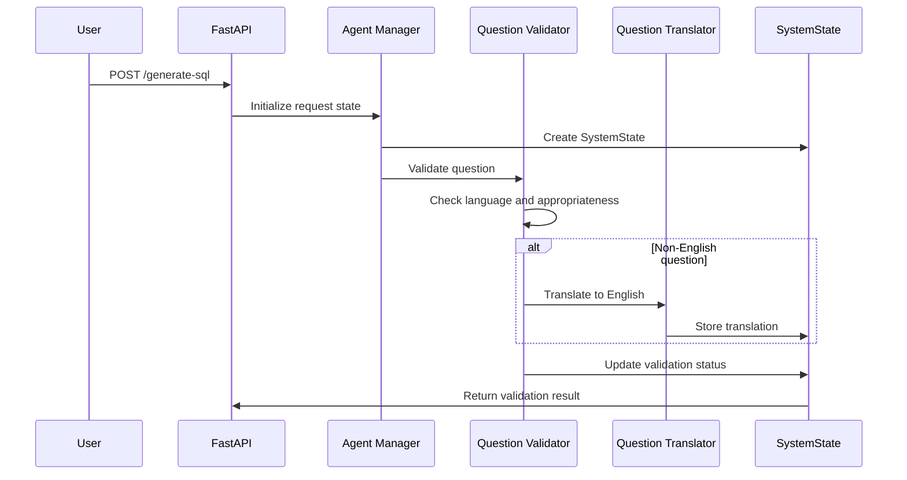
```mermaid
sequenceDiagram
    participant U as User
    participant API as FastAPI
    participant AM as Agent Manager
    participant QV as Question Validator
    participant QT as Question Translator
    participant S as SystemState

    U->>API: POST /generate-sql
    API->>AM: Initialize request state
    AM->>S: Create SystemState
    AM->>QV: Validate question
    QV->>QV: Check language and appropriateness
    alt Non-English question
        QV->>QT: Translate to English
        QT->>S: Store translation
    end
    QV->>S: Update validation status
    S->>API: Return validation result
```

### Phase 2-3: Keyword Extraction & Context Retrieval
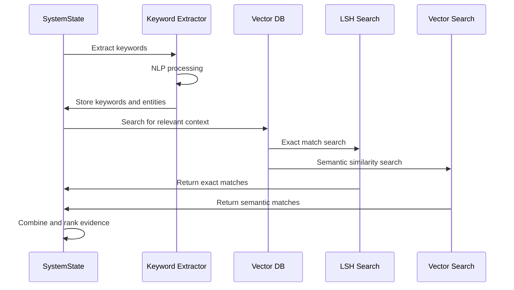
```mermaid
sequenceDiagram
    participant S as SystemState
    participant KE as Keyword Extractor
    participant VDB as Vector DB
    participant LSH as LSH Search
    participant VS as Vector Search

    S->>KE: Extract keywords
    KE->>KE: NLP processing
    KE->>S: Store keywords and entities

    S->>VDB: Search for relevant context
    VDB->>LSH: Exact match search
    VDB->>VS: Semantic similarity search
    LSH->>S: Return exact matches
    VS->>S: Return semantic matches
    S->>S: Combine and rank evidence
```

### Phase 4-5: Test Generation & SQL Generation
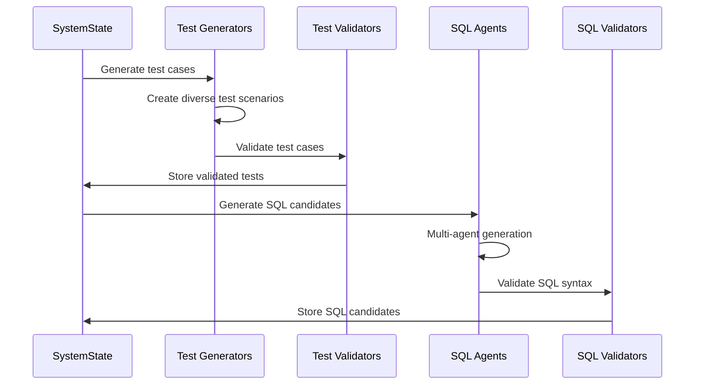
```mermaid
sequenceDiagram
    participant S as SystemState
    participant TG as Test Generators
    participant TV as Test Validators
    participant SQL as SQL Agents
    participant SV as SQL Validators

    S->>TG: Generate test cases
    TG->>TG: Create diverse test scenarios
    TG->>TV: Validate test cases
    TV->>S: Store validated tests

    S->>SQL: Generate SQL candidates
    SQL->>SQL: Multi-agent generation
    SQL->>SV: Validate SQL syntax
    SV->>S: Store SQL candidates
```

### Phase 6-7: Evaluation & Response
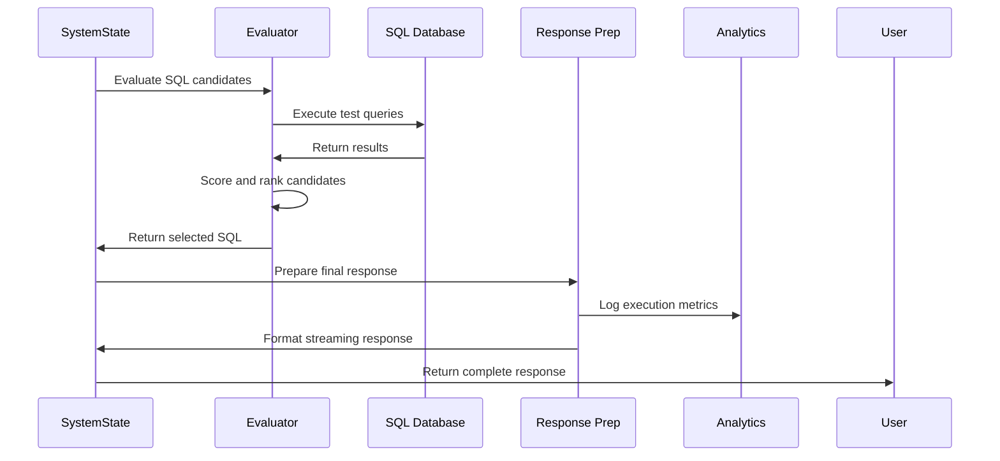
```mermaid
sequenceDiagram
    participant S as SystemState
    participant EVAL as Evaluator
    participant DB as SQL Database
    participant RP as Response Prep
    participant LOG as Analytics

    S->>EVAL: Evaluate SQL candidates
    EVAL->>DB: Execute test queries
    DB->>EVAL: Return results
    EVAL->>EVAL: Score and rank candidates
    EVAL->>S: Return selected SQL

    S->>RP: Prepare final response
    RP->>LOG: Log execution metrics
    RP->>S: Format streaming response
    S->>User: Return complete response
```

## Key Design Patterns

### 1. Pipeline Architecture
- Sequential phase processing with clear separation of concerns
- Each phase has specific input/output contracts
- Error handling at each phase with appropriate fallbacks

### 2. Multi-Agent Collaboration
- Specialized agents for different tasks
- Agent pools for load balancing and redundancy
- Configurable agent selection based on functionality level

### 3. State Management
- Centralized `SystemState` for maintaining pipeline state
- Thread-safe state updates
- Comprehensive logging and debugging support

### 4. Caching Strategy
- Session-level caching for agent managers
- Workspace-level caching for database connections
- Intelligent cache invalidation

### 5. Error Handling
- Graceful degradation for non-critical failures
- Critical error detection and pipeline termination
- Comprehensive error reporting and logging

## Performance Considerations

### Parallel Processing
- Concurrent agent execution where possible
- Asynchronous I/O operations
- Batch processing for database operations

### Resource Management
- Connection pooling for databases
- Agent lifecycle management
- Memory optimization for large datasets

### Scalability
- Horizontal scaling through agent pools
- Database connection management
- Caching strategies for repeated queries

## Quality Assurance

### Multi-Level Validation
- Question validation for appropriateness
- SQL syntax and semantic validation
- Test case execution and validation
- Performance metric evaluation

### Confidence Scoring
- Multi-factor confidence calculation
- Threshold-based decision making
- Explainable AI reasoning

### Feedback Learning
- User feedback collection
- Vector database storage for improvement
- Continuous learning from successful queries

## Configuration and Deployment

### Environment Variables
- Database connection strings
- AI provider API keys
- Vector database configuration
- Logging and monitoring settings

### Deployment Options
- Local development with `uv`
- Docker containerization
- Kubernetes orchestration
- Cloud platform deployment

## Monitoring and Analytics

### Logging
- Structured logging with correlation IDs
- Performance metrics collection
- Error tracking and alerting
- User behavior analytics

### Observability
- Real-time pipeline monitoring
- Agent performance metrics
- Database query performance
- User satisfaction tracking

# Detailed Process: Test Generation to Final Response

This chapter provides a deep technical analysis of the critical pipeline segment from test generation through final response preparation, including the complex decision logic, evaluation loops, and multi-agent coordination that ensures SQL quality and reliability.

## Overview of the Process Flow

The process from test generation to final response involves a sophisticated multi-agent system with the following key stages:

1. **Test Precomputation Phase** - Generate validation tests before SQL generation
2. **SQL Generation Phase** - Multiple agents create SQL candidates with escalation logic
3. **Evaluation Phase** - Comprehensive testing and scoring of SQL candidates
4. **Selection Phase** - Intelligent SQL selection with threshold-based decision making
5. **Final Response Phase** - Response formatting, logging, and state management

## Phase 4: Test Precomputation (Before SQL Generation)

### Purpose and Strategy

The test precomputation phase represents a sophisticated architectural decision: **generate validation tests BEFORE creating SQL candidates**. This approach enables:

- **Evidence-critical gating**: Tests derived from evidence become mandatory requirements
- **Stateless validation**: SQL generation can be validated without context switching
- **Early quality detection**: Identify potential issues before SQL generation

### Process Flow

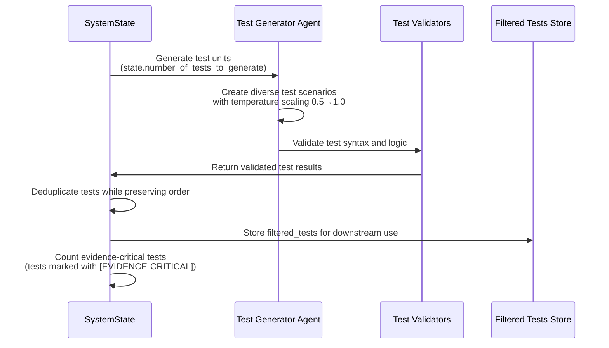
```mermaid
sequenceDiagram
    participant S as SystemState
    participant TG as Test Generator Agent
    participant TV as Test Validators
    participant FT as Filtered Tests Store

    S->>TG: Generate test units<br/>(state.number_of_tests_to_generate)
    TG->>TG: Create diverse test scenarios<br/>with temperature scaling 0.5→1.0
    TG->>TV: Validate test syntax and logic
    TV->>S: Return validated test results
    S->>S: Deduplicate tests while preserving order
    S->>FT: Store filtered_tests for downstream use
    S->>S: Count evidence-critical tests<br/>(tests marked with [EVIDENCE-CRITICAL])
```

### Test Generation Logic

The test generation uses a **temperature scaling strategy** to ensure diversity:

```python
# Temperature scaling from 0.5 to 1.0
min_temp = 0.5
max_temp = 1.0
for i in range(number_of_tests_to_generate):
    temp = min_temp + (max_temp - min_temp) * (i / (number_of_tests_to_generate - 1))
    temperature_values.append(round(temp, 2))
```

**Key Test Types Generated:**
- **Schema validation tests** - Ensure SQL respects database constraints
- **Business logic tests** - Validate expected query behavior
- **Edge case tests** - Handle null values, empty sets, boundary conditions
- **Performance tests** - Check for efficient query patterns
- **Evidence-critical tests** - Tests derived from retrieved evidence (mandatory)

### Evidence-Critical Gating

Tests marked with `[EVIDENCE-CRITICAL]` become mandatory requirements:

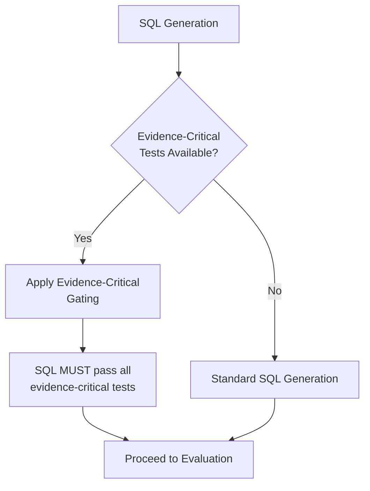
```mermaid
graph TD
    A[SQL Generation] --> B{Evidence-Critical<br/>Tests Available?}
    B -->|Yes| C[Apply Evidence-Critical<br/>Gating]
    B -->|No| D[Standard SQL Generation]
    C --> E[SQL MUST pass all<br/>evidence-critical tests]
    E --> F[Proceed to Evaluation]
    D --> F
```

## Phase 5: SQL Generation with Escalation Logic

### Multi-Agent SQL Generation

The system generates multiple SQL candidates using specialized agents:

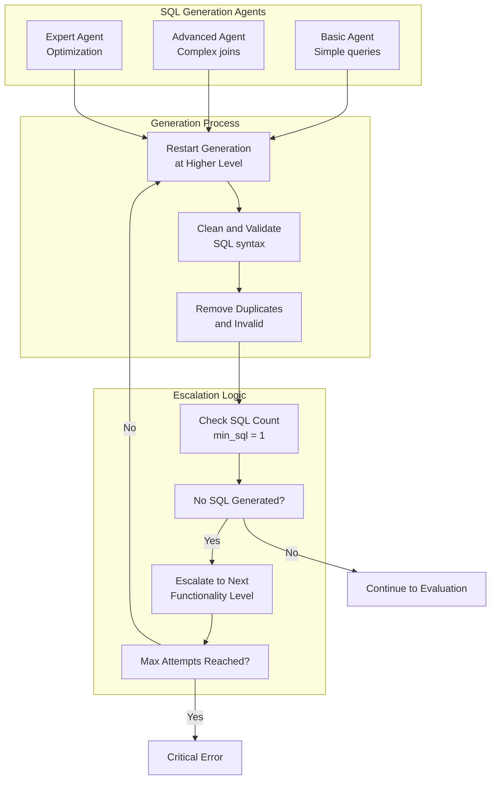
```mermaid
graph TB
    subgraph "SQL Generation Agents"
        BA[Basic Agent<br/>Simple queries]
        AA[Advanced Agent<br/>Complex joins]
        EA[Expert Agent<br/>Optimization]
    end

    subgraph "Generation Process"
        G1[Generate in Parallel<br/>temperature scaling]
        G2[Clean and Validate<br/>SQL syntax]
        G3[Remove Duplicates<br/>and Invalid]
    end

    subgraph "Escalation Logic"
        E1[Check SQL Count<br/>min_sql = 1]
        E2[No SQL Generated?]
        E3[Escalate to Next<br/>Functionality Level]
        E4[Max Attempts Reached?]
    end

    BA --> G1
    AA --> G1
    EA --> G1
    G1 --> G2
    G2 --> G3
    G3 --> E1
    E1 --> E2
    E2 -->|Yes| E3
    E2 -->|No| F[Continue to Evaluation]
    E3 --> E4
    E4 -->|No| G1[Restart Generation<br/>at Higher Level]
    E4 -->|Yes| ERR[Critical Error]
```

### Escalation Mechanism

The system implements a sophisticated escalation strategy when SQL generation fails:

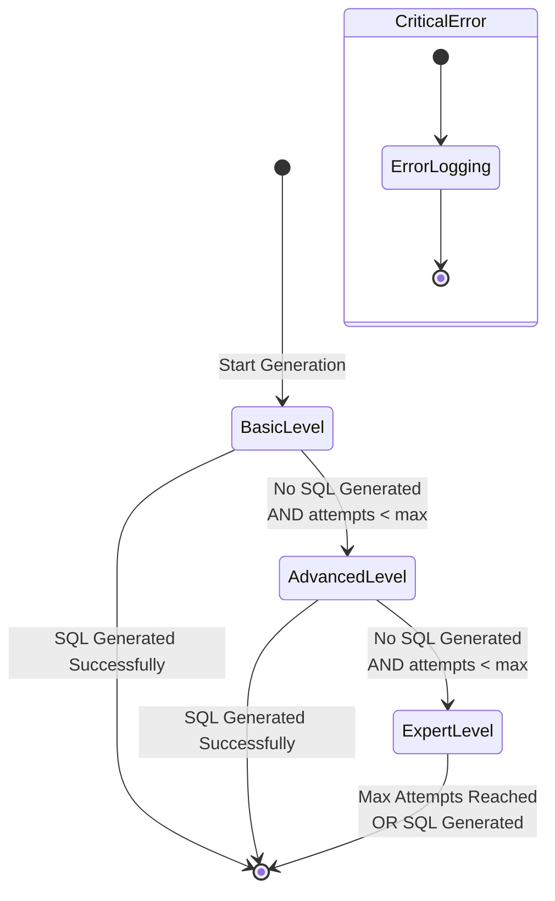
```mermaid
stateDiagram-v2
    [*] --> BasicLevel: Start Generation
    BasicLevel --> AdvancedLevel: No SQL Generated<br/>AND attempts < max
    BasicLevel --> [*]: SQL Generated Successfully
    AdvancedLevel --> ExpertLevel: No SQL Generated<br/>AND attempts < max
    AdvancedLevel --> [*]: SQL Generated Successfully
    ExpertLevel --> [*]: Max Attempts Reached<br/>OR SQL Generated

    state CriticalError {
        [*] --> ErrorLogging
        ErrorLogging --> [*]
    }
```

**Escalation Logic:**
1. **Initial attempt** - Use configured functionality level (BASIC/ADVANCED/EXPERT)
2. **First failure** - Escalate to next higher level (BASIC → ADVANCED → EXPERT)
3. **Maximum attempts** - Track escalation attempts, stop after configured limit
4. **State management** - Clear previous results, update escalation context

### Error Handling Patterns

The system implements sophisticated error detection and handling:

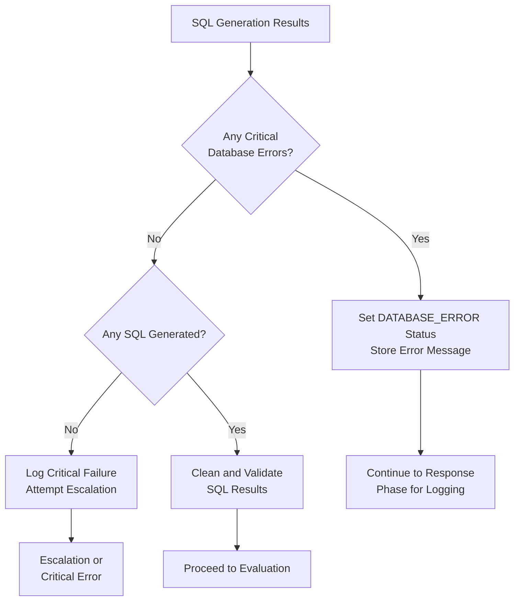
```mermaid
graph TD
    A[SQL Generation Results] --> B{Any Critical<br/>Database Errors?}
    B -->|Yes| C[Set DATABASE_ERROR Status<br/>Store Error Message]
    B -->|No| D{Any SQL Generated?}
    D -->|No| E[Log Critical Failure<br/>Attempt Escalation]
    D -->|Yes| F[Clean and Validate<br/>SQL Results]
    C --> G[Continue to Response<br/>Phase for Logging]
    E --> H[Escalation or<br/>Critical Error]
    F --> I[Proceed to Evaluation]
```

## Phase 6: Evaluation and Selection Complex Logic

### Multi-Stage Evaluation Process

The evaluation phase is the most complex part of the system, involving multiple evaluation strategies and decision loops:

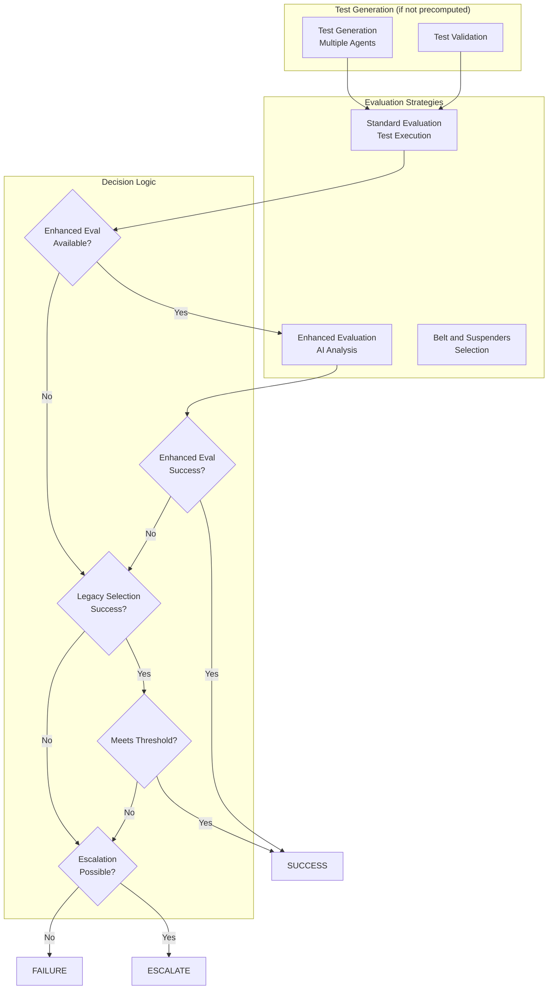
```mermaid
graph TB
    subgraph "Test Generation (if not precomputed)"
        TG[Test Generation<br/>Multiple Agents]
        TV[Test Validation]
    end

    subgraph "Evaluation Strategies"
        SE[Standard Evaluation<br/>Test Execution]
        EE[Enhanced Evaluation<br/>AI Analysis]
        BE[Belt and Suspenders<br/>Selection]
    end

    subgraph "Decision Logic"
        DT1{Enhanced Eval<br/>Available?}
        DT2{Enhanced Eval<br/>Success?}
        DT3{Legacy Selection<br/>Success?}
        DT4{Meets Threshold?}
        DT5{Escalation<br/>Possible?}
    end

    TG --> SE
    TV --> SE
    SE --> DT1
    DT1 -->|Yes| EE
    DT1 -->|No| DT3
    EE --> DT2
    DT2 -->|Yes| SUCCESS
    DT2 -->|No| DT3
    DT3 -->|Yes| DT4
    DT3 -->|No| DT5
    DT4 -->|Yes| SUCCESS
    DT4 -->|No| DT5
    DT5 -->|Yes| ESCALATE
    DT5 -->|No| FAILURE
```

### Detailed Evaluation Flow

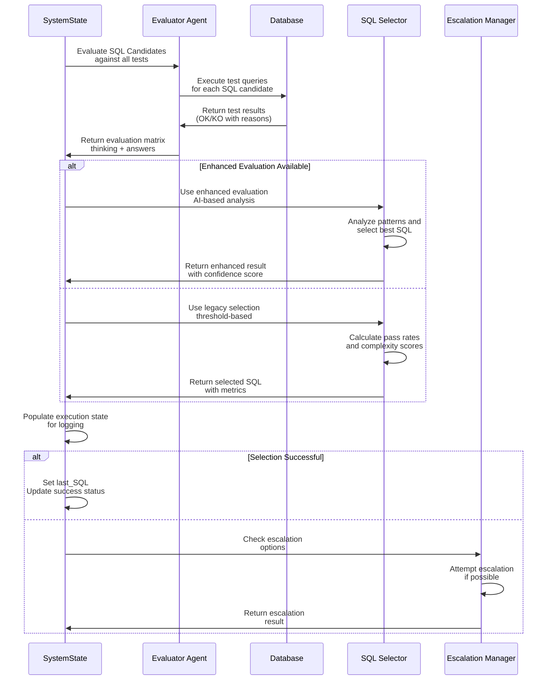
```mermaid
sequenceDiagram
    participant S as SystemState
    participant EG as Evaluator Agent
    participant DB as Database
    participant SS as SQL Selector
    participant EM as Escalation Manager

    S->>EG: Evaluate SQL Candidates<br/>against all tests
    EG->>DB: Execute test queries<br/>for each SQL candidate
    DB->>EG: Return test results<br/>(OK/KO with reasons)
    EG->>S: Return evaluation matrix<br/>thinking + answers

    alt Enhanced Evaluation Available
        S->>SS: Use enhanced evaluation<br/>AI-based analysis
        SS->>SS: Analyze patterns and<br/>select best SQL
        SS->>S: Return enhanced result<br/>with confidence score
    else
        S->>SS: Use legacy selection<br/>threshold-based
        SS->>SS: Calculate pass rates<br/>and complexity scores
        SS->>S: Return selected SQL<br/>with metrics
    end

    S->>S: Populate execution state<br/>for logging

    alt Selection Successful
        S->>S: Set last_SQL<br/>Update success status
    else
        S->>EM: Check escalation<br/>options
        EM->>EM: Attempt escalation<br/>if possible
        EM->>S: Return escalation<br/>result
    end
```

### Test Execution Matrix

The system creates a comprehensive test execution matrix:

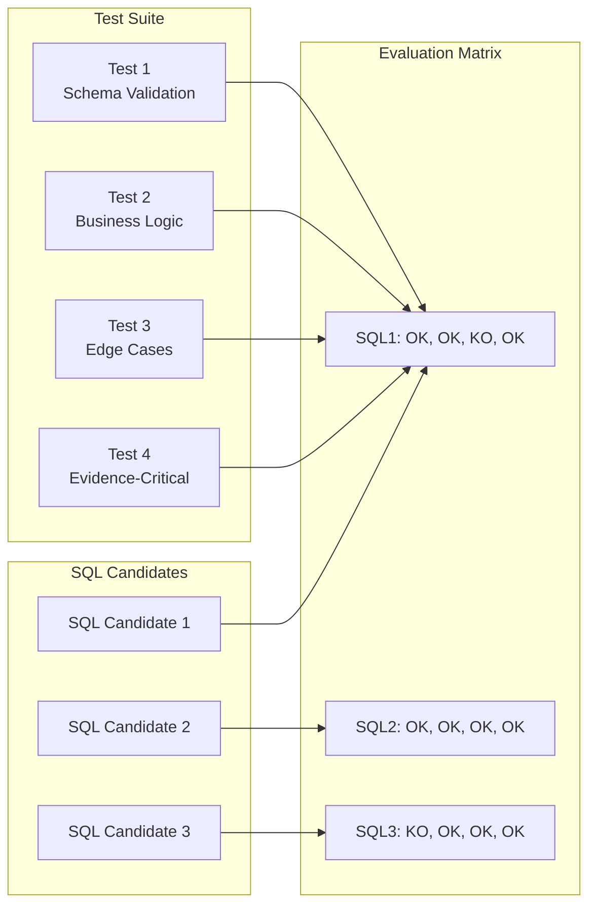
```mermaid
graph LR
    subgraph "SQL Candidates"
        SQL1[SQL Candidate 1]
        SQL2[SQL Candidate 2]
        SQL3[SQL Candidate 3]
    end

    subgraph "Test Suite"
        T1[Test 1<br/>Schema Validation]
        T2[Test 2<br/>Business Logic]
        T3[Test 3<br/>Edge Cases]
        T4[Test 4<br/>Evidence-Critical]
    end

    subgraph "Evaluation Matrix"
        M1[SQL1: OK, OK, KO, OK]
        M2[SQL2: OK, OK, OK, OK]
        M3[SQL3: KO, OK, OK, OK]
    end

    SQL1 --> M1
    SQL2 --> M2
    SQL3 --> M3
    T1 --> M1
    T2 --> M1
    T3 --> M1
    T4 --> M1
```

### Selection Algorithm Decision Tree

The SQL selection algorithm uses a sophisticated decision tree:

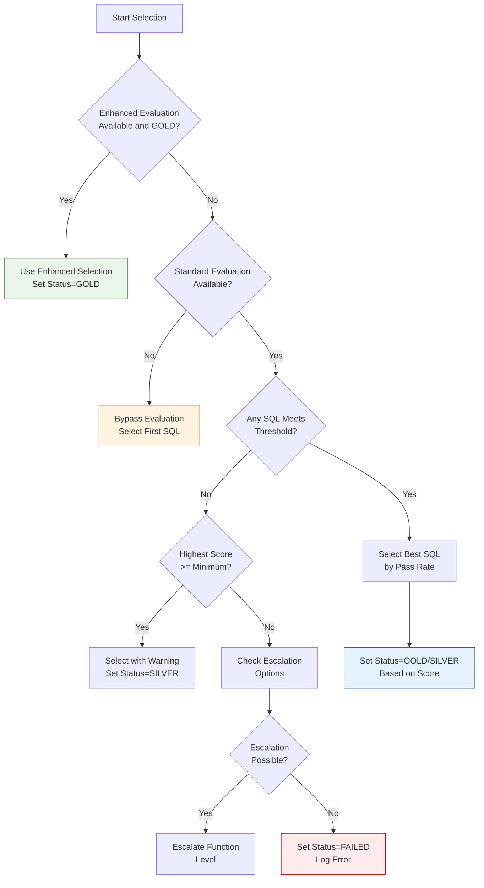
```mermaid
graph TD
    A[Start Selection] --> B{Enhanced Evaluation<br/>Available and GOLD?}
    B -->|Yes| C[Use Enhanced Selection<br/>Set Status=GOLD]
    B -->|No| D{Standard Evaluation<br/>Available?}
    D -->|No| E[Bypass Evaluation<br/>Select First SQL]
    D -->|Yes| F{Any SQL Meets<br/>Threshold?}
    F -->|Yes| G[Select Best SQL<br/>by Pass Rate]
    F -->|No| H{Highest Score<br/>>= Minimum?}
    H -->|Yes| I[Select with Warning<br/>Set Status=SILVER]
    H -->|No| J[Check Escalation<br/>Options]
    G --> K[Set Status=GOLD/SILVER<br/>Based on Score]
    J --> L{Escalation<br/>Possible?}
    L -->|Yes| M[Escalate Function<br/>Level]
    L -->|No| N[Set Status=FAILED<br/>Log Error]

    style C fill:#e8f5e8,stroke:#1b5e20
    style E fill:#fff3e0,stroke:#e65100
    style K fill:#e3f2fd,stroke:#0d47a1
    style N fill:#ffebee,stroke:#b71c1c
```

## Phase 7: Final Response Preparation

### Response Preparation Logic

The final response phase handles SQL formatting, explanation generation, and comprehensive logging:

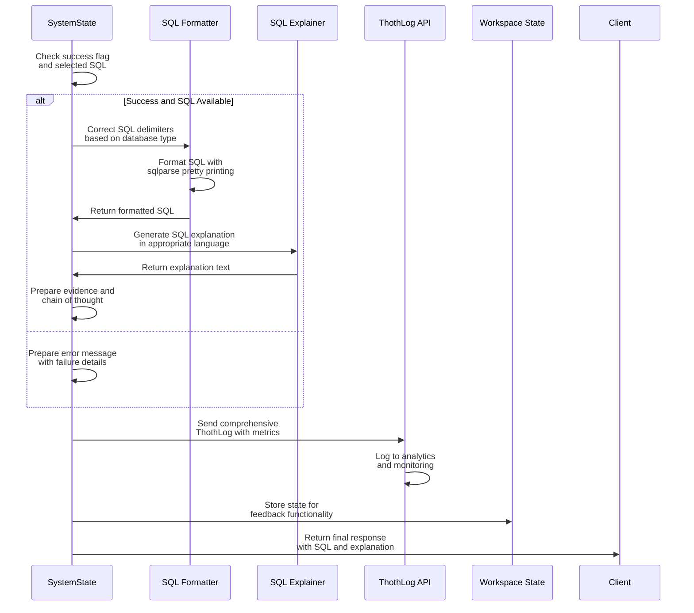
```mermaid
sequenceDiagram
    participant S as SystemState
    participant SF as SQL Formatter
    participant SE as SQL Explainer
    participant TL as ThothLog API
    participant WS as Workspace State

    S->>S: Check success flag<br/>and selected SQL
    alt Success and SQL Available
        S->>SF: Correct SQL delimiters<br/>based on database type
        SF->>SF: Format SQL with<br/>sqlparse pretty printing
        SF->>S: Return formatted SQL
        S->>SE: Generate SQL explanation<br/>in appropriate language
        SE->>S: Return explanation text
        S->>S: Prepare evidence and<br/>chain of thought
    else
        S->>S: Prepare error message<br/>with failure details
    end

    S->>TL: Send comprehensive<br/>ThothLog with metrics
    TL->>TL: Log to analytics<br/>and monitoring
    S->>WS: Store state for<br/>feedback functionality
    S->>Client: Return final response<br/>with SQL and explanation
```

### State Management and Logging

The system maintains comprehensive state management throughout the process:

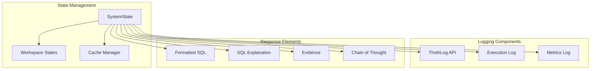
```mermaid
graph TD
    subgraph "State Management"
        SS[SystemState]
        WS[Workspace States]
        CM[Cache Manager]
    end

    subgraph "Logging Components"
        TL[ThothLog API]
        EL[Execution Log]
        ML[Metrics Log]
    end

    subgraph "Response Elements"
        SQL[Formatted SQL]
        EXP[SQL Explanation]
        EV[Evidence]
        COT[Chain of Thought]
    end

    SS --> WS
    SS --> CM
    SS --> TL
    SS --> EL
    SS --> ML
    SS --> SQL
    SS --> EXP
    SS --> EV
    SS --> COT
```

## Key Decision Loops and Logic Patterns

### 1. Evidence-Critical Test Loop

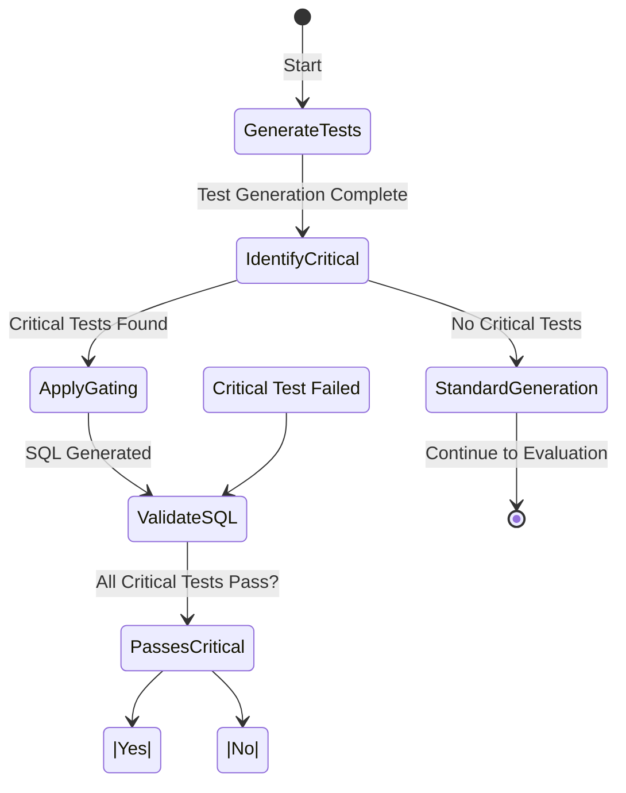
```mermaid
stateDiagram-v2
    [*] --> GenerateTests: Start
    GenerateTests --> IdentifyCritical: Test Generation Complete
    IdentifyCritical --> ApplyGating: Critical Tests Found
    IdentifyCritical --> StandardGeneration: No Critical Tests
    ApplyGating --> ValidateSQL: SQL Generated
    ValidateSQL --> PassesCritical: All Critical Tests Pass?
    PassesCritical -->|Yes| StandardGeneration
    PassesCritical -->|No| RegenerateSQL: Critical Test Failed
    RegenerateSQL --> ValidateSQL
    StandardGeneration --> [*]: Continue to Evaluation
```

### 2. Escalation Decision Loop

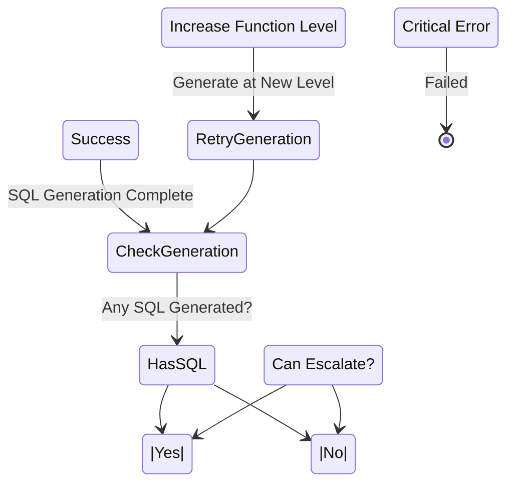
```mermaid
stateDiagram-v2
    [*] --> CheckGeneration: SQL Generation Complete
    CheckGeneration --> HasSQL: Any SQL Generated?
    HasSQL -->|Yes| [*]: Success
    HasSQL -->|No| CheckEscalation: Can Escalate?
    CheckEscalation -->|Yes| Escalate: Increase Function Level
    CheckEscalation -->|No| LogFailure: Critical Error
    Escalate --> RetryGeneration: Generate at New Level
    RetryGeneration --> CheckGeneration
    LogFailure --> [*]: Failed
```

### 3. Evaluation Decision Loop

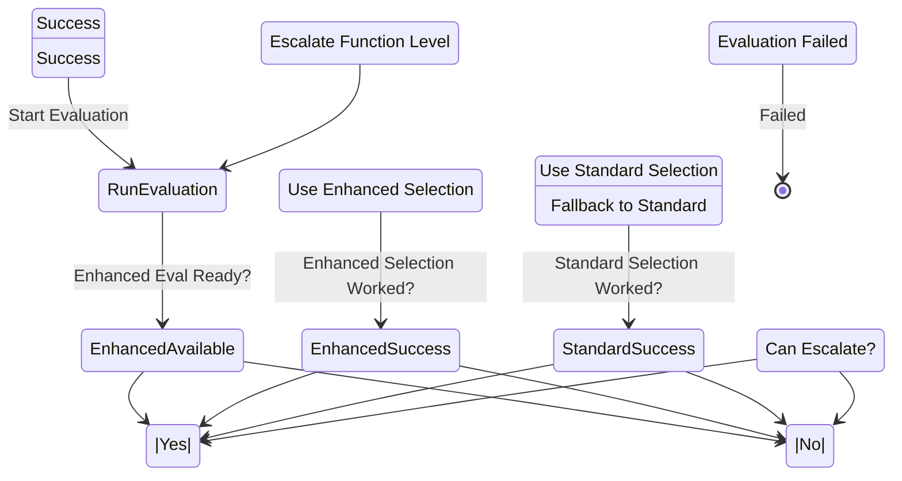
```mermaid
stateDiagram-v2
    [*] --> RunEvaluation: Start Evaluation
    RunEvaluation --> EnhancedAvailable: Enhanced Eval Ready?
    EnhancedAvailable -->|Yes| TryEnhanced: Use Enhanced Selection
    EnhancedAvailable -->|No| TryStandard: Use Standard Selection
    TryEnhanced --> EnhancedSuccess: Enhanced Selection Worked?
    EnhancedSuccess -->|Yes| [*]: Success
    EnhancedSuccess -->|No| TryStandard: Fallback to Standard
    TryStandard --> StandardSuccess: Standard Selection Worked?
    StandardSuccess -->|Yes| [*]: Success
    StandardSuccess -->|No| CheckEscalation: Can Escalate?
    CheckEscalation -->|Yes| EscalateAndRetry: Escalate Function Level
    CheckEscalation -->|No| LogFailure: Evaluation Failed
    EscalateAndRetry --> RunEvaluation
    LogFailure --> [*]: Failed
```

## Performance Optimization Patterns

### Parallel Processing

The system extensively uses parallel processing for performance:

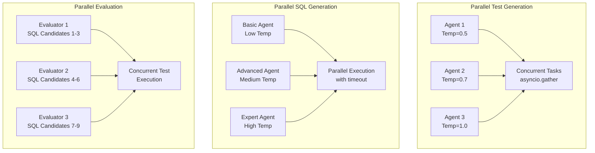
```mermaid
graph TB
    subgraph "Parallel Test Generation"
        P1[Agent 1<br/>Temp=0.5]
        P2[Agent 2<br/>Temp=0.7]
        P3[Agent 3<br/>Temp=1.0]
        P4[Concurrent Tasks<br/>asyncio.gather]
    end

    subgraph "Parallel SQL Generation"
        S1[Basic Agent<br/>Low Temp]
        S2[Advanced Agent<br/>Medium Temp]
        S3[Expert Agent<br/>High Temp]
        S4[Parallel Execution<br/>with timeout]
    end

    subgraph "Parallel Evaluation"
        E1[Evaluator 1<br/>SQL Candidates 1-3]
        E2[Evaluator 2<br/>SQL Candidates 4-6]
        E3[Evaluator 3<br/>SQL Candidates 7-9]
        E4[Concurrent Test<br/>Execution]
    end

    P1 --> P4
    P2 --> P4
    P3 --> P4
    S1 --> S4
    S2 --> S4
    S3 --> S4
    E1 --> E4
    E2 --> E4
    E3 --> E4
```

### Caching Strategies

```mermaid
graph LR
    subgraph "Cache Layers"
        SC[Session Cache<br/>Workspace Setup]
        WC[Workspace Cache<br/>Agent Managers]
        TC[Test Cache<br/>Precomputed Tests]
        RC[Result Cache<br/>Evaluation Results]
    end

    subgraph "Cache Invalidation"
        IV[Version-based<br/>Invalidation]
        TV[Time-based<br/>Expiration]
        MV[Manual<br/>Invalidation]
    end

    SC --> WC
    WC --> TC
    TC --> RC
    RC --> IV
    RC --> TV
    RC --> MV
```

## Error Recovery and Resilience

### Multi-level Error Handling

The system implements comprehensive error handling at multiple levels:

```mermaid
graph TD
    subgraph "Error Detection"
        ED1[Syntax Errors]
        ED2[Database Errors]
        ED3[Timeout Errors]
        ED4[Validation Errors]
    end

    subgraph "Error Recovery"
        ER1[Retry Logic]
        ER2[Fallback Agents]
        ER3[Escalation Paths]
        ER4[Graceful Degradation]
    end

    subgraph "Error Reporting"
        ER1[Detailed Logging]
        ER2[User-Friendly Messages]
        ER3[Performance Metrics]
        ER4[Debug Information]
    end

    ED1 --> ER1
    ED2 --> ER3
    ED3 --> ER1
    ED4 --> ER2
    ER1 --> ER1
    ER2 --> ER2
    ER3 --> ER3
    ER4 --> ER4
```

This detailed analysis reveals the sophisticated nature of the SQL Generator's core pipeline, demonstrating how multiple AI agents work together with complex decision logic, parallel processing, and comprehensive error handling to transform natural language questions into reliable SQL queries.

This workflow documentation provides a comprehensive overview of the SQL Generator system, highlighting the sophisticated multi-agent architecture and the coordinated pipeline processing that enables accurate natural language to SQL conversion.